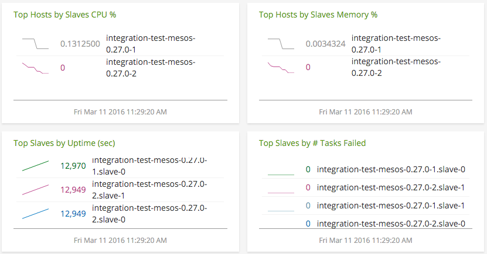
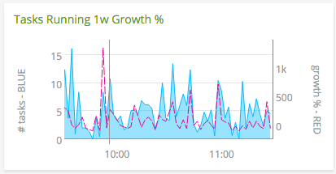

#  Mesos collectd plugin

- [Description](#description)
- [Requirements and Dependencies](#requirements-and-dependencies)
- [Installation](#installation)
- [Configuration](#configuration)
- [Usage](#usage)
- [Metrics](#metrics)
- [License](#license)

### DESCRIPTION

This README describes the Mesos plugin for collectd. Use it to monitor your Mesos installation.

Use this plugin to monitor the following information about Mesos:
  - Cluster status: number of activated slaves, schedulers and tasks
  - CPU, disk and memory usage for Mesos
  - Tasks finished, lost, and failed

### REQUIREMENTS AND DEPENDENCIES

This plugin requires:

- collectd 4.9+
- Python plugin for collectd (included with SignalFx collectd)
- Python 2.3+
- Mesos 0.19.0 or greater

### INSTALLATION

Follow these steps to install this plugin:

1. Install the Python plugin for collectd.

 **RHEL/CentOS 6.x & 7.x, and Amazon Linux 2014.09, 2015.03 & 2015.09**

 Run the following commands to install the Python plugin for collectd:

 ```
 yum install collectd-python
 ```

 **Ubuntu 12.04, 14.04, 15.04 and Debian 7 & 8:**

 This plugin is included with [SignalFx's collectd package](https://support.signalfx.com/hc/en-us/articles/208080123).

1. Download the [Python module for Mesos](https://github.com/signalfx/collectd-mesos).
1. Download SignalFx's sample configuration files for this plugin: for [Mesos masters](././10-mesos-master.conf), and [Mesos slaves](././10-mesos-slave.conf).
3. Modify the appropriate sample configuration file to contain values that make sense for your environment, as described [below](#configuration).
4. Add the following line to collectd.conf, replacing the path with the path to the sample configuration file you downloaded in step 2:

  ```
  include '/path/to/10-mesos-[slave/master].conf'
  ```
5. Restart collectd.

### CONFIGURATION

Using the example configuration files [`10-mesos-master.conf`](././10-mesos-master.conf) or [`10-mesos-slave.conf`](././10-mesos-slave.conf) as a guide, provide values for the configuration options listed below that make sense for your environment and allow you to connect to the Mesos instance to be monitored.

| configuration option | definition | default value |
| ---------------------|------------|---------------|
| ModulePath | Path on disk where collectd can find this module. | "/opt/collectd-mesos" |
| Cluster | The name of the cluster to which the Mesos instance belongs. Appears in the dimension `cluster`. | "cluster-0" |
| Instance | The name of this Mesos master/slave instance. Appears in the dimension `plugin_instance`. | "master-0" / "slave-0" |
| Host  | The hostname or IP address of the Mesos instance to be monitored. | "%%%MASTER_IP%%%" |
| Port | The port on which the Mesos instance is listening for connections. | %%%MASTER_PORT%%% |
| Verbose | Enable verbose logging from this plugin to collectd's log file | false |

### USAGE

Below are screen captures of dashboards created for this plugin by SignalFx, illustrating the metrics emitted by this plugin. The dashboards are included in this repository and can be imported into SignalFx or other monitoring products. [Click here to download](./Page_Mesos.json).

#### Monitoring Mesos clusters


It’s important to keep track of the status of tasks in the cluster. An increase in failed tasks for a master or slave can indicate a problem with a framework.



It can be important to analyze performance per Mesos host. An increase in failed tasks for many masters and slaves on a single host may indicate a hardware problem.



Track week-over-week growth of tasks in your cluster to be informed of changing workloads.

#### Monitoring Mesos masters and slaves


An unexpectedly low number of connected slaves on a Mesos master can indicate a network problem preventing them from connecting. To verify this, check to see if there’s an unexpectedly high number of dropped messages in [`counter.master_dropped_messages`](./docs/counter.master_dropped_messages.md).


On the Mesos master dashboard, you can view in detail the number of tasks that are finished, failed, lost or errored out. Monitoring connected and active frameworks can help you determine the health of your Mesos scheduler.

For additional information on how to monitor Mesos, check out Apache's guide [here](http://mesos.apache.org/documentation/latest/monitoring/).


### METRICS

For documentation of the metrics and dimensions emitted by this plugin, [click here](././docs).

### LICENSE

> Include licensing information for the plugin in this section.

This plugin is released under the Apache 2.0 license. See [LICENSE](https://github.com/signalfx/collectd-mesos/blob/master/LICENSE.txt) for more details.
