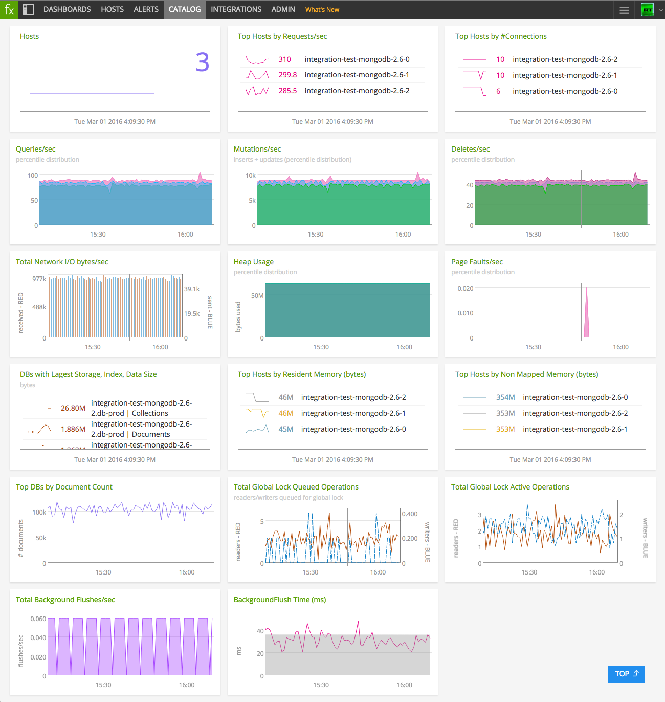
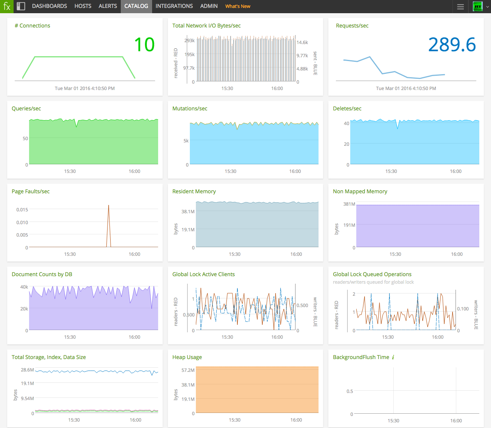

# MongoDB Plugin

- [Description](#description)
- [Requirements and Dependencies](#requirements-and-dependencies)
- [Installation](#installation)
- [Configuration](#configuration)
- [Usage](#usage)
- [Metrics](#metrics)
- [License](#license)

### DESCRIPTION

Use the [mongodb](https://github.com/signalfx/collectd-mongodb) collectd
plugin to collect metrics from MongoDB nodes.

This plugin captures the following metrics about MongoDB generally:

* memory
* network input/output bytes count
* heap usage
* db connections
* operations count
* active client connections
* queued operations

The plugin also captures the following DB-specific metrics:

* db size
* db counters

Documentation for MongoDB can be found here: http://docs.mongodb.org/manual/

### REQUIREMENTS AND DEPENDENCIES

### Version information

| Software  | Version        |
|-----------|----------------|
| collectd  |  4.9 or later  |
| Python    |  2.4 or later  |
| MongoDB   |  2.4 or later  |
| PyMongo   |  3.0 or later  |

### INSTALLATION

1. Install the Python plugin for collectd.

 **RHEL/CentOS 6.x & 7.x, and Amazon Linux 2014.09, 2015.03 & 2015.09**

 Run the following commands to install the Python plugin for collectd, pip, and pymongo:

 ```
 yum install -y epel-release
 yum install -y python-pip
 yum install -y collectd-python
 pip install pymongo==3.0.3
 ```

 **Ubuntu 12.04, 14.04, 15.04 and Debian 7 & 8:**

 This plugin is included with [SignalFx's collectd package](https://support.signalfx.com/hc/en-us/articles/208080123).

1. Run the following commands to install `pip` and `pymongo`:

 ```
 apt-get install -y python-pip python-dev build-essential
 pip install pymongo==3.0.3
 ```
1. Download the [Python module for MongoDB](https://github.com/signalfx/collectd-mongodb).  

1. Download SignalFx's [sample configuration file ](https://github.com/signalfx/Integrations/collectd-mongodb/10-mongodb.conf).

1. Modify the sample configuration file as described in [Configuration](#configuration) below.

1. Add the following line to `/etc/collectd.conf`, replacing the example path with the location of the configuration file:

 ```
 include '/path/to/10-mongodb.conf'
 ```

1. Restart collectd.

### CONFIGURATION

Using the example configuration file [`10-mongodb.conf`](././10-mongodb.conf) as a guide, provide values for the configuration options listed below that make sense for your environment and allow you to connect to the MongoDB instance to be monitored.

| configuration option | definition | default value |
| ---------------------|------------|---------------|
| ModulePath | Path on disk where collectd can find this module. | "/opt/setup/scripts" |
| Host | Host IP | "127.0.0.1" |
| Port | Port number for IP connection | "27017" |
| User | Valid mongodb user | "" |
| Password | Associated password for valid user | "password" |
| Database | Name(s) of database(s) that you would like metrics from. Note: the first database in this list must be "admin", as it is used to perform a `serverStatus()` command. | "admin" "db-prod" "db-dev" |

#### Note: Additional instances

Each MongoDB instance to be monitored is specified in a `<Module>` block within the configuration file. By default, the sample configuration file `10-mongodb.conf` contains only one such block. To monitor an additional instance of MongoDB, add another `<Module>` block immediately below the first, and configure it according to that instance's parameters. 

#### Note: Creating a MongoDB user for collectd

If you're monitoring a secured MongoDB deployment, it is a good practice to create a MongoDB user with minimal read-only roles, as follows:

```
db.createUser( {
  user: "collectd",
  pwd: "collectd",
  roles: [ { role: "readAnyDatabase", db: "admin" }, { role: "clusterMonitor", db: "admin" } ]
});
```

### USAGE

Below are screen captures of dashboards created for this plugin by SignalFx, illustrating the metrics emitted by this plugin. The dashboards are included in this repository and can be imported into SignalFx or other monitoring products. [Click here to download](././Page_MongoDB.json).

**Monitoring MongoDB clusters**


**Monitoring MongoDB hosts**


### METRICS

For documentation of the metrics and dimensions emitted by this plugin, [click here](././docs).

### LICENSE

This plugin is released under the Apache 2.0 license. See LICENSE for more details.
