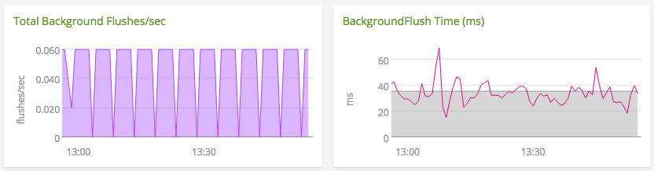
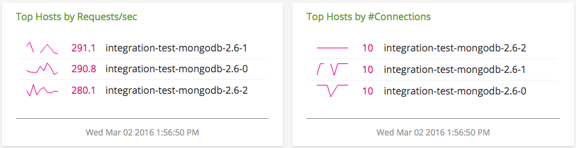

# MongoDB Plugin

- [Description](#description)
- [Requirements and Dependencies](#requirements-and-dependencies)
- [Installation](#installation)
- [Configuration](#configuration)
- [Usage](#usage)
- [Metrics](#metrics)
- [License](#license)

### DESCRIPTION

Use the [mongodb](https://github.com/signalfx/collectd-mongodb) collectd
plugin to collect metrics from MongoDB nodes.

This plugin captures the following metrics about MongoDB generally:

* memory
* network input/output bytes count
* heap usage
* db connections
* operations count
* active client connections
* queued operations

The plugin also captures the following DB-specific metrics:

* db size
* db counters

Documentation for MongoDB can be found here: http://docs.mongodb.org/manual/

### REQUIREMENTS AND DEPENDENCIES

### Version information

| Software  | Version        |
|-----------|----------------|
| collectd  |  4.9 or later  |
| Python    |  2.4 or later  |
| MongoDB   |  2.4 or later  |
| PyMongo   |  3.0 or later  |

### INSTALLATION

1. Install the Python plugin for collectd.

 **RHEL/CentOS 6.x & 7.x, and Amazon Linux 2014.09, 2015.03 & 2015.09**

 Run the following commands to install the Python plugin for collectd, `pip`, and `pymongo`:

 ```
 yum install -y epel-release
 yum install -y python-pip
 yum install -y collectd-python
 pip install pymongo==3.0.3
 ```

 **Ubuntu 12.04, 14.04, 15.04 and Debian 7 & 8:**

 This plugin is included with [SignalFx's collectd package](https://support.signalfx.com/hc/en-us/articles/208080123).
 Run the following commands to install `pip` and `pymongo`:

 ```
 apt-get install -y python-pip python-dev build-essential
 pip install pymongo==3.0.3
 ```
1. Download the [Python module for MongoDB](https://github.com/signalfx/collectd-mongodb).  

1. Download SignalFx's [sample configuration file ](https://github.com/signalfx/Integrations/collectd-mongodb/10-mongodb.conf) for this plugin.

1. Modify the sample configuration file as described in [Configuration](#configuration), below.

1. Add the following line to `/etc/collectd.conf`, replacing the example path with the location of the configuration file:

 ```
 include '/path/to/10-mongodb.conf'
 ```

1. Restart collectd.

### CONFIGURATION

Using the example configuration file [`10-mongodb.conf`](././10-mongodb.conf) as a guide, provide values for the configuration options listed below that make sense for your environment and allow you to connect to the MongoDB instance to be monitored.

| configuration option | definition | default value |
| ---------------------|------------|---------------|
| ModulePath | Path on disk where collectd can find this module. | "/opt/setup/scripts" |
| Host | Host IP | "127.0.0.1" |
| Port | Port number for IP connection | "27017" |
| User | Valid mongodb user | "" |
| Password | Associated password for valid user | "password" |
| Database | Name(s) of database(s) that you would like metrics from. Note: the first database in this list must be "admin", as it is used to perform a `serverStatus()` command. | "admin" "db-prod" "db-dev" |

#### Note: Monitoring multiple instances

Each MongoDB instance to be monitored is specified in a `<Module>` block within the configuration file. By default, the sample configuration file `10-mongodb.conf` contains only one such block. To monitor an additional instance of MongoDB, add another `<Module>` block immediately below the first, and configure it according to that instance's parameters. 

#### Note: Creating a MongoDB user for collectd

If you're monitoring a secured MongoDB deployment, it is a good practice to create a MongoDB user with minimal read-only roles, as follows:

```
db.createUser( {
  user: "collectd",
  pwd: "collectd",
  roles: [ { role: "readAnyDatabase", db: "admin" }, { role: "clusterMonitor", db: "admin" } ]
});
```

### USAGE

Below are screen captures of dashboards created for this plugin by SignalFx, illustrating the metrics emitted by this plugin. The dashboards are included in this repository and can be imported into SignalFx or other monitoring products. [Click here to download](././Page_MongoDB.json).

For general reference on how to monitor MongoDB performance, see [Analyzing MongoDB Performance](https://docs.mongodb.org/manual/administration/analyzing-mongodb-performance/). 

**Monitoring MongoDB clusters**

Writes to MongoDB require the use of the global lock. If lock utilization is high, operations can begin to slow down. This can be a symptom of database issues such as poorly configured or absent indexes, or a schema design that needs improvement. It can also indicate the failure of a disk. Monitor the number of readers and writers waiting for the lock in [`gauge.globalLock.activeClients.total`](././docs/gauge.globalLock.activeClients.total.md). 


*This lock has little utilization and few queued readers and writers.*

MongoDB flushes data changes from memory to disk on a timed interval, by default every 60 seconds. If background flushes begin taking longer than usual, it can indicate that the disk doesn't have enough I/O capacity to handle the load (read more below). It could also reflect a large number of writes occurring at once -- check [`counter.opcounters.insert`](././docs/counter.opcounters.insert.md) and [`counter.opcounters.update`](././docs/counter.opcounters.update.md). 

Monitor average background flush time and the most recent background flush time in [`gauge.backgroundFlushing.average_ms`](././docs/gauge.backgroundFlushing.average_ms.md) and [`gauge.backgroundFlushing.last_ms`](gauge.backgroundFlushing.last_ms.md) respectively. 

 
*Average background flush time on this cluster is around 40ms, well within healthy parameters.*

When analyzing the performance of a MongoDB cluster, it's also important to verify that the load is balanced across each instance. The cluster dashboard included in this repository contains many list charts of individual MongoDB instances ordered by important metrics like requests per second ([`counter.network.numRequests`](././docs/counter.network.numRequests.md)) and number of connections to MongoDB ([`gauge.connections.current`](././docs/gauge.connections.current.md)). This can help you compare load between instances. Load imbalance can arise in a sharded cluster if MongoDB is unable to balance chunks equally between the shards, for example if lock utilization is high. 


*All the listed instances show about the same requests per second and number of connections. Their load is balanced.*

**Monitoring MongoDB hosts**

On an individual instance level, it's important to monitor system statistics like memory usage, page faults, and disk I/O utilization. 

MongoDB uses memory-mapped files to store data, so it is important to compare the amount of memory that MongoDB has allocated to the amount of system memory. This plugin reports resident memory usage in [`gauge.mem.resident`](././docs/gauge.mem.resident.md) and mapped memory usage in [`gauge.mem.mapped`](././docs/gauge.mem.mapped.md). If either of these quantities exceed the amount of system memory (reported by the [`memory`](../collectd-memory) plugin for collectd), the system may be at or over capacity. 


*This MongoDB instance is not using a large amount of resident memory, and has non-mapped memory available to the process (calculated as [`gauge.mem.virtual`](././docs/gauge.mem.virtual.md) - [`gauge.mem.mapped`](././docs/gauge.mem.mapped.md).)*

This plugin reports page faults in [`counter.extra_info.page_faults`](././docs/counter.extra_info.page_faults.md). Page faults indicate that reads or writes are occurring to data files that are not currently in memory. This is different from an OS page fault. Sudden increases in MongoDB page faults can indicate that a large read operation is taking place. Steadily high numbers of page faults indicate that MongoDB is reading more often from disk than is optimal. 


*This MongoDB instance has a low rate of page faults. This means that most of the data MongoDB needs to access is in memory, and doesn't need to be fetched from disk.*

You can monitor disk I/O utilization for your MongoDB host using the [`disk_ops.write`](../collectd-disk/docs/disk_ops.write.md) and [`disk_ops.read`](../collectd-disk/docs/disk_ops.read.md) metrics emitted by the `disk` plugin for collectd, which is included and enabled by default in most packages of collectd. [Click here to learn more about `collectd-disk`](../collectd-disk/).

### METRICS

For complete documentation of the metrics and dimensions emitted by this plugin, [click here](././docs).

### LICENSE

This plugin is released under the Apache 2.0 license. See [LICENSE](https://github.com/signalfx/collectd-mongodb/blob/master/LICENSE.txt) for more details.
