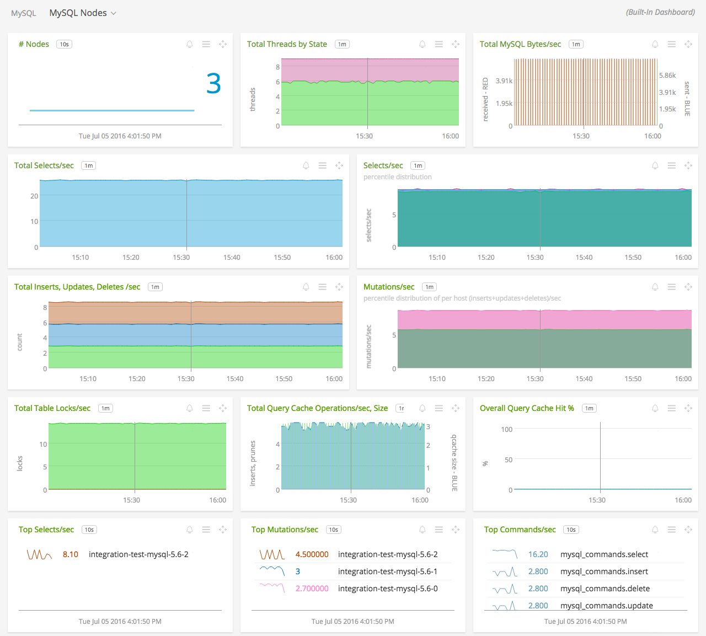
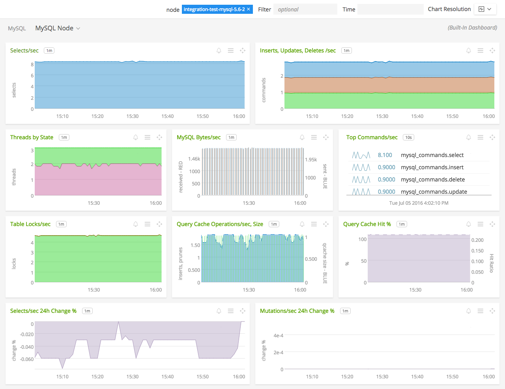
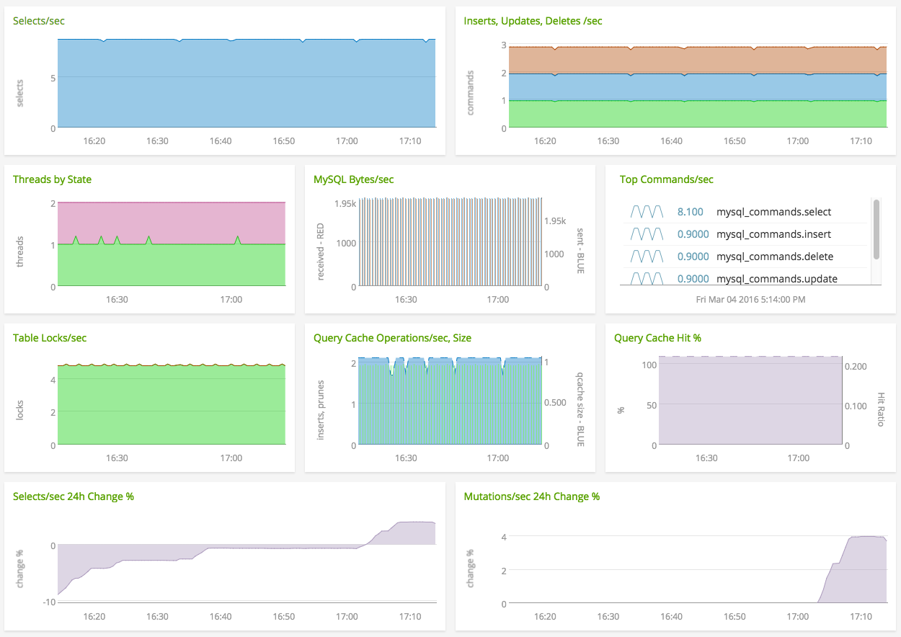

#  MySQL

Metadata associated with the MySQL collectd plugin can be found <a target="_blank" href="https://github.com/signalfx/integrations/tree/release/collectd-mysql">here</a>. The relevant code for the plugin can be found <a target="_blank" href="https://github.com/signalfx/collectd/blob/master/src/mysql.c">here</a>.

- [Description](#description)
- [Requirements and Dependencies](#requirements-and-dependencies)
- [Installation](#installation)
- [Configuration](#configuration)
- [Usage](#usage)
- [Metrics](#metrics)
- [License](#license)

### DESCRIPTION

Use the MySQL plugin for collectd to monitor MySQL database performance.

This plugin connects to a MySQL instance and reports on the values returned by a `SHOW STATUS` command. This includes the following:

  - Number of commands processed
  - Table and row operations (handlers)
  - State of the query cache
  - Status of MySQL threads
  - Network traffic

#### FEATURES

##### Built-in dashboards

- **MySQL Nodes**: Overview of data from all MySQL nodes.

  

- **MySQL Node**: Focus on a single MySQL node.

    

### REQUIREMENTS AND DEPENDENCIES

#### Version information

| Software  | Version        |
|-----------|----------------|
| collectd  |  3.6 or later  |
| MySQL     |  4.x or later  |

### INSTALLATION

**If you are using the new Smart Agent, see the docs for [the collectd/mysql
monitor](https://github.com/signalfx/signalfx-agent/tree/master/docs/monitors/collectd-mysql.md)
for more information.  The configuration documentation below may be helpful as
well, but consult the Smart Agent repo's docs for the exact schema.**

Follow these steps to install and configure this plugin:

1. Installing the plugin:
    * On RHEL/CentOS and Amazon Linux systems, run the following command to install this plugin:

            yum install collectd-mysql

    * On Ubuntu and Debian systems, this plugin is included by default with the [SignalFx collectd agent](https://github.com/signalfx/integrations/tree/master/collectd).

2. Download SignalFx's <a target="_blank" href="https://github.com/signalfx/integrations/tree/master/collectd-mysql/10-mysql.conf">sample configuration file</a> for this plugin to `/etc/collectd/managed_config`.

3. Modify the sample configuration file as described in [Configuration](#configuration), below.

4. Restart collectd.

### CONFIGURATION

Using the example configuration file <a target="_blank" href="https://github.com/signalfx/integrations/tree/master/collectd-mysql/10-mysql.conf">10-mysql.conf</a> as a guide, provide values for the configuration options listed below that make sense for your environment and allow you to connect to the MySQL instance to be monitored.

| configuration option | definition | example value |
| ---------------------|------------|---------------|
| Database (in block declaration) | The value of the dimension `plugin_instance` that will be recorded for this database. | `<Database hostA_database1>` |
| Host  | The host on which MySQL is running. | "10.128.8.2" |
| Socket | A socket that collectd can use to connect to the database. You may be able to find this value by looking at the command used to run MySQL on your server as follows: <code>ps auwxxx &#124; grep mysql<code> | "/var/run/mysqld/mysqld.sock" |
| Port | Can be used to connect to the database in lieu of specifying a Socket | 3306 |
| User | A valid username that collectd can use to connect to MySQL. | "root" |
| Password | Password for the username given in User. | "abcdABCD1." |
| Database (within block) | The name of the MySQL database to monitor. | `Database "mysql\_one"` |

#### Note: Monitoring multiple instances

The sample configuration file <a target="_blank" href="https://github.com/signalfx/integrations/tree/master/collectd-mysql/10-mysql.conf">10-mysql.conf</a> illustrates how to configure this plugin to monitor multiple databases, on the same host or on different hosts.

To monitor just one database, include just one `Database` block and delete the others.

#### Note: Two different directives called "Database"
This plugin configuration file uses directives called “Database” in two different places: one in each block declaration, and one within each block.

The value of “Database” in the _block declaration_ (`<Database foo>`) indicates the value of the  `plugin_instance` dimension that will be recorded for this database. The value of “Database” within the block (`Database "my_database"`) indicates the `db_name` of the MySQL database to monitor using this configuration.

To illustrate the difference between these two uses of "Database", the example configuration given in <a target="_blank" href="https://github.com/signalfx/integrations/tree/master/collectd-mysql/10-mysql.conf">10-mysql.conf</a> directs collectd to collect metrics for three total MySQL databases: the databases named `mysql_one` and `mysql_two` on host 10.128.8.2, and the database named `mysql_one` on host 10.128.8.3.

#### Note: Monitoring a MySQL environment that is configured for replication
If you have configured MySQL to use replication you may want to collect information relevant to the performance and status of your master and/or slave nodes. This can be achieved by utilizing the `MasterStats`, `SlaveStats`, and `SlaveNotifications` options as described in <a target="_blank" href="https://github.com/signalfx/integrations/tree/master/collectd-mysql/10-mysql.conf">10-mysql.conf</a>

### USAGE

Below are screen captures of dashboards created for this plugin by SignalFx, illustrating the metrics emitted by this plugin.

For general reference on how to monitor MySQL performance using this plugin, see <a target="_blank" href="https://collectd.org/wiki/index.php/Plugin:MySQL">documentation on collectd.org</a>.

**Monitoring multiple MySQL nodes**

*Example dashboard showing performance of multiple MySQL nodes.*

**Monitoring a single MySQL node**

*Example dashboard showing performance of a single MySQL node.*

### METRICS

For documentation of the metrics and dimensions emitted by this plugin, [click here](./docs).

#### Note: This plugin may not emit all listed metrics

This plugin will not emit metrics about features that are not used. For example, this plugin will not emit a count of an operation that has never occurred. For another example, this plugin will not emit metrics about the query cache if MySQL is not configured to use the query cache.

### LICENSE

This integration is released under the Apache 2.0 license. See [LICENSE](./LICENSE) for more details.
