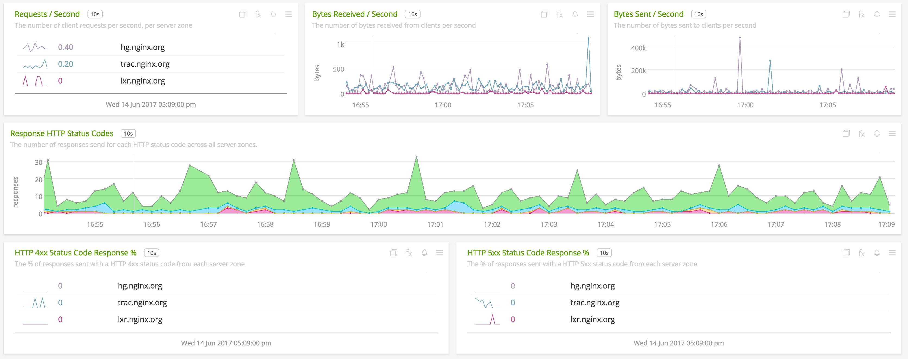

#  NGINX Plus

Metadata associated with the NGINX Plus plugin for collectd can be found <a target="_blank" href="https://github.com/signalfx/integrations/tree/release/collectd-nginx-plus">here</a>. The relevant code for the plugin can be found <a target="_blank" href="https://github.com/signalfx/collectd-nginx-plus">here</a>.

- [Description](#description)
- [Installation](#installation)
- [Configuration](#configuration)
- [Usage](#usage)
- [Metrics](#metrics)
- [License](#license)

### DESCRIPTION

This is the SignalFx NGINX Plus plugin. Follow these instructions to install the NGINX Plus plugin for collectd.

The <a target="_blank" href="https://github.com/signalfx/collectd-nginx-plus">niginx-plus-collectd</a> plugin collects metrics about a single NGINX Plus instance, using the `/status` endpoints exposed with the ngx_http_status_module, documentation <a target="_blank" href="http://nginx.org/en/docs/http/ngx_http_status_module.html">here</a>.


#### FEATURES

##### Built-in dashboards

- **NGINX+ Overview**: Provides a high-level overview of key metrics for each NGINX Plus instance.

  [](./img/overview_dashboard.png)

- **NGINX+ Server Connections**: Provides connection and SSL metrics for a single NIGNX Plus instance.

  [](./img/connections_dashboard.png)  

- **NGINX+ Server Server Zones**: Provides server zone metrics for a single NGINX Plus instance.

  [](./img/server_zones_dashboard.png)  

- **NGINX+ Server Upstreams**: Provides upstream group metrics for a single NGINX Plus instance.

  [](./img/server_zones_dashboard.png)  

### INSTALLATION

1. Download the <a target="_blank" href="https://github.com/signalfx/collectd-nginx-plus">niginx-plus-collectd</a> project.

2. Run the following command to install the module’s dependencies using `pip`, replacing the example path with the download location of the `niginx-plus-collectd` project:

        sudo pip install -r install_requirements.txt

3. Download SignalFx’s <a target="_blank" href="https://github.com/signalfx/integrations/blob/master/collectd-nginx-plus/10-nginx-plus.conf">sample configuration file</a> for this plugin to `/etc/collectd/managed_config`.

4. Modify the configuration file to provide values that make sense for your environment, as described in [Configuration](#configuration) below.

5. Restart collectd.

### CONFIGURATION

Using the example configuration file <a target="_blank" href="https://github.com/signalfx/integrations/tree/master/collectd-nginx-plus/10-nginx-plus.conf">10-nginx-plus.conf</a> as a guide, provide values for the configuration options listed below that make sense for your environment.

| Configuration Option | Definition | Default Value |
| ---------------------|------------|---------------|
| ModulePath | Path where collectd can find this module. | `/usr/share/collectd/niginx-plus-collectd/plugin` |
| StatusHost | IP address or DNS of the NGINX+ instance to retrieve status information from | `localhost` |
| StatusPort | Port the NGINX+ status endpoint can be reached at. | `8080` |
| DebugLogLevel | `true` to enable logging at DEBUG level. | `false` |
| Username | Username to use for username/password authentication. | None |
| Password | Password to use for username/password authentication. | None |
| Dimension | A single additional dimension decorating to each metric. There are two values, the first for the name, the second for the value. | None |

Example configuration:

```apache
LoadPlugin python

<Plugin python>
  ModulePath "/usr/share/collectd/collectd-nginx-plus/plugin"
  Import nginx_plus_collectd

  <Module nginx_plus_collectd>
    StatusHost "localhost"
    StatusPort "8080"
    DebugLogLevel true
    Username "user_1"
    Password "my_password"
    Dimension "extra_dimension_name_1" "extra_dimension_value_1"
    Dimension "extra_dimension_name_2" "extra_dimension_value_2"
  </Module>
</Plugin>
```

By default only a subset of the available metrics are published by default. The remaining metrics can be enabled by opting-in to additional metric groups. See [Usage](#usage) for more details on each metric group
and how to enable them.


### METRICS
By default only a subset (32) of the available metrics (87) are published by default. The remaining metrics can be enabled by opting-in to additional metric groups.

### USAGE
All metrics reported by the NGINX Plus collectd plugin will contain the following dimensions:

* `nginx.version` will contain the version number of the NGINX Plus instance being monitored
* `plugin` is always set to `nginx-plus`
* `plugin_instance` will contain the IP address of the NGINX Plus instance as given in the `/status/address` response and the port given in the `StatusPort` configuration property.

#### Default Metrics
The default metrics report the values necessary to power the default dashboards. This includes high-level connection
information, cache, server zone and upstreams metrics.

##### Metrics
* connections.accepted
* connections.dropped
* connections.idle
* connections.active
* ssl.handshakes.successful
* ssl.handshakes.failed
* ssl.handshakes.reuses
* requests.total
* requests.current
* server.zone.requests
* server.zone.responses.1xx
* server.zone.responses.2xx
* server.zone.responses.3xx
* server.zone.responses.4xx
* server.zone.responses.5xx
* server.zone.responses.total
* server.zone.responses.received
* server.zone.bytes.received
* server.zone.bytes.sent
* caches.size
* caches.size.max
* upstreams.requests
* upstreams.responses.1xx
* upstreams.responses.2xx
* upstreams.responses.3xx
* upstreams.responses.4xx
* upstreams.responses.5xx
* upstreams.responses.total
* upstreams.downtime
* upstreams.response.time
* upstreams.bytes.received
* upstreams.bytes.sent

#### Server Zone Metrics
Server Zone metrics are emitted for each server in each <a target="_blank" href="http://nginx.org/en/docs/http/ngx_http_status_module.html#status_zone">status zone</a>.
To include these metrics, add `ServerZone true` to the plugin configuration, e.g.
```apache
  <Module nginx_plus_collectd>
    StatusHost "localhost"
    StatusPort "8080"
    ServerZone true
  </Module>
```
##### Metrics
* server.zone.processing
* server.zone.discarded

#### Memory Zone Metrics
Memory Zone metrics are emitted for each shared memory zone that uses a slab allocator.
To include these metrics, add `MemoryZone true` to the plugin configuration, e.g.
```apache
  <Module nginx_plus_collectd>
    StatusHost "localhost"
    StatusPort "8080"
    MemoryZone true
  </Module>
```
##### Metrics
* zone.pages.used
* zone.pages.free

#### Upstream Metrics
Upstream metrics are emitted for each server in each http-context <a target="_blank" href="http://nginx.org/en/docs/http/ngx_http_upstream_module.html#upstream">upstream group</a>.
To include these metrics, add `Upstream true` to the plugin configuration, e.g.
```apache
  <Module nginx_plus_collectd>
    StatusHost "localhost"
    StatusPort "8080"
    Upstream true
  </Module>
```
##### Metrics
* upstreams.active
* upstreams.fails
* upstreams.unavailable
* upstreams.health.checks.checks
* upstreams.health.checks.fails
* upstreams.health.checks.unhealthy
* upstreams.header.time
* upstreams.keepalive
* upstreams.zombies

#### Cache Metrics
Cache metrics are emitted for each cache, e.g. <a target="_blank" href="http://nginx.org/en/docs/http/ngx_http_proxy_module.html#proxy_cache_path">proxy cache</a>.
To include these metrics, add `Cache true` to the plugin configuration, e.g.
```apache
  <Module nginx_plus_collectd>
    StatusHost "localhost"
    StatusPort "8080"
    Cache true
  </Module>
```
##### Metrics
* caches.hit.responses
* caches.miss.responses
* caches.stale.responses
* caches.updating.responses
* caches.revalidated.responses
* caches.expired.responses
* caches.bypass.responses
* caches.hit.bytes
* caches.miss.bytes
* caches.stale.bytes
* caches.updating.bytes
* caches.revalidated.bytes
* caches.expired.bytes
* caches.bypass.bytes
* caches.miss.responses.written
* caches.expired.responses.written
* caches.bypass.responses.written
* caches.miss.bytes.written
* caches.expired.bytes.written
* caches.bypass.bytes.written

#### Stream Server Zone Metrics
Stream Server Zone metrics are emitted for each server in each stream-context <a target="_blank" href="http://nginx.org/en/docs/http/ngx_http_status_module.html#status_zone">status zone</a>.
To include these metrics, add `StreamServerZone true` to the plugin configuration, e.g.
```apache
  <Module nginx_plus_collectd>
    StatusHost "localhost"
    StatusPort "8080"
    StreamServerZone true
  </Module>
```
##### Metrics
* stream.server.zone.connections
* stream.server.zone.processing
* stream.server.zone.sessions.2xx
* stream.server.zone.sessions.4xx
* stream.server.zone.sessions.5xx
* stream.server.zone.received
* stream.server.zone.sent
* stream.server.zone.discarded

#### Stream Upstream Metrics
Stream Upstream metrics are emitted for each server in each stream-context <a target="_blank" href="http://nginx.org/en/docs/http/ngx_http_upstream_module.html#upstream">upstream group</a>.
To include these metrics, add `StreamUpstream true` to the plugin configuration, e.g.
```apache
  <Module nginx_plus_collectd>
    StatusHost "localhost"
    StatusPort "8080"
    StreamUpstream true
  </Module>
```
##### Metrics
* stream.upstreams.connections
* stream.upstreams.active
* stream.upstreams.connections.max
* stream.upstreams.bytes.sent
* stream.upstreams.bytes.received
* stream.upstreams.fails
* stream.upstreams.unavailable
* stream.upstreams.health.checks.checks
* stream.upstreams.health.checks.fails
* stream.upstreams.health.checks.unhealthy
* stream.upstreams.response.time
* stream.upstreams.downtime
* stream.upstreams.bytes.received
* stream.upstreams.bytes.sent
* stream.upstreams.zombies

#### Processes Metrics
Process metrics only include the default dimensions.
To include these metrics, add `Processes true` to the plugin configuration, e.g.
```apache
  <Module nginx_plus_collectd>
    StatusHost "localhost"
    StatusPort "8080"
    Processes true
  </Module>
```
##### Metrics
* processes.respawned

### LICENSE

This integration is released under the Apache 2.0 license. See [LICENSE](./LICENSE) for more details.
