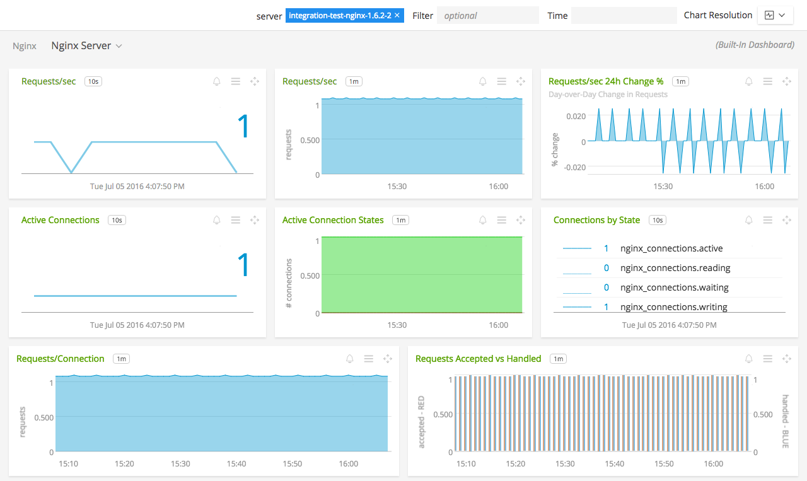

#  NGINX

Metadata associated with the NGINX collectd plugin can be found <a target="_blank" href="https://github.com/signalfx/integrations/tree/release/collectd-nginx">here</a>. The relevant code for the plugin can be found <a target="_blank" href="https://github.com/signalfx/collectd/blob/master/src/nginx.c">here</a>.

- [Description](#description)
- [Requirements and Dependencies](#requirements-and-dependencies)
- [Installation](#installation)
- [Configuration](#configuration)
- [Usage](#usage)
- [Metrics](#metrics)
- [License](#license)

### DESCRIPTION

Use the NGINX plugin for collectd to monitor NGINX webserver performance.

#### FEATURES

##### Built-in dashboards

- **NGINX Servers**: Overview of data from all NGINX servers.

  

- **NGINX Server**: Focus on a single NGINX server.

    

### REQUIREMENTS AND DEPENDENCIES

This plugin requires:

| Software          | Version        |
|-------------------|----------------|
| collectd |  4.2+  |

### INSTALLATION

**If you are using the new Smart Agent, see the docs for [the collectd/nginx
monitor](https://github.com/signalfx/signalfx-agent/tree/master/docs/monitors/collectd-nginx.md)
for more information.  The configuration documentation below may be helpful as
well, but consult the Smart Agent repo's docs for the exact schema.**

1. Installing the plugin:
    * On RHEL/CentOS and Amazon Linux systems, run the following command to install this plugin:

            yum install collectd-nginx

    * On Ubuntu and Debian systems, this plugin is included by default with the [SignalFx collectd agent](https://github.com/signalfx/integrations/tree/master/collectd).

2. Enable the `stub_status` module in your NGINX server as described [below](#configuration).

3. Download SignalFx’s <a target="_blank" href="https://github.com/signalfx/integrations/blob/master/collectd-nginx/10-nginx.conf">sample configuration file</a> to `/etc/collectd/managed_config`.

4. Modify the sample configuration file to provide values that make sense for your environment, as described in [Configuration](#configuration), below.

5. Restart collectd.

### CONFIGURATION

Using the example configuration file <a target="_blank" href="https://github.com/signalfx/integrations/blob/master/collectd-nginx/10-nginx.conf">10-nginx.conf</a> as a guide, provide values for the configuration options listed below that make sense for your environment and allow you to connect to the NGINX instance to be monitored.

| configuration option | definition | default value |
| ---------------------|------------|---------------|
| URL | URL at which collectd can access the output of the NGINX status module.  | "http://localhost:80/nginx_status" |

#### NGINX service configuration

Please see <a target="_blank" href="http://nginx.org/en/docs/http/ngx_http_stub_status_module.html">nginx docs</a> for a guide to configuring the NGINX stats module `ngx_http_stub_status_module`.

### USAGE

Sample of built-in dashboard in SignalFx:

### METRICS

The following status information is provided:

| Metric | definition |
| -------|-------------|
|Active connections| The current number of active client connections including Waiting connections.|
|accepts|The total number of accepted client connections.|
|handled|The total number of handled connections. Generally, the parameter value is the same as accepts unless some resource limits have been reached (for example, the worker\_connections limit).|
|requests|The total number of client requests.|
|Reading|The current number of connections where nginx is reading the request header.|
|Writing|The current number of connections where nginx is writing the response back to the client.|
|Waiting|The current number of idle client connections waiting for a request.|

For documentation of the metrics and dimensions emitted by this plugin, [click here](./docs).

### LICENSE

This integration is released under the Apache 2.0 license. See [LICENSE](./LICENSE) for more details.
