#  OpenStack

Metadata associated with the openstack plugin for collectd can be found [here](https://github.com/signalfx/integrations/tree/release/collectd-openstack). The relevant code for the plugin can be found [here](https://github.com/signalfx/collectd-openstack).

- [Description](#description)
- [Requirements and Dependencies](#requirements-and-dependencies)
- [Installation](#installation)
- [Configuration](#configuration)
- [Usage](#usage)
- [Metrics](#metrics)
- [License](#license)

### DESCRIPTION

This is the SignalFx openstack plugin. Follow these instructions to install the openstack plugin for collectd.

The [openstack-collectd](https://github.com/signalfx/collectd-openstack) plugin collects metrics from openstack components by hitting various endpoints. This plugin covers the following components:

* Nova (Compute)
* Cinder (BlockStorge)
* Neutron (Network)

Reference for OpenStack [Monitoring](https://wiki.openstack.org/wiki/Operations/Monitoring).

#### FEATURES

#### Built-in dashboards

- **OPENSTACK HYPERVISOR**: Provides a high-level overview metrics for a single openstack hypervisor.

  [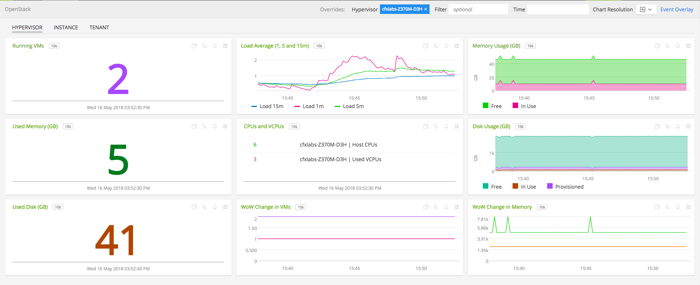](./img/openstack-hypervisor-dashboard.png)

- **OPENSTACK TENANT**: Provides metrics from a single openstack project/tenant.

  [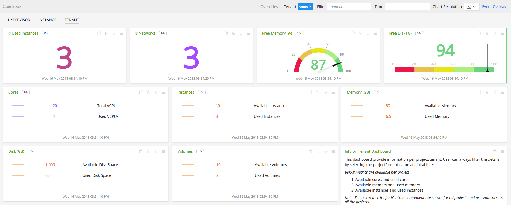](./img/openstack-tenant-dashboard.png)

- **OPENSTACK INSTANCE**: Provides metrics from a single openstack NOVA instance.

  [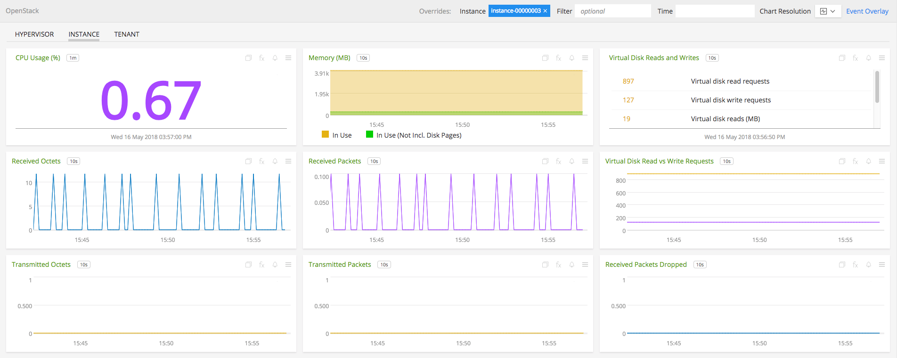](./img/openstack-instance-dashboard.png)


### REQUIREMENTS AND DEPENDENCIES

#### Version information

| Software  | Version        |
|-----------|----------------|
| collectd  |  4.9 or later  |
| python | 2.6 or later |
| Python plugin for collectd | (included with [SignalFx collectd agent](https://github.com/signalfx/integrations/tree/master/collectd)[](sfx_link:sfxcollectd)) |

### INSTALLATION

1. Download [collectd-openstack](https://github.com/signalfx/collectd-openstack). Place the `openstack_metrics.py`, `NovaMetrics.py`, `CinderMetrics.py`, and `NeutronMetrics.py` files in `/usr/share/collectd/collectd-openstack`

2. Modify the [sample configuration file](https://github.com/signalfx/integrations/tree/release/collectd-openstack/20-openstack.conf) for this plugin and copy to `/etc/collectd/managed_config`

3. Modify the sample configuration file as described in [Configuration](#configuration), below

4. Install the Python requirements with sudo ```pip install -r requirements.txt```

5. Restart collectd


### CONFIGURATION

Using the example configuration file [20-openstack.conf](https://github.com/signalfx/integrations/tree/release/collectd-openstack/20-openstack.conf) as a guide, provide values for the configuration options listed below that make sense for your environment and allow you to connect to the openstack instances

| configuration option | definition | example value |
| ---------------------|------------|---------------|
| ModulePath | Path on disk where collectd can find this module. | "/usr/share/collectd/collectd-openstack/" |
| AuthURL | Keystone authentication URL/endpoint for the OpenStack cloud | "http://localhost/identity/v3" |
| Username | Username to authenticate with keystone identity | "admin" |
| Password | Password to authenticate with keystone identity | "secret" |
| ProjectName | Specify the name of Project to be monitored | "demo" |
| ProjectDomainId | Specify the project domain | "default" |
| UserDomainId | Specify the user domain | "default" |
| Dimension | Space-separated key-value pair for a user-defined dimension | dimension\_name dimension\_value |
| Interval | Number of seconds between calls to openstack API. | 10 |

Example configuration:

```apache
LoadPlugin python
<Plugin python>
  ModulePath "/usr/share/collectd/collectd-openstack/"

  Import openstack_metrics
  <Module openstack_metrics>
        AuthURL "http://localhost/identity/v3"
        Username "admin"
        Password "secret"
        ProjectName "demo"
        ProjectDomainId "default"
        UserDomainId "default"
  </Module>
</Plugin>
```

The plugin can be configured to collect metrics from multiple projects in the following manner.

```apache
LoadPlugin python

<Plugin python>
  ModulePath "/usr/share/collectd/collectd-openstack/"

  Import openstack_metrics
  <Module openstack_metrics>
        AuthURL "http://localhost/identity/v3"
        Username "admin"
        Password "secret"
        ProjectName "demo"
        ProjectDomainId "default"
        UserDomainId "default"
  </Module>

  <Module openstack_metrics>
        AuthURL "http://localhost/identity/v3"
        Username "admin"
        Password "secret"
        ProjectName "alt_demo"
        ProjectDomainId "default"
        UserDomainId "default"
  </Module>
</Plugin>
```

### USAGE

#### Interpreting Built-in dashboards

- **OPENSTACK HYPERVISOR**:

  - **Number of VMs**: Shows the number of VMs running in the hypervisor.

    [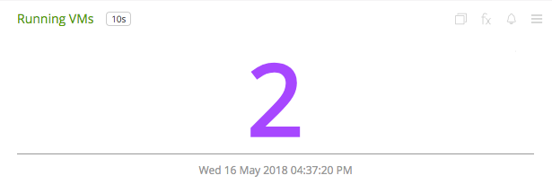](./img/chart-openstack-hypervisor-vms.png)

  - **Average CPU Load**: Shows the average CPU load on the hypervisor.

    [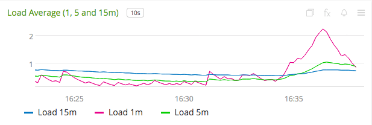](./img/chart-openstack-hypervisor-load.png)

  - **Memory Usage**: Shows the memory usage free vs used in the hypervisor.

    [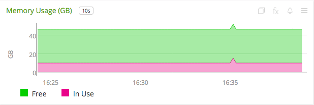](./img/chart-openstack-hypervisor-usage-memory.png)

  - **Disk Usage**: Shows the overall disk used in the hypervisor.

    [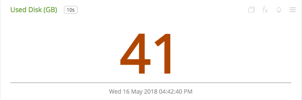](./img/chart-openstack-hypervisor-used-disk.png)

  - **Number of CPUs and VCPUs**: Shows the number of CPUs available and VCPUs used in the hypervisor.

    [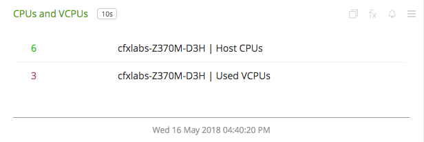](./img/chart-openstack-hypervisor-vcpus.png)

  - **Memory WoW change**: Shows the WoW (week over week) change in memory in the hypervisor.

    [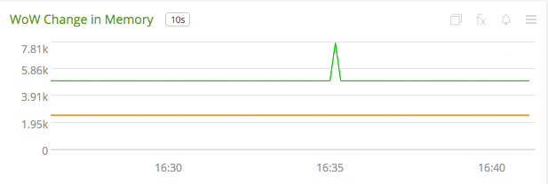](./img/chart-openstack-hypervisor-wowmemory.png)


- **OPENSTACK TENANT**:

  - **Number of Instances**: Shows the number of used instances in the tenant/project.

    [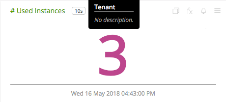](./img/chart-openstack-tenant-instances.png)

  - **Free Memory**: Shows the percentage of free memory in the tenant/project.

    [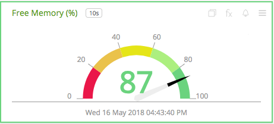](./img/chart-openstack-tenant-free-memory.png)

  - **Number of VCPUs used**: Shows the number of used VCPUs over available VCPUs in the tenant/project.

    [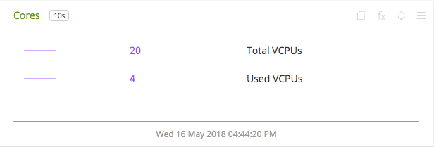](./img/chart-openstack-tenant-cores.png)

  - **Number of Floating IPs**: Shows the number of used floating ips over available in the tenant/project.

    [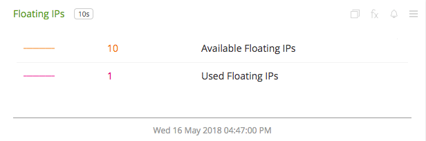](./img/chart-openstack-tenant-floatingips.png)

  - **Free Disk**: Shows the percentage of free disk in the tenant/project.

    [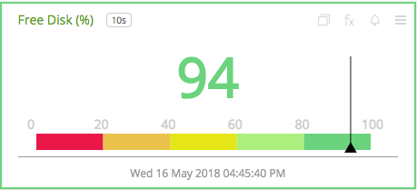](./img/chart-openstack-tenant-free-disk.png)

  - **Memory Used vs Available**: Shows the used memory over available in the tenant/project.

    [](./img/chart-openstack-tenant-memory.png)

  - **Volumes Used vs Available**: Shows the used volumes over available volumes in the tenant/project.

    [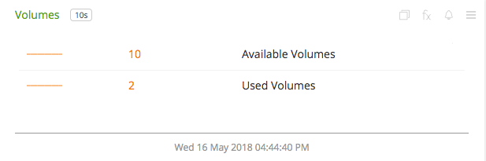](./img/chart-openstack-tenant-volumes.png)

  - **Neutron Resources**: Shows the usage of various resources in the Neutron.

    [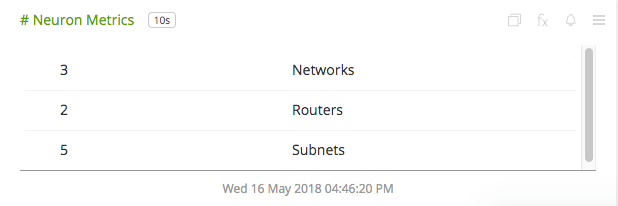](./img/chart-openstack-tenant-neutron.png)


- **OPENSTACK INSTANCE**:

  - **CPU Usage**: Shows the percentage of CPU usage of an instance.

    [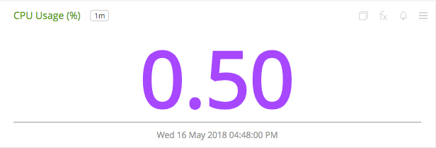](./img/chart-openstack-instance-cpu.png)

  - **Memory Usage**: Shows the used memory in the instance.

    [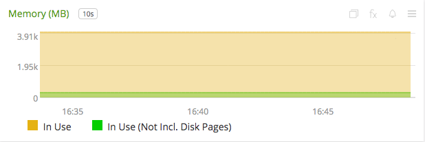](./img/chart-openstack-instance-memory.png)

  - **Received Network Packets**: Shows the number of network packets received at the instance.

    [](./img/chart-openstack-instance-rx-packets.png)

  - **Virtual Disk Reads and Writes**: Shows the virtual disk reads and write requests of the instance.

    [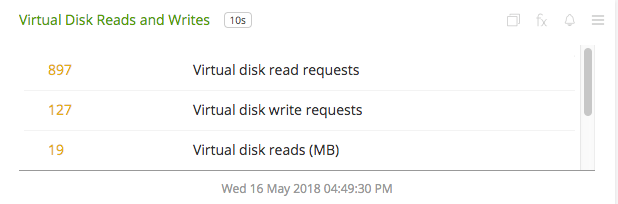](./img/chart-openstack-instance-vda.png)

  
A few other details:

* `plugin` is always set to `openstack`
* `plugin_instance` will contain the project id and name of the project given in the configuration


### METRICS
Metrics about a hypervisor, tenant and instances are collected by default. For documentation of the metrics and dimensions emitted by this plugin, [click here](./docs). Note, that SignalFx does not support `histogram` and `summary` metric types (hence, metrics of these will be skipped if provided in the configuration). See [usage](#usage) for details.


#### Metric naming
`<metric type>.openstack.<component>.<name of metric>`. This is the format of default metric names reported by the plugin.


### LICENSE

This integration is released under the Apache 2.0 license. See [LICENSE](./LICENSE) for more details.
