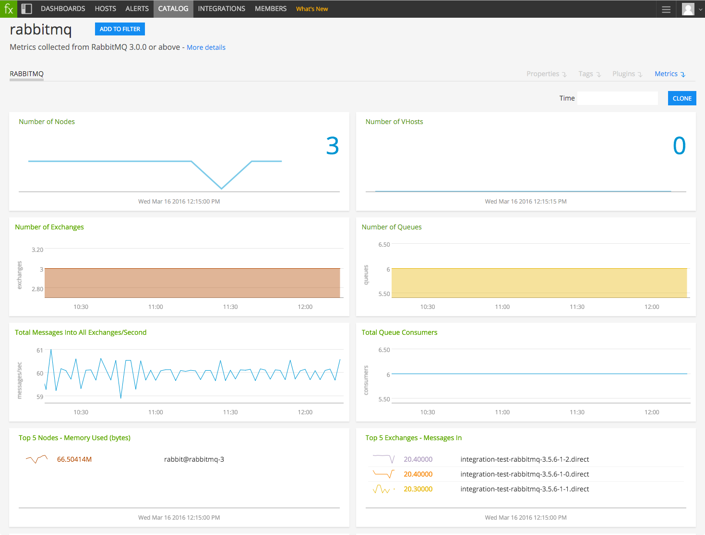

#  RabbitMQ

Metadata associated with the RabbitMQ collectd plugin can be found <a target="_blank" href="https://github.com/signalfx/integrations/tree/release/collectd-rabbitmq">here</a>. The relevant code for the plugin can be found <a target="_blank" href="https://github.com/signalfx/collectd-rabbitmq">here</a>.

- [Description](#description)
- [Requirements and Dependencies](#requirements-and-dependencies)
- [Installation](#installation)
- [Configuration](#configuration)
- [Usage](#usage)
- [Metrics](#metrics)
- [License](#license)

### DESCRIPTION

The RabbitMQ plugin that collects statistics from RabbitMQ. The plugin uses the <a target="_blank" href="https://www.rabbitmq.com/management.html">RabbitMQ Management HTTP API</a> to poll for statistics on a RabbitMQ server, then reports them to collectd.

#### FEATURES

##### Built-in dashboards

- **RabbitMQ**: Overview of data from all RabbitMQ nodes.

  

- **RabbitMQ Node**: Focus on a single RabbitMQ node.

  

### REQUIREMENTS AND DEPENDENCIES

This plugin requires:

| Software          | Version        |
|-------------------|----------------|
| collectd | 4.9+ |
| Python plugin for collectd | (included with [SignalFx collectd agent](https://github.com/signalfx/integrations/tree/master/collectd)) |
| Python |  2.6+  |
| RabbitMQ | 3.0+ |
| RabbitMQ Management plugin | (match with RabbitMQ version)|

### INSTALLATION

**If you are using the new Smart Agent, see the docs for [the collectd/rabbitmq
monitor](https://github.com/signalfx/signalfx-agent/tree/master/docs/monitors/collectd-rabbitmq.md)
for more information.  The configuration documentation below may be helpful as
well, but consult the Smart Agent repo's docs for the exact schema.**

1. Download the <a target="_blank" href="https://github.com/signalfx/collectd-rabbitmq/">collectd-rabbitmq Python module</a>

2. Download SignalFx’s <a target="_blank" href="https://github.com/signalfx/integrations/blob/master/collectd-rabbitmq/10-rabbitmq.conf">sample configuration file</a> to `/etc/collectd/managed_config`.

3. Modify the configuration file as described in [Configuration](#configuration) below.

4. Restart collectd.

### CONFIGURATION

Using the example configuration file <a target="_blank" href="https://github.com/signalfx/integrations/tree/master/collectd-rabbitmq/10-rabbitmq.conf">10-rabbitmq.conf</a> as a guide, provide values for the configuration options listed below that make sense for your environment and allow you to connect to the RabbitMQ instance to be monitored.

| configuration option | definition | example value |
| ---------------------|------------|---------------|
| Username | Username that collectd will use to connect to RabbitMQ | "guest" |
| Password | Password for user indicated in `Username` | "guest" |
| Host | Hostname at which collectd can connect to RabbitMQ | "localhost" |
|Port | Port number at which collectd can connect to RabbitMQ | "15672" |
|CollectChannels| Toggles the collection of `channels` metrics | false |
|CollectConnections| Toggles the collection of `connections` metrics| false |
|CollectExchanges | Toggles the collection of `exchanges` metrics| true |
|CollectNodes | Toggles the collection of `nodes` metrics| true |
|CollectQueues | Toggles the collection of `queues` metrics| true |
| HTTPTimeout | Timeout in seconds for connecting to the RabbitMQ Management API | 60 |
| FieldLength | This option should only be specified if you are *not* running the SignalFx fork of collectd. It should be set to 1 less than the value for `DATA_MAX_NAME_LEN` in `plugin.h` that you compiled collectd with. Typically this would be 127 for collectd versions 5.6.0 or newer, or 63 for versions earlier than 5.6.0. | 63 |
| VerbosityLevel | Representation of the quantity of metrics generated by RabbitMQ that are actually reported to SignalFx. If not specified, the default value is `info`. The verbosity levels are as follows: <ui><li>`info`: Only the most commonly-used metrics are reported</li><li>`debug`: Additonal metrics useful for debugging are reported</li><li>`trace`: All available metrics are reported</li></ui> | "info" |

### USAGE

Sample of built-in dashboard in SignalFx:

#### Metric naming

When collectd is configured to publish metrics to SignalFx, metrics from this plugin will be named according to the format: `<metric type>.<category>.<statistic>`

For example:

- `gauge.connection.recv_oct_details.rate`
- `counter.connection.send_oct`
- `gauge.queue.message_stats.deliver_get_details.rate`

### METRICS

For documentation of the metrics and dimensions emitted by this plugin, [click here](./docs).

### LICENSE

This integration is released under the Apache 2.0 license. See [LICENSE](./LICENSE) for more details.
