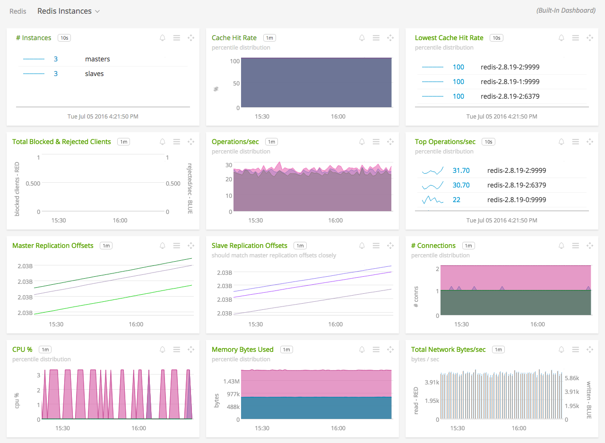
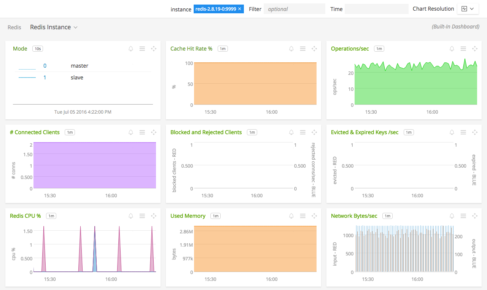

#  Redis

Metadata associated with the Redis collectd plugin can be found <a target="_blank" href="https://github.com/signalfx/integrations/tree/release/collectd-redis">here</a>. The relevant code for the plugin can be found <a target="_blank" href="https://github.com/signalfx/redis-collectd-plugin">here</a>.

- [Description](#description)
- [Requirements and Dependencies](#requirements-and-dependencies)
- [Installation](#installation)
- [Configuration](#configuration)
- [Usage](#usage)
- [Metrics](#metrics)
- [License](#license)

### DESCRIPTION

A <a target="_blank" href="http://redis.io">Redis</a> plugin for <a target="_blank" href="http://collectd.org">collectd</a> using the Python plugin for collectd.

You can capture any kind of Redis metrics like:

 * Memory used
 * Commands processed per second
 * Number of connected clients and slaves
 * Number of blocked clients
 * Number of keys stored (per database)
 * Uptime
 * Changes since last save
 * Replication delay (per slave)

#### FEATURES

##### Built-in dashboards

- **Redis Instances**: Overview of data from all Redis instances.

  [](./img/dashboard_redis_instances.png)

- **Redis Instance**: Focus on a single Redis instance.

  [](./img/dashboard_redis_instance.png)  

### REQUIREMENTS AND DEPENDENCIES

This plugin requires:

| Software          | Version        |
|-------------------|----------------|
| collectd   |  4.9+  |
| Python plugin for collectd | (included with [SignalFx collectd agent](https://github.com/signalfx/integrations/tree/master/collectd)[](sfx_link:sfxcollectd)) |
| Python    |  2.6+ |
| redis | 2.8+ |


### INSTALLATION

**If you are using the new Smart Agent, see the docs for [the collectd/redis
monitor](https://github.com/signalfx/signalfx-agent/tree/master/docs/monitors/collectd-redis.md)
for more information.  The configuration documentation below may be helpful as
well, but consult the Smart Agent repo's docs for the exact schema.**


1. Download the <a target="_blank" href="https://github.com/signalfx/redis-collectd-plugin">redis-collectd-plugin Python module</a>.

2. Download SignalFx's sample configuration files for a <a target="_blank" href="https://github.com/signalfx/integrations/tree/master/collectd-redis/10-redis_master.conf">Redis master</a> or <a target="_blank" href="https://github.com/signalfx/integrations/tree/master/collectd-redis/10-redis_slave.conf">Redis slave</a> to `/etc/collectd/managed_config`.

3. Modify the sample configuration file as described in  [Configuration](#configuration), below.

4. Restart collectd.

### CONFIGURATION

Using the example configuration files <a target="_blank" href="https://github.com/signalfx/integrations/tree/master/collectd-redis/10-redis_master.conf">10-redis\_master.conf</a> or <a target="_blank" href="https://github.com/signalfx/integrations/tree/master/collectd-redis/10-redis_slave.conf">10-redis\_slave.conf</a> as a guide, provide values for the configuration options listed below that make sense for your environment and allow you to connect to the Redis instance to be monitored.

| Configuration Option | Type | Definition |
|----------------------|------|------------|
| Instance | Nodename | The Module block identifies a Redis instance running in an specified host and port. The name for node is a canonical identifier which is used as plugin instance. It is limited to 64 characters in length.|
| Host | Hostname |The Host option is the hostname or IP-address where the Redis instance is running.|
|Port |Port| The Port option is the TCP port on which the Redis instance accepts connections. Either a service name of a port number may be given. Please note that numerical port numbers must be given as a string, too.|
| Auth | Password | Optionally specify a password to use for AUTH. |
| SendListLength | (DB Index) (Key pattern) | Specify a pattern of keys to lists for which to send their length as a metric. See below for more details. |

#### Note: Monitoring multiple Redis instances on one host

You can configure this plugin to monitor multiple Redis instances on the same machine by repeating the <Module> section, as in the following example:

```
<Plugin python>
  ModulePath "/opt/collectd_plugins"
  Import "redis_info"

  <Module redis_info>
    Host "127.0.0.1"
    Port 9100
    Verbose true
    Instance "instance_9100"
    Redis_uptime_in_seconds "gauge"
    Redis_used_memory "bytes"
    Redis_used_memory_peak "bytes"
  </Module>

  <Module redis_info>
    Host "127.0.0.1"
    Port 9101
    Verbose true
    Instance "instance_9101"
    Redis_uptime_in_seconds "gauge"
    Redis_used_memory "bytes"
    Redis_used_memory_peak "bytes"
    Redis_master_repl_offset "gauge"
  </Module>

  <Module redis_info>
    Host "127.0.0.1"
    Port 9102
    Verbose true
    Instance "instance_9102"
    Redis_uptime_in_seconds "gauge"
    Redis_used_memory "bytes"
    Redis_used_memory_peak "bytes"
    Redis_slave_repl_offset "gauge"
  </Module>
</Plugin>
```

#### Note: value of plugin_instance

In the example above, 3 redis instances on the same host listen on different ports and `Instance` is used to supply a static value for the dimension `plugin_instance`. If `Instance` was not specified, the value of `plugin_instance` reported by collectd would contain the combination of `Host` and `Port` as follows:

- "plugin\_instance" => "127.0.0.1:9100"
- "plugin\_instance" => "127.0.0.1:9101"
- "plugin\_instance" => "127.0.0.1:9102"

### USAGE

Sample of built-in dashboard in SignalFx:


#### Monitoring length of Redis lists
To monitor the length of list keys, the key and database index must be
specified in the config file. Specify keys in the config file in the form
`SendListLength $db_index "$key_name"`.  `$key_name` can be a globbed pattern
(only `*` is supported), in which case all keys matching that glob will be
processed.  Don't forget to surround the pattern with double quotes or else
Collectd will strip out the asterisks.  If any keys match the glob that are not
lists, an error will be sent to the collectd logs.

Lengths will be reported to SignalFx under the metric `gauge.key_llen`, a
separate time series for each list.

**Warning**: The `KEYS` command is used to match the globs so don't try and
match something that is very big, as this command is not highly optimized and
can block other commands from executing.

Note: To avoid duplication reporting, this should only be reported in one node.
Keys can be defined in either the master or slave config.
```
<Plugin python>
  ModulePath "/opt/collectd_plugins"
  Import "redis_info"

  <Module redis_info>
    Host "127.0.0.1"
    Port 9100
    # Matches "mylist1", "mylist-test", etc...  Don't forget double quotes!
    SendListLength 0 "mylist*"
    SendListLength 0 "message-queue"
    Verbose true
    Instance "instance_9100"
    Redis_uptime_in_seconds "gauge"
    Redis_used_memory "bytes"
    Redis_used_memory_peak "bytes"
  </Module>
```

### METRICS

For documentation of the metrics and dimensions emitted by this plugin, [click here](./docs).

### LICENSE

This integration is released under the Apache 2.0 license. See [LICENSE](./LICENSE) for more details.
