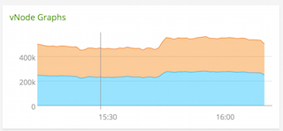
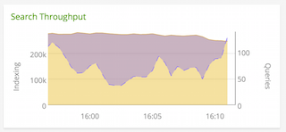
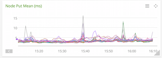
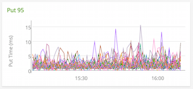
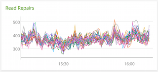
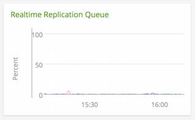

#  Riak KV

Metadata associated with the Riak KV collectd Configuration can be found <a target="_blank" href="https://github.com/signalfx/integrations/tree/release/collectd-riak">here</a>. The relevant code for the cURL-JSON plugin can be found <a target="_blank" href="https://github.com/signalfx/collectd/blob/master/src/curl_json.c">here</a>.

- [Description](#description)
- [Requirements and Dependencies](#requirements-and-dependencies)
- [Installation](#installation)
- [Configuration](#configuration)
- [Usage](#usage)
- [Metrics](#metrics)
- [License](#license)

### DESCRIPTION

From <a target="_blank" href="http://basho.com/products/riak-kv/">Basho site</a>:

Riak KV is a distributed NoSQL database with a key/value design and advanced local and multi-cluster replication that guarantees reads and writes even in the event of hardware failures or network partitions.

This plugin captures the following metrics about Riak:

* vNode Put and Get metrics
* Read Repair counters
* Search index and query times
* memory
* cpu activity

The plugin also captures the following enterprise metrics:

* Multi-Datacenter replication throughput
* queue backlog

### REQUIREMENTS AND DEPENDENCIES

This plugin requires:

| Software          | Version        |
|-------------------|----------------|
| collectd | 4.9+  |
| cURL-JSON plugin | (match with collectd version) |
|  Riak KV  | 1.4.0+ |

### INSTALLATION

This plugin is included with [SignalFx's collectd package](https://support.signalfx.com/hc/en-us/articles/208080123).

1. Download SignalFx's <a target="_blank" href="https://github.com/signalfx/integrations/tree/master/collectd-riak/10-riak.conf">sample configuration file </a> for this plugin.

2. Modify the sample configuration file as described in [Configuration](#configuration), below.

3. Add the following line to `/etc/collectd.conf`, replacing the example path with the location of the configuration file:

        include '/path/to/10-riak.conf'

4. Restart collectd.

### CONFIGURATION

Using the example configuration file <a target="_blank" href="https://github.com/signalfx/integrations/tree/master/collectd-riak/10-riak.conf">10-riak.conf</a> as a guide, provide values for the configuration options listed below that make sense for your environment and allow you to connect to the Riak KV instance to be monitored.

| Setting	| Value |
|----------|----------|
| Hostname	| riak1 |
| Base directory for collectd |	/var/lib/collectd |
| collectd .pid file	| /var/run/collectd.pid |
| collectd plugin directory	| /usr/local/lib/collectd |
| collectd types.db file	| /usr/local/share/collectd/types.db |
| Riak stats URL	| http://localhost:8098/stats |
| Riak Repl stats URL | http://localhost:8098/riak-repl/stats |
| Riak node/instance name	| riak1@127.0.0.1 |

#### Note: Monitoring Riak Multi-Datacenter Replication

Replication is part of the Riak KV <a target="_blank" href="http://docs.basho.com/riakee/latest/cookbooks/Multi-Data-Center-Replication-Architecture/">enterprise</a> package. Unless this feature is enabled, all the metrics available at ../riak-repl/stats will be empty.

### USAGE

Below are screen captures of dashboards created for this plugin by SignalFx, illustrating the metrics emitted by this plugin.

For general reference on how to monitor Riak performance, see <a target="_blank" href="http://docs.basho.com/riak/latest/ops/running/stats-and-monitoring/">Riak Stats and Monitoring</a>.

**Monitoring Riak Clusters**

Throughput for Riak KV can be measured in a few different ways. PUTs and GETs are the most common type of requests. These metrics can be gathered for nodes as well as vNodes.



*vNode PUTs and GETs showing the number cluster operations per minute*

Riak Search throughput can be measured separately in terms of number of documents indexed and queries performed. If using Search, it's a good idea to keep an eye on these numbers since running queries can heavily tax system resources.



*Search Throughput is useful to see where cpu/mem/network usage might be coming from*

Latency metrics are useful to determine if Riak is slowing down requests from  applications. Riak should respond to PUTs and GETs very quickly - single digit milliseconds - otherwise applications start to suffer. If there is a serious issue with Riak, this is most likely the first indicator that something is going wrong. Keeping an eye on the 95/99 percentile metrics are also useful to uncover issues unseen in the mean latency times.

 

*Put mean times below 5ms means our applications are very happy*

General Riak Health can be determined using a few metrics available from the stats URL. Here we show Read Repairs which show how healthy the data is in the custer. If repairs increase significantly this could indicate nodes going offline or vnode data missing.



*Consistent and low count of read repairs indicates a healthy cluster*

**Riak Multi-Datacenter Replication Monitoring**

#### Note: This section applies to Riak KV Enterprise Edition.

Some production workloads require replicating all data from one Riak cluster to another Riak cluster (often in another datacenter or Availability Zone). This would be useful in the event of the loss of one cluster or other distributed workloads. Each node in each cluster can participate in replication. There is a local queue on each Riak node that should be monitored to ensure it is not filling up.




*The queue is very low so replication is working*

This is not an exhaustive list of metrics, there are dozens of metrics that are useful to keep an eye on regularly. In addition to this plugin, collectd can measure CPU, memory, disk IO, and network all of which are relevant to maintaining a healthy cluster.


### METRICS

For documentation of the metrics and dimensions emitted by this plugin, [click here](./docs).

#### Note: Discover _all_ Available Riak Metrics

There are nearly 400 metrics that can be sent to SignalFx using curl. The configurations here include some commonly used stats. The exhaustive list can be obtained by curling any Riak KV node.

```
curl -X GET http://localhost:8098/stats
```

Optionally, use jsonpp to produce an easily parsable list:

```
brew install jsonpp
curl -X GET http://localhost:8098/stats | jsonpp
```

### LICENSE

This integration is released under the Apache 2.0 license. See [LICENSE](./LICENSE) for more details.
