#  Apache Solr

Metadata associated with the solr plugin for collectd can be found <a target="_blank" href="https://github.com/signalfx/integrations/tree/release/collectd-solr">here</a>. The relevant code for the plugin can be found <a target="_blank" href="https://github.com/signalfx/collectd-solr">here</a>.

- [Description](#description)
- [Requirements and Dependencies](#requirements-and-dependencies)
- [Installation](#installation)
- [Configuration](#configuration)
- [Usage](#usage)
- [Metrics](#metrics)
- [License](#license)

### DESCRIPTION

*NOTE: This plugin can collect metrics from Solr only when a Solr instance is running in SolrCloud mode*

This is the SignalFx solr plugin. Follow these instructions to install the solr plugin for collectd.

The <a target="_blank" href="https://github.com/signalfx/collectd-solr">solr-collectd</a> plugin collects metrics from solr instances hitting these endpoints: <a target="_blank" href="https://lucene.apache.org/solr/guide/6_6/performance-statistics-reference.html">statistics</a> (default metrics)  and <a target="_blank" href="https://lucene.apache.org/solr/guide/6_6/metrics-reporting.html">metrics</a> (optional metrics).

#### FEATURES

#### Built-in dashboards

- **SOLR CLUSTER**: Provides a high-level overview of metrics for a single solr cluster.

  [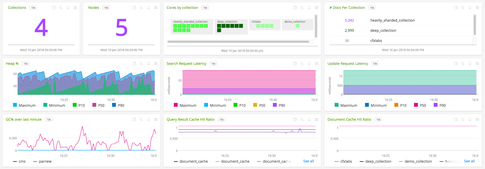](./img/solr-cluster-dashboard-top.png)

  [](./img/solr-cluster-dashboard-bottom.png)  

- **SOLR COLLECTION**: Provides metrics from a single solr collection.

  [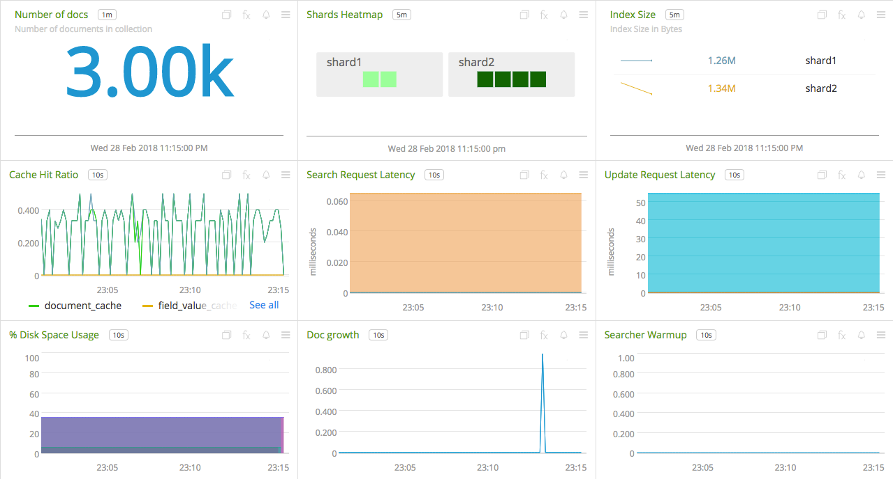](./img/solr-collection-dashboard.png)

- **SOLR NODE**: Provides metrics from a single solr instance/node.

  [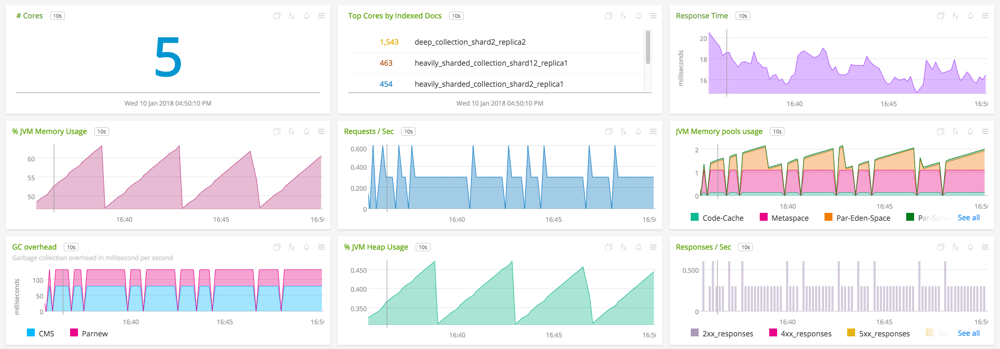](./img/solr-node-dashboard.png)

- **SOLR NODES**: Provides metrics from nodes on a particular host.

  [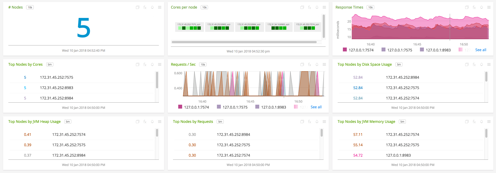](./img/solr-nodes-dashboard.png)


### REQUIREMENTS AND DEPENDENCIES

#### Version information

| Software  | Version        |
|-----------|----------------|
| collectd  |  4.9 or later  |
| python | 2.6 or later |
| solr | 6.6 or later |
| Python plugin for collectd | (included with [SignalFx collectd agent](https://github.com/signalfx/integrations/tree/master/collectd)[](sfx_link:sfxcollectd)) |

### INSTALLATION

1. Download <a target="_blank" href="https://github.com/signalfx/collectd-solr">collectd-solr</a>. Place the `solr_collectd.py` file in `/usr/share/collectd/collectd-solr`

2. Modify the <a target="_blank" href="https://github.com/signalfx/integrations/tree/release/collectd-solr/20-solr.conf">sample configuration file</a> for this plugin to `/etc/collectd/managed_config`

3. Modify the sample configuration file as described in [Configuration](#configuration), below

4. Install the Python requirements with sudo ```pip install -r requirements.txt```

5. Restart collectd


### CONFIGURATION

Using the example configuration file <a target="_blank" href="https://github.com/signalfx/integrations/tree/release/collectd-solr/20-solr.conf">20-solr.conf</a> as a guide, provide values for the configuration options listed below that make sense for your environment and allow you to connect to the solr nodes

| configuration option | definition | example value |
| ---------------------|------------|---------------|
| ModulePath | Path on disk where collectd can find this module. | "/usr/share/collectd/collectd-solr/" |
| Host | Host name of the solr node | "localhost" |
| Port | Port at which the node can be reached | "8983" |
| Cluster | Name of this solr cluster. | "demo" |
| EnhancedMetrics | Boolean to indicate whether stats from `/metrics` are needed | "false" |
| IncludeMetric | Metric name from the `/admin/metrics` endpoint to include(valid when EnhancedMetrics is "false") | "" |
| ExcludeMetric | Metric name from the `/admin/metrics` endpoint to exclude(valid when EnhancedMetrics is "true") | "" |
| Dimension | Space-separated key-value pair for a user-defined dimension | dimension\_name dimension\_value |
| Interval | Number of seconds between calls to solr API. | 10 |
| ssl\_keyfile | Path to the keyfile | "path/to/file" |
| ssl\_certificate | Path to the certificate | "path/to/file" |
| ssl\_ca\_certs | Path to the ca file | "path/to/file" |

Example configuration:

```apache
LoadPlugin python
<Plugin python>
  ModulePath "/usr/share/collectd/collectd-solr/"

  Import solr_plugin
  <Module solr_plugin>
    Host "localhost"
    Port "8983"
    Interval 10
    Cluster "prod"
    Dimension dimension_name dimension_value
    EnhancedMetrics False
    IncludeMetric metric_name_from_metrics_endpoint
    ssl_keyfile "/Users/as001/work/play/solr/solr-ca/solr-ca/private/solr-client.key"
    ssl_certificate "/Users/as001/work/play/solr/solr-ca/solr-ca/certs/solr-client.crt"
    ssl_ca_certs "/Users/as001/work/play/solr/solr-ca/solr-ca/certs/ca.crt"
  </Module>
</Plugin>
```

The plugin can be configured to collect metrics from multiple nodes in the following manner.

```apache
LoadPlugin python

<Plugin python>
  ModulePath "/usr/share/collectd/collectd-solr/"
  Import solr_plugin
  <Module solr_plugin>
    Host "localhost"
    Port "8983"
    Interval 10
    Cluster "prod"
  </Module>
  <Module solr_plugin>
    Host "localhost"
    Port "7574"
    Interval 10
    Cluster "prod"
    IncludeMetric "metrics.solr.node.ADMIN./admin/zookeeper.serverErrors.meanRate"
    IncludeMetric "metrics.solr.jetty.org.eclipse.jetty.server.handler.DefaultHandler.post-requests.count"
  </Module>
  <Module solr_plugin>
    Host "localhost"
    Port "8984"
    Interval 10
    Cluster "test"
  </Module>
</Plugin>
```

### USAGE

#### Interpreting Built-in dashboards

- **SOLR CLUSTER**:

  - **Number of Collections**: Shows the number of collections in the cluster.

    [](./img/chart-solr-cluster-collections.png)

  - **Number of Nodes**: Shows the number of nodes in the cluster.

    [](./img/chart-solr-cluster-nodes.png)

  - **Index Size per Collection**: Shows the total index size by collection for all the collections in the cluster.

    [](./img/chart-solr-cluster-collection-index-sizes.png)

  - **Document Cache Hit Ratio**: Shows the cumulative document cache hit ration for all collections in the cluster.

    [](./img/chart-solr-cluster-document-cache-hit-ratio.png)

  - **Query Result Cache Hit Ratio**: Shows the cumulative query result cache hit ration for all collections in the cluster.

    [](./img/chart-solr-cluster-query-result-cache-hit-ratio.png)

  - **Overall Heap Usage**: Shows the average, minimum, maximum, percentile distribution heap usage of the cluster.

    [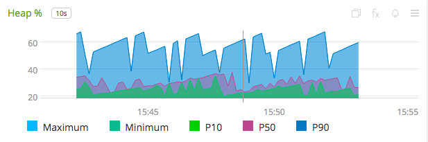](./img/chart-solr-cluster-heap-usage.png)

  - **GC Invocations**: Shows the mean parnew & cms GC invocations over last minute in the cluster.

    [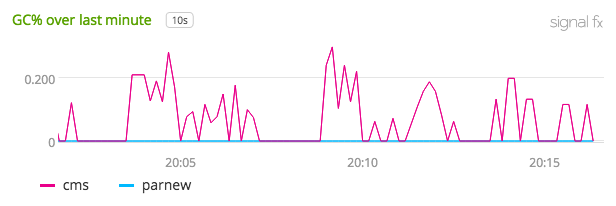](./img/chart-solr-cluster-gc-over-last-minute.png)

  - **Search Request Latency**: Shows the average time taken to process a search request in the cluster.

    [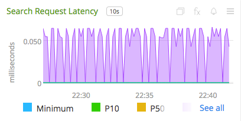](./img/chart-solr-cluster-search-request-latency.png)


- **SOLR COLLECTION**:

  - **Number of Documents**: Shows the number of documents in the collection.

    [](./img/chart-solr-collection-num-docs.png)

  - **Number of Shards**: Shows the number of shards & cores per shard in the collection.

    [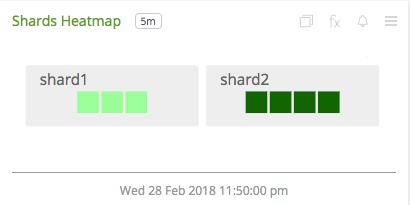](./img/chart-solr-collection-shards-heatmap.png)

  - **Documents Growth**: Shows growth in the number of documents in the collection.

    [](./img/chart-solr-collection-doc-growth.png)

  - **Overall Cache Hit Ratio**: Shows the various caches cumulative hit ratio in the collection.

    [](./img/chart-solr-collection-cache-hit-ratio.png)


- **SOLR NODE**:

  - **Number of Cores**: Shows the number of cores in the node.

    [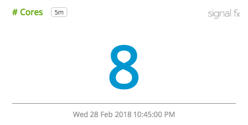](./img/chart-solr-node-num-cores.png)

  - **Cores by Indexed Documents**: Shows the top cores by number of indexed documents in the node.

    [](./img/chart-solr-node-top-cores-indexed-docs.png)

  - **Http Request Latency**: Shows the response time of http requests to the cores in the node.

    [](./img/chart-solr-node-response-time.png)

  - **JVM Memory Pools Usage**: Shows the usage of JVM memory pools.

    [](./img/chart-solr-node-jvm-memory-pools-usage.png)


- **SOLR NODES**:

  - **Number of Nodes**: Shows the total number of Solr nodes monitored in the org.

    [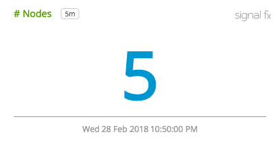](./img/chart-solr-nodes-num-nodes.png)

  - **Number of Cores Heatmap**: Shows the total number of cores in heapmap for each node.

    [](./img/chart-solr-nodes-cores-per-node.png)

  - **Http response time**: Shows the http response time of each node.

    [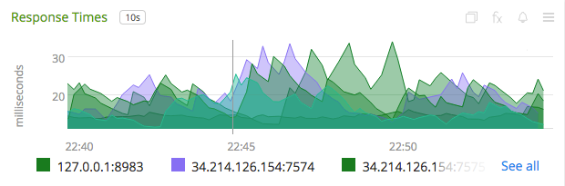](./img/chart-solr-nodes-response-times.png)

  - **Number of Requests**: Shows the number of requests for each node.

    [](./img/chart-solr-nodes-requests-per-sec.png)


A few other details:

* `plugin` is always set to `solr`
* `plugin_instance` will contain the IP address and the port of the node given in the configuration
* To add metrics from the `/admin/metrics` endpoint, use the configuration options mentioned in [configuration](#configuration). If metrics are being included individually, make sure to give names that are valid.


### METRICS
By default, metrics about a collection, shard and core are provided. For documentation of the metrics and dimensions emitted by this plugin, [click here](./docs). Note, that SignalFx does not support `histogram` and `summary` metric types (hence, metrics of these will be skipped if provided in the configuration). See [usage](#usage) for details.


#### Metric naming
`<metric type>.solr.<endpoint name>.<name of metric>`. This is the format of default metric names reported by the plugin. Optional metrics are named as available from the `/metrics` endpoint with `_` replaced by `.`.


### LICENSE

This integration is released under the Apache 2.0 license. See [LICENSE](./LICENSE) for more details.
