#  Apache Spark  

**Plugin currently supports cluster modes Standalone, Mesos and Hadoop Yarn**

Metadata associated with the spark plugin for collectd can be found <a target="_blank" href="https://github.com/signalfx/integrations/tree/release/collectd-spark">here</a>. The relevant code for the plugin can be found <a target="_blank" href="https://github.com/signalfx/collectd-spark">here</a>.

- [Description](#description)
- [Requirements and Dependencies](#requirements-and-dependencies)
- [Installation](#installation)
- [Configuration](#configuration)
- [Usage](#usage)
- [Metrics](#metrics)
- [License](#license)

### DESCRIPTION

This is the SignalFx Apache Spark plugin. Note we currently only support cluster modes 
Standalone, Mesos, and Hadoop Yarn. Follow these instructions to install the Apache Spark plugin for collectd.

The <a target="_blank" href="https://github.com/signalfx/collectd-spark">spark-collectd</a> plugin collects metrics from Spark cluster and instances hitting endpoints specified in Spark's Monitoring and Instrumentation documentation under `REST API` and `Metrics`: <a target="_blank" href="https://spark.apache.org/docs/latest/monitoring.html">Spark documentation</a>

#### FEATURES

#### Built-in dashboards

- **Spark Overview**: Overview of Spark cluster.

  [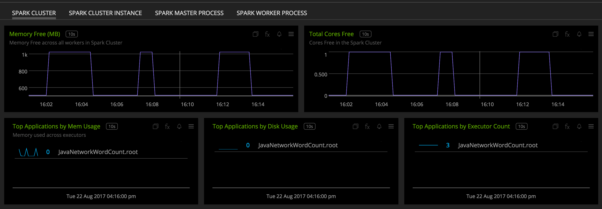](./img/dashboard_spark_cluster_top.png)

  [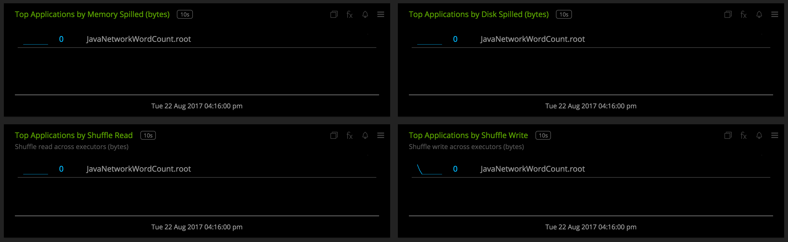](./img/dashboard_spark_cluster_bottom.png)

- **Master Process**: Overview of master process (data captured from Metrics sink).

  [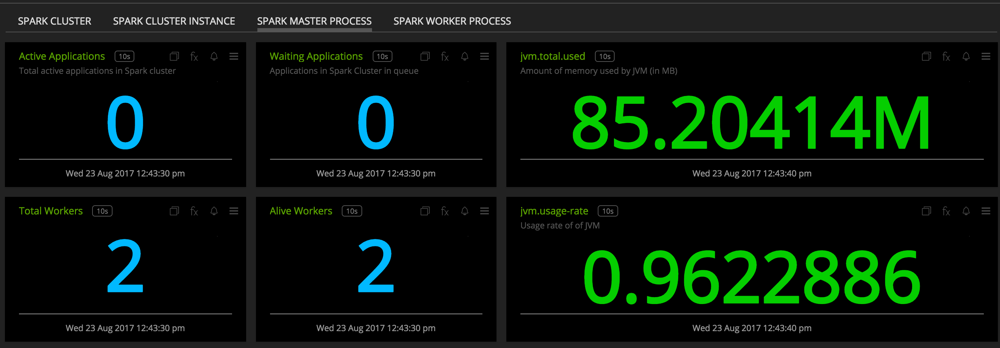](./img/dashboard_master_top.png)

  [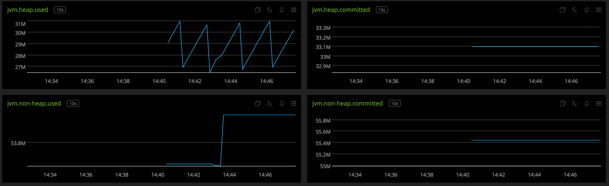](./img/dashboard_master_bottom.png)

- **Worker Process**: Overview of worker process (data captured from Metrics sink).

  [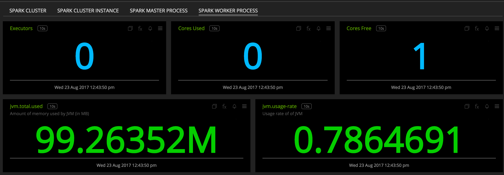](./img/dashboard_worker_top.png)

  [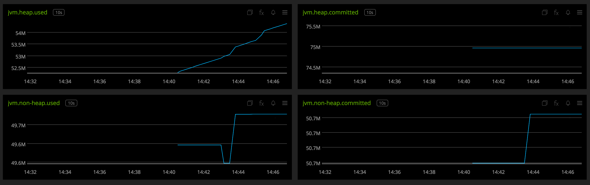](./img/dashboard_worker_bottom.png)

- **Spark Application**: Overview of data by Spark Application and user.

  [](./img/dashboard_spark_app_top.png)

  [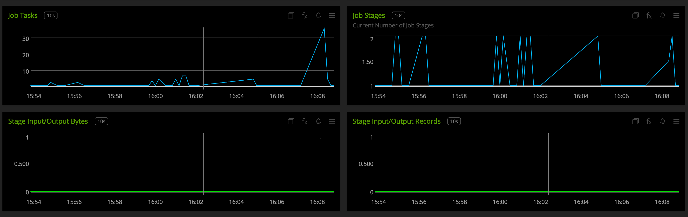](./img/dashboard_spark_app_bottom.png)

- **Running Jobs**: Overview of running jobs by Spark Application and user.

  [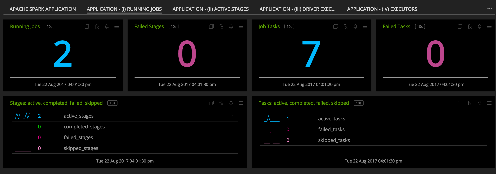](./img/dashboard_jobs.png)

- **Active Stages**: Overview of active stages by Spark Application and user.

  [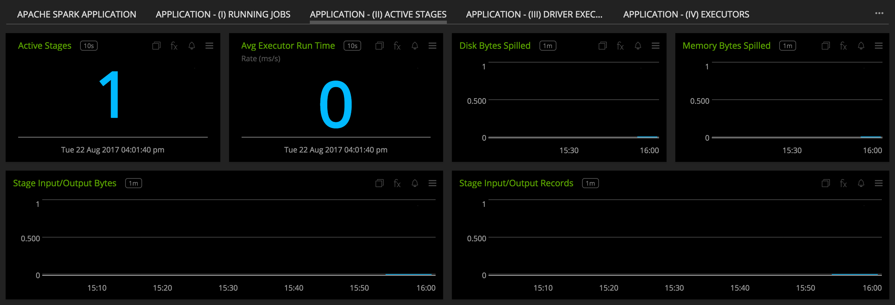](./img/dashboard_stages.png)

- **Driver**: Overview of driver executor by Spark Application and user.

  [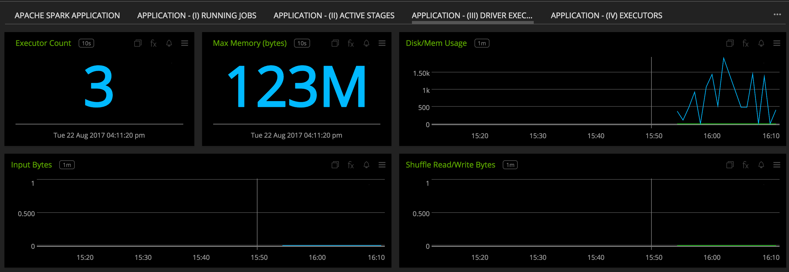](./img/dashboard_driver.png)

- **Executors**: Overview of executors (excluding driver) by Spark Application and user.

  [](./img/dashboard_executors.png)

- **Streaming Statistics**: Overview of streaming applications by Spark Application and user.

  [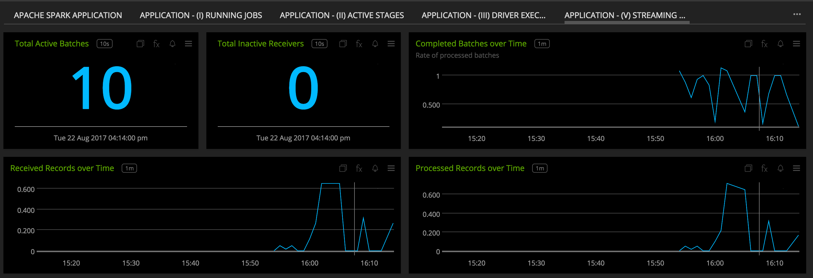](./img/dashboard_streaming_top.png)

  [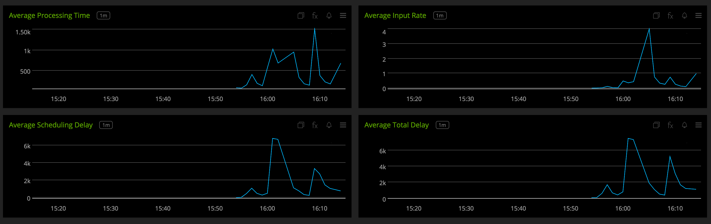](./img/dashboard_streaming_bottom.png)

### REQUIREMENTS AND DEPENDENCIES

#### Version information

| Software  | Version        |
|-----------|----------------|
| collectd  |  4.9 or later  |
| python | 2.6 or later |
| spark | 2.2.0 or later |
| Python plugin for collectd | (included with [SignalFx collectd agent](https://github.com/signalfx/integrations/tree/master/collectd)[](sfx_link:sfxcollectd)) |

### INSTALLATION

**If you are using the new Smart Agent, see the docs for [the collectd/spark
monitor](https://github.com/signalfx/signalfx-agent/tree/master/docs/monitors/collectd-spark.md)
for more information.  The configuration documentation below may be helpful as
well, but consult the Smart Agent repo's docs for the exact schema.**


1. Download <a target="_blank" href="https://github.com/signalfx/collectd-spark">collectd-spark</a>. Place the `spark_plugin.py` file in `/usr/share/collectd/collectd-spark`

2. Modify the <a target="_blank" href="https://github.com/signalfx/integrations/tree/release/collectd-spark/10-spark.conf">sample configuration file</a> for this plugin to `/etc/collectd/managed_config`

3. Modify the sample configuration file as described in [Configuration](#configuration), below

4. Install the Python requirements with sudo ```pip install -r requirements.txt```

5. Restart collectd


### CONFIGURATION

Using the example configuration file <a target="_blank" href="https://github.com/signalfx/integrations/tree/release/collectd-spark/10-spark.conf">10-spark.conf</a> as a guide, provide values for the configuration options listed below that make sense for your environment and the metrics you want to be collected and reported.

| configuration option | definition | example value |
| ---------------------|------------|---------------|
| ModulePath | Path on disk where collectd can find this module. | "/usr/share/collectd/collectd-spark/" |
| MetricsURL | URL for master or worker node if Metrics source (and therefore, by default Metrics HTTP Servlet Sink) are enabled | "http://localhost" |
| MasterPort | Master (webui) port to query for metrics  | 8080 |
| WorkerPorts | Space-separated worker (webui) ports to query for metrics | 8081 8082 |
| Applications | Boolean indicating whether to collect application level metrics | "False" |
| Master | URL for master application | "http://localhost:8080" |
| Cluster | Your Spark cluster mode - only `Standalone`, `Mesos`, and `Yarn` are supported | "Standalone" |
| EnhancedMetrics | Flag to specify whether to include additional metrics | "False" |
| IncludeMetrics | Metrics from enhanced metrics that can be included individually | "metric\_name\_1,metric\_name\_2" |
| ExcludeMetrics | Metrics from enhanced metrics that can be excluded individually | "metric\_name\_1,metric\_name2" |
| Dimension | Key-value pair for a user-defined dimension | "dimension\_key=dimension\_value" |
| Dimension | Comma-separated key-value pairs for user-defined dimensions | "dimension\_key1=dimension\_value1,dimension\_key2=dimension\_value2" |

Example configuration:

```apache
LoadPlugin python
<Plugin python>
  ModulePath "/usr/share/collectd/collectd-spark"

  Import spark_plugin

  <Module spark_plugin>
  MetricsURL "http://127.0.0.1"
  MasterPort 8080
  WorkerPorts 8081 8082
  Applications "True"
  Master "http://127.0.0.1:8080"
  Cluster "Standalone"
  EnhancedMetrics "True"
  ExcludeMetrics "jvm.pools.Code-Cache.committed"
  </Module>
</Plugin>
```

The plugin can be configured to collect metrics from multiple instances in the following manner.

```apache
LoadPlugin python
<Plugin python>
  ModulePath "/usr/share/collectd/collectd-spark"

  Import spark_plugin

  <Module spark_plugin>
    MetricsURL "http://master"
    MasterPort 8080
    Applications "True"
    Master "http://master:8080"
    Cluster "Standalone"
    Dimension "name=MASTERTEST"
    IncludeMetrics "jvm.pools.Code-Cache.committed"
  </Module>

  <Module spark_plugin>
    MetricsURL "http://worker"
    WorkerPorts 8081 8082
    Applications "False"
    Master "http://master:8080"
    Dimension "name=WORKER1TEST"
    IncludeMetrics "jvm.pools.Code-Cache.committed"
  </Module>
</Plugin>
```

**When running Spark on Hadoop Yarn, this integration is only capable of
reporting application metrics from the master node. Please use the
<a target="_blank" href="https://github.com/signalfx/integrations/tree/release/collectd-hadoop">
SignalFx collectd Hadoop plugin</a> to report on the health of the cluster.**

An example configuration for monitoring applications on Hadoop Yarn

```apache
LoadPlugin python
<Plugin python>
  ModulePath "/usr/share/collectd/collectd-spark"

  Import spark_plugin

  <Module spark_plugin>
    Cluster "Yarn"
    Master "http://127.0.0.1:8080"
    MasterPort 8080
    MetricsURL "http://127.0.0.1"
    Applications "True"
    EnhancedMetrics "True"
  </Module>
</Plugin>
```

### USAGE

Sample of built-in dashboard in SignalFx:


Metrics corresponding to Metrics sink will contain the following dimension by default:

* `spark_process`, either master or worker to differentiate master- and worker- specific metrics like master.apps and worker.coresFree

Metrics at the application level (endpoint /api/v1/applications) will contain the following dimension by default:

* `cluster`, set to value corresponding to key "Cluster" in configuration file

Additional details:

* `plugin` is always set to `apache_spark`


### METRICS
To emphasize, metrics will only be collected if MetricsURL is provided and/or Applications is set to True in 10-spark.conf (please read the example configuration file for associated required keys). For documentation of the metrics and dimensions emitted by this plugin, [click here](./docs). See [usage](#usage) for details.

The following are default metrics captured and sent if Metrics Sink and Applications are enabled:

* jvm.total.used
* jvm.total.committed
* jvm.heap.used
* jvm.heap.committed
* jvm.non-heap.used
* jvm.non-heap.committed
* jvm.MarkSweepCompact.count
* jvm.MarkSweepCompact.time
* worker.coresFree
* worker.coresUsed
* worker.executors
* worker.memFree_MB
* worker.memUsed_MB
* master.aliveWorkers
* master.apps
* master.waitingApps
* master.workers
* spark.job.num_tasks
* spark.job.num_active_tasks
* spark.job.num_completed_tasks
* spark.job.num_skipped_tasks
* spark.job.num_failed_tasks
* spark.job.num_active_stages
* spark.job.num_completed_stages
* spark.job.num_skipped_stages
* spark.job.num_failed_stages
* spark.stage.executor_run_time
* spark.stage.input_bytes
* spark.stage.input_records
* spark.stage.output_bytes
* spark.stage.output_records
* spark.stage.memory_bytes_spilled
* spark.stage.disk_bytes_spilled
* spark.driver.memory_used
* spark.driver.disk_used
* spark.driver.total_input_bytes
* spark.driver.total_shuffle_read
* spark.driver.total_shuffle_write
* spark.driver.max_memory
* spark.executor.memory_used
* spark.executor.disk_used
* spark.executor.total_input_bytes
* spark.executor.total_shuffle_read
* spark.executor.total_shuffle_write
* spark.executor.max_memory
* spark.streaming.avg_input_rate
* spark.streaming.num_total_completed_batches
* spark.streaming.num_active_batches
* spark.streaming.num_inactive_receivers
* spark.streaming.num_received_records
* spark.streaming.num_processed_records
* spark.streaming.avg_processing_time
* spark.streaming.avg_scheduling_delay
* spark.streaming.avg_total_delay

The following are metrics that can be collected and sent if EnhancedMetrics is set to "True" in configurations (see [CONFIGURATION](#configuration) for more information):

* jvm.pools.Code-Cache.used
* jvm.pools.Code-Cache.committed
* jvm.pools.Compressed-Class-Space.used
* jvm.pools.Compressed-Class-Space.committed
* jvm.pools.Metaspace.used
* jvm.pools.Metaspace.committed
* jvm.pools.Eden-Space.used
* jvm.pools.Eden-Space.committed
* jvm.pools.Survivor-Space.used
* jvm.pools.Survivor-Space.committed
* jvm.pools.Tenured-Gen.used
* jvm.pools.Tenured-Gen.committed
* HiveExternalCatalog.fileCacheHits
* HiveExternalCatalog.filesDiscovered
* HiveExternalCatalog.hiveClientCalls
* HiveExternalCatalog.parallelListingJobCount
* HiveExternalCatalog.partitionsFetched
* spark.stage.shuffle_read_bytes
* spark.stage.shuffle_read_records
* spark.stage.shuffle_write_bytes
* spark.stage.shuffle_write_records
* spark.driver.rdd_blocks
* spark.driver.active_tasks
* spark.driver.failed_tasks
* spark.driver.completed_tasks
* spark.driver.total_tasks
* spark.driver.total_duration
* spark.executor.rdd_blocks
* spark.executor.active_tasks
* spark.executor.failed_tasks
* spark.executor.completed_tasks
* spark.executor.total_tasks
* spark.executor.total_duration

#### Metric naming
`<metric type>.spark.<name of metric>` or `<metric type><name of metric>`. This is the format of default metric names reported by the plugin.


### LICENSE

This integration is released under the Apache 2.0 license. See [LICENSE](./LICENSE) for more details.
