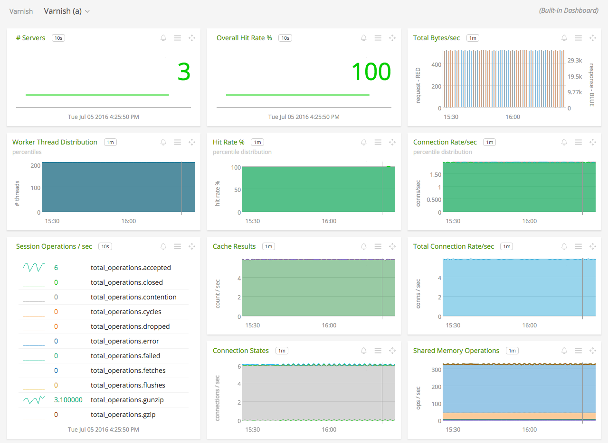
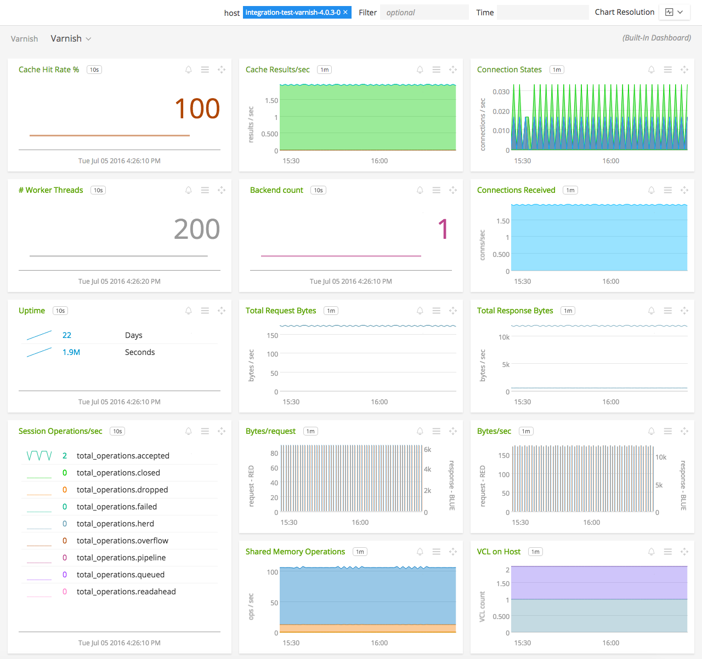

#  Varnish

Metadata associated with the Varnish collectd plugin can be found <a target="_blank" href="https://github.com/signalfx/integrations/tree/release/collectd-varnish">here</a>. The relevant code for the plugin can be found <a target="_blank" href="https://github.com/signalfx/collectd/blob/master/src/varnish.c">here</a>.

- [Description](#description)
- [Requirements and Dependencies](#requirements-and-dependencies)
- [Installation](#installation)
- [Configuration](#configuration)
- [Usage](#usage)
- [Metrics](#metrics)
- [License](#license)

### DESCRIPTION

The Varnish collectd plugin collects metrics from Varnish and sends them to SignalFx.

Varnish Cache is a web application accelerator also known as a caching HTTP reverse proxy. You install it in front of any server that speaks HTTP and configure it to cache the contents. Varnish Cache is really, really fast. It typically speeds up delivery with a factor of 300 - 1000x, depending on your architecture.

#### FEATURES

##### Built-in dashboards

- **Varnish (a)**: Overview of data from all Varnish servers.

  [](./img/dashboard_varnish_a.png)

- **Varnish**: Focus on a single Varnish server.

  [](./img/dashboard_varnish.png)

### REQUIREMENTS AND DEPENDENCIES

| Software  | Version        |
|-----------|----------------|
| collectd  |  5.1* or later (varnish 4.0+ requires collectd 5.5+)  |


### INSTALLATION

1. On RHEL/CentOS and Amazon Linux systems, run the following command to install this plugin:

        yum install collectd-varnish

2. Download SignalFx's <a target="_blank" href="https://github.com/signalfx/integrations/blob/master/collectd-varnish/10-varnish.conf">sample configuration file</a> to `/etc/collectd/managed_config`.

3. Modify the sample configuration file to provide values that make sense for your environment, as described in [Configuration](#configuration) below.

4. Restart collectd.

#### Special Instructions for installing Varnish 3 on Ubuntu

Starting with collectd 5.6.1-sfx0, the varnish plugin provided within the SignalFx Package only supports varnish 4.
Follow these steps to add varnish 3 plugin support:

1. Copy the <a target="_blank" href="https://dl.signalfx.com/debs/collectd-varnish/varnish3.so">varnish3.so</a> file to the collectd library directory `/usr/lib/collectd/`.

2. Update the configuration file `10-varnish.conf` in your `/etc/collectd/managed_config` directory to show `varnish3` instead of `varnish` as the name used by the LoadPlugin.

3. Restart collectd.

Example configuration for Varnish 3 on Ubuntu
```apache
LoadPlugin varnish3
<Plugin "varnish">
  <Instance>
    CollectCache       true
    CollectConnections true
    CollectBackend     true
    CollectSHM         true
    CollectESI         true
    CollectFetch       true
    CollectHCB         true
    CollectSMA         true
    CollectSMS         true
    CollectSM          true
    CollectTotals      true
    CollectWorkers     true
    CollectUptime      true
    CollectVCL         true
    CollectStruct      true
    CollectObjects     true
    CollectSession     true
    CollectVSM         true
  </Instance>
</Plugin>
```

### CONFIGURATION

There is no configuration required for the varnish collectd plugin. The default configuration is setup to bring in data on a large variety of metrics.

If using the sample configuration file <a target="_blank" href="https://github.com/signalfx/integrations/tree/master/collectd-varnish/10-varnish.conf">10-varnish.conf</a>, no additional configuration is required. The following optional settings allow you to configure the metrics that will be sent using this plugin:

| Setting            | Description     | Default  |
|--------------------|----------------------------|----------|
| CollectBackend     | Back-end connection statistics, such as successful, reused, and closed connections.                               | enabled  |
| CollectCache       | Cache hits and misses.                                                                                            | enabled  |
| CollectConnections | Number of client connections received, accepted and dropped.                                                      | enabled  |
| CollectESI         | Edge Side Includes (ESI) parse statistics.                                                                        | enabled |
| CollectFetch       | Statistics about fetches (HTTP requests sent to the backend).                                                     | enabled |
| CollectHCB         | Inserts and look-ups in the crit bit tree based hash. Look-ups are divided into locked and unlocked look-ups.     | enabled |
| CollectSHM         | Statistics about the shared memory log, a memory region to store log messages which is flushed to disk when full. | enabled  |
| CollectSM          | file (memory mapped file) storage statistics.                                                                     | enabled |
| CollectSMA         | malloc or umem (umem\_alloc(3MALLOC) based) storage statistics. The umem storage component is Solaris specific.    | enabled |
| CollectSMS         | synth (synthetic content) storage statistics. This storage component is used internally only.                     | enabled |
| CollectTotals      | Collects overview counters, such as the number of sessions created, the number of requests and bytes transferred. | enabled |
| CollectWorkers     | Collect statistics about worker threads.                                                                          | enabled |

### USAGE

Sample of built-in dashboard in SignalFx:


### METRICS

| Field name        | Description                   | Collected (Yes/No) | Collectd option    |
|-------------------|-------------------------------|--------------------|--------------------|
| uptime            | Child uptime                  | No                 | n/a                |
| client\_conn       | Client connections accepted   | Yes                | CollectConnections |
| client\_drop       | Connection dropped, no sess   | Yes                |                    |
| client\_req        | Client requests received      | Yes                |                    |
| cache\_hit         | Cache hits                    | Yes                | CollectCache       |
| cache\_hitpass     | Cache hits for pass           | Yes                |                    |
| cache\_miss        | Cache misses                  | Yes                |                    |
| backend\_conn      | Backend conn. success         | Yes                | CollectBackend     |
| backend\_unhealthy | Backend conn. not attempted   | Yes                |                    |
| backend\_busy      | Backend conn. too many        | Yes                |                    |
| backend\_fail      | Backend conn. failures        | Yes                |                    |
| backend\_reuse     | Backend conn. reuses          | Yes                |                    |
| backend\_toolate   | Backend conn. was closed      | Yes                |                    |
| backend\_recycle   | Backend conn. recycles        | Yes                |                    |
| backend\_unused    | Backend conn. unused          | Yes                |                    |
| fetch\_head        | Fetch head                    | Yes                | CollectFetch       |
| fetch\_length      | Fetch with Length             | Yes                |                    |
| fetch\_chunked     | Fetch chunked                 | Yes                |                    |
| fetch\_eof         | Fetch EOF                     | Yes                |                    |
| fetch\_bad         | Fetch had bad headers         | Yes                |                    |
| fetch\_close       | Fetch wanted close            | Yes                |                    |
| fetch\_oldhttp     | Fetch pre HTTP/1.1 closed     | Yes                |                    |
| fetch\_zero        | Fetch zero len                | Yes                |                    |
| fetch\_failed      | Fetch failed                  | Yes                |                    |
| n\_sess\_mem        | N struct sess\_mem             | No                 | n/a                |
| n\_sess            | N struct sess                 | No                 |                    |
| n\_object          | N struct object               | No                 |                    |
| n\_vampireobject   | N unresurrected objects       | No                 |                    |
| n\_objectcore      | N struct objectcore           | No                 |                    |
| n\_objecthead      | N struct objecthead           | No                 |                    |
| n\_smf             | N struct smf                  | No                 |                    |
| n\_smf\_frag        | N small free smf              | No                 |                    |
| n\_smf\_large       | N large free smf              | No                 |                    |
| n\_vbe\_conn        | N struct vbe\_conn             | No                 |                    |
| n\_wrk             | N worker threads              | Yes                | CollectWorkers     |
| n\_wrk\_create      | N worker threads created      | Yes                |                    |
| n\_wrk\_failed      | N worker threads not created  | Yes                |                    |
| n\_wrk\_max         | N worker threads limited      | Yes                |                    |
| n\_wrk\_queue       | N queued work requests        | Yes                |                    |
| n\_wrk\_overflow    | N overflowed work requests    | Yes                |                    |
| n\_wrk\_drop        | N dropped work requests       | Yes                |                    |
| n\_backend         | N backends                    | No                 | n/a                |
| n\_expired         | N expired objects             | No                 |                    |
| n\_lru\_nuked       | N LRU nuked objects           | No                 |                    |
| n\_lru\_saved       | N LRU saved objects           | No                 |                    |
| n\_lru\_moved       | N LRU moved objects           | No                 |                    |
| n\_deathrow        | N objects on deathrow         | No                 |                    |
| losthdr           | HTTP header overflows         | No                 |                    |
| n\_objsendfile     | Objects sent with sendfile    | No                 |                    |
| n\_objwrite        | Objects sent with write       | No                 |                    |
| n\_objoverflow     | Objects overflowing workspace | No                 |                    |
| s\_sess            | Total Sessions                | Yes                | CollectTotals      |
| s\_req             | Total Requests                | Yes                |                    |
| s\_pipe            | Total pipe                    | Yes                |                    |
| s\_pass            | Total pass                    | Yes                |                    |
| s\_fetch           | Total fetch                   | Yes                |                    |
| s\_hdrbytes        | Total header bytes            | Yes                |                    |
| s\_bodybytes       | Total body bytes              | Yes                |                    |
| sess\_closed       | Session Closed                | No                 | n/a                |
| sess\_pipeline     | Session Pipeline              | No                 |                    |
| sess\_readahead    | Session Read Ahead            | No                 |                    |
| sess\_linger       | Session Linger                | No                 |                    |
| sess\_herd         | Session herd                  | No                 |                    |
| shm\_records       | SHM records                   | Yes                | CollectSHM         |
| shm\_writes        | SHM writes                    | Yes                |                    |
| shm\_flushes       | SHM flushes due to overflow   | Yes                |                    |
| shm\_cont          | SHM MTX contention            | Yes                |                    |
| shm\_cycles        | SHM cycles through buffer     | Yes                |                    |
| sm\_nreq           | allocator requests            | Yes                | CollectSM          |
| sm\_nobj           | outstanding allocations       | Yes                |                    |
| sm\_balloc         | bytes allocated               | Yes                |                    |
| sm\_bfree          | bytes free                    | Yes                |                    |
| sma\_nreq          | SMA allocator requests        | Yes                | CollectSMA         |
| sma\_nobj          | SMA outstanding allocations   | Yes                |                    |
| sma\_nbytes        | SMA outstanding bytes         | Yes                |                    |
| sma\_balloc        | SMA bytes allocated           | Yes                |                    |
| sma\_bfree         | SMA bytes free                | Yes                |                    |
| sms\_nreq          | SMS allocator requests        | Yes                | CollectSMS         |
| sms\_nobj          | SMS outstanding allocations   | Yes                |                    |
| sms\_nbytes        | SMS outstanding bytes         | Yes                |                    |
| sms\_balloc        | SMS bytes allocated           | Yes                |                    |
| sms\_bfree         | SMS bytes freed               | Yes                |                    |
| backend\_req       | Backend requests made         | No                 | n/a                |
| n\_vcl             | N vcl total                   | No                 |                    |
| n\_vcl\_avail       | N vcl available               | No                 |                    |
| n\_vcl\_discard     | N vcl discarded               | No                 |                    |
| n\_purge           | N total active purges         | No                 |                    |
| n\_purge\_add       | N new purges added            | No                 |                    |
| n\_purge\_retire    | N old purges deleted          | No                 |                    |
| n\_purge\_obj\_test  | N objects tested              | No                 |                    |
| n\_purge\_re\_test   | N regexps tested against      | No                 |                    |
| n\_purge\_dups      | N duplicate purges removed    | No                 |                    |
| hcb\_nolock        | HCB Lookups without lock      | Yes                | CollectHCB         |
| hcb\_lock          | HCB Lookups with lock         | Yes                |                    |
| hcb\_insert        | HCB Inserts                   | Yes                |                    |
| esi\_parse         | Objects ESI parsed (unlock)   | Yes                | CollectESI         |
| esi\_errors        | ESI parse errors (unlock)     | Yes                |                    |

For documentation of the metrics and dimensions emitted by this plugin, [click here](./docs).

### LICENSE

This integration is released under the Apache 2.0 license. See [LICENSE](./LICENSE) for more details.
