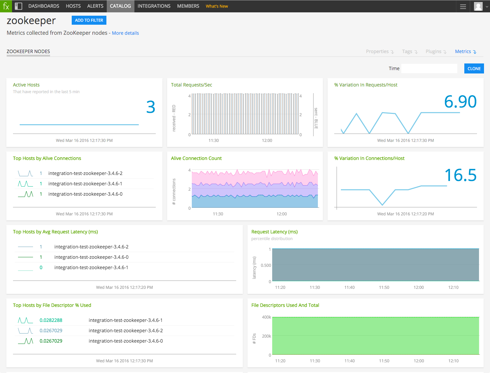

#  Zookeeper

Metadata associated with SignalFx's integration with Zookeeper can be found <a target="_blank" href="https://github.com/signalfx/integrations/tree/release/collectd-zookeeper">here</a>. The relevant code for the plugin can be found <a target="_blank" href="https://github.com/signalfx/collectd-zookeeper">here</a>.

- [Description](#description)
- [Requirements and Dependencies](#requirements-and-dependencies)
- [Installation](#installation)
- [Configuration](#configuration)
- [Usage](#usage)
- [Metrics](#metrics)
- [License](#license)

### DESCRIPTION

This is a collectd plugin for getting metrics and information from <a target="_blank" href="http://zookeeper.apache.org">ZooKeeper</a> servers, based on the ZooKeeper monitoring script <a target="_blank" href="https://svn.apache.org/repos/asf/zookeeper/trunk/src/contrib/monitoring/check_zookeeper.py">check_zookeeper.py</a>.

#### FEATURES

##### Built-in dashboards

- **Zookeeper Nodes**: Overview of data from all Zookeeper nodes.

  

- **Zookeeper Node**: Focus on a single Zookeeper node.

    

### REQUIREMENTS AND DEPENDENCIES

This plugin requires:

| Software          | Version        |
|-------------------|----------------|
| collectd          | 4.9+    |
| Python plugin for collectd | (included with [SignalFx collectd agent](https://github.com/signalfx/integrations/tree/master/collectd)) |
| Python            | 2.6+     |
| Zookeeper         | 3.4.0+   |

#### Note:
 - Requires ZooKeeper 3.4.0 or greater in order to use the `mntr` <a target="_blank" href="http://zookeeper.apache.org/doc/trunk/zookeeperAdmin.html#sc_zkCommands">four letter word command</a>.
 - If support for earlier versions is needed, add `srvr` command, available in since 3.3.0, or `stat` (fetches extra uneeded data but available pre-3.3).

### INSTALLATION

**If you are using the new Smart Agent, see the docs for [the collectd/zookeeper
monitor](https://github.com/signalfx/signalfx-agent/tree/master/docs/monitors/collectd-zookeeper.md)
for more information.  The configuration documentation below may be helpful as
well, but consult the Smart Agent repo's docs for the exact schema.**

1. Download the <a target="_blank" href="https://github.com/signalfx/collectd-zookeeper">collectd-zookeeper Python module</a>.

2. Download SignalFx’s <a target="_blank" href="https://github.com/signalfx/integrations/blob/master/collectd-zookeeper/20-zookeeper.conf">sample configuration file</a> to `/etc/collectd/managed_config`.

3. Modify the configuration file as described in [Configuration](#configuration) below.

4. Restart collectd.

### CONFIGURATION

Using the example configuration file <a target="_blank" href="https://github.com/signalfx/integrations/tree/master/collectd-zookeeper/20-zookeeper.conf">20-zookeeper.conf</a> as a guide, provide values for the configuration options listed below that make sense for your environment and allow you to connect to the Zookeeper instance to be monitored.

| Setting            | Description     | Default|
|--------------------|-----------------|-----------|
|Hosts | Hostname where Zookeeper is running | `"localhost"`|
|Port| port number for Zookeeper  | `2181`|
|Instance | Specify a cluster name | none (commented out)|

### USAGE

Sample of built-in dashboard in SignalFx:

### METRICS

For documentation of the metrics and dimensions emitted by this plugin, [click here](./docs).

### LICENSE

This integration is released under the Apache 2.0 license. See [LICENSE](./LICENSE) for more details.
