#  Consul

Metadata associated with this integration can be found <a target="_blank" href="https://github.com/signalfx/integrations/tree/release/consul">here</a>. The relevant code for the integration can be found <a target="_blank" href="https://github.com/signalfx/collectd-consul">here</a>.

- [Description](#description)
- [Requirements and Dependencies](#requirements-and-dependencies)
- [Installation](#installation)
- [Configuration](#configuration)
- [Usage](#usage)
- [Metrics](#metrics)
- [License](#license)

#### FEATURES

##### Built-in dashboards

- **CONSUL CLUSTER**: Provides a high-level overview of metrics for a single Consul cluster.

  [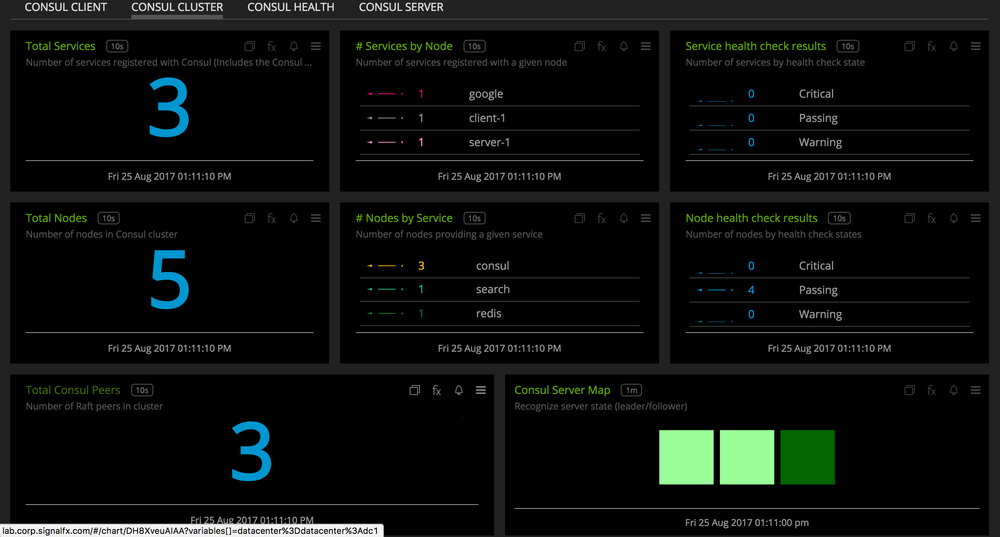](./img/dashboard_cluster_top.png)

  [](./img/dashboard_cluster_bottom.png)

- **CONSUL HEALTH**: Provides key metrics to monitoring Consul's performance.

  [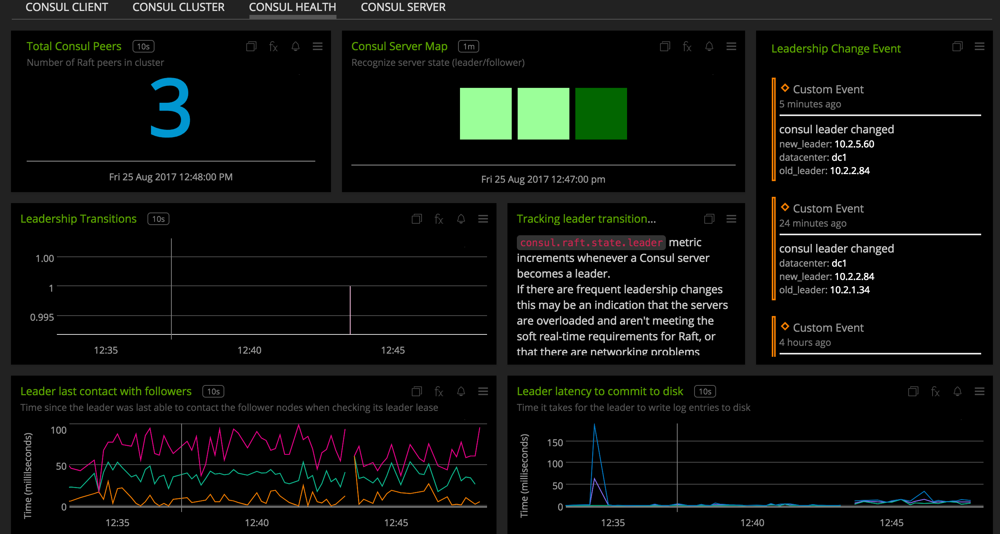](./img/dashboard_health_top.png)

  [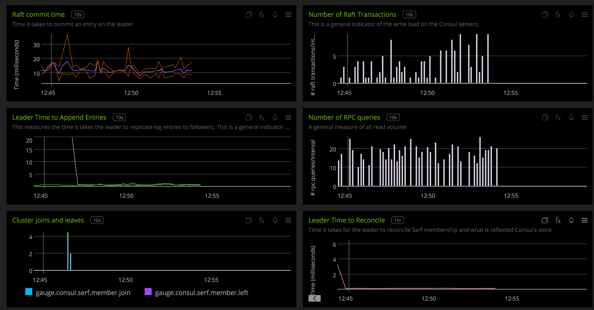](./img/dashboard_health_middle.png)

  [](./img/dashboard_health_bottom.png)

- **CONSUL SERVER**: Provides server-specific metrics.

  [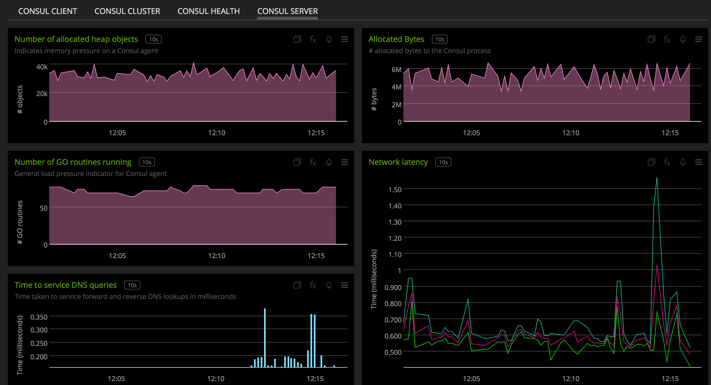](./img/dashboard_server_top.png)

  [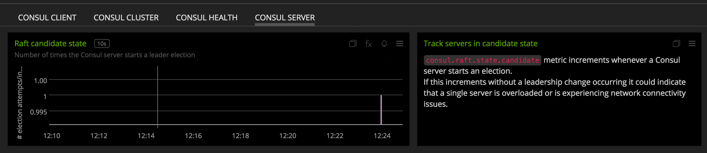](./img/dashboard_server_bottom.png)

- **CONSUL CLIENT**: Provides client-specific metrics.

  [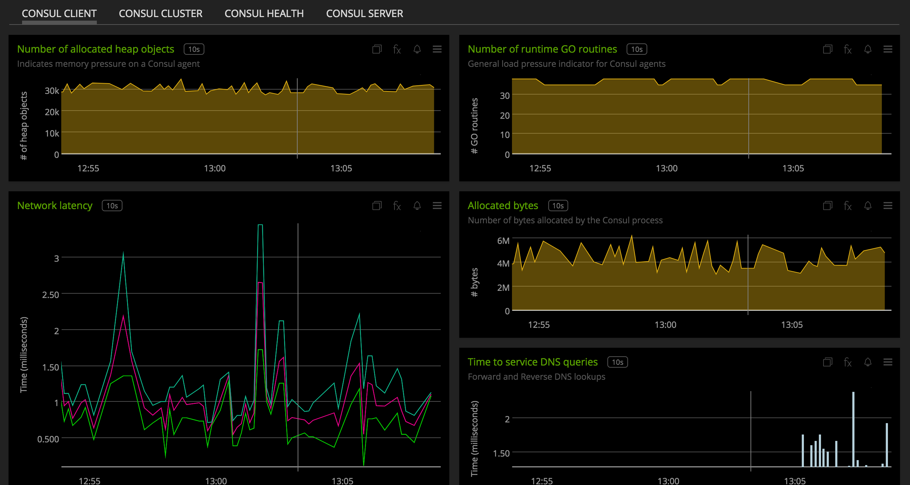](./img/dashboard_client.png)


### USAGE

#### Interpreting Built-in dashboards

- **CONSUL CLUSTER**:

  - **Total Services**: Shows the total number of services registered with the Consul cluster.

    [](./img/chart_cluster_total_services.png)

  - **Total Nodes**: Shows the total number of nodes in the Consul cluster's catalog. Nodes include instances running consul agent in either client or server mode and external nodes registered with the Consul store.

    [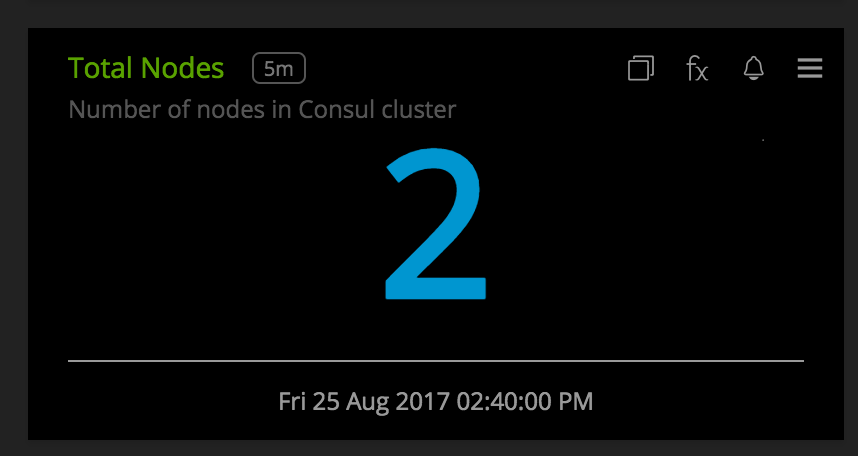](./img/chart_cluster_total_nodes.png)

  - **Number of services by node**: Descending list showing the number of services that are registered with a given node. The node name displayed is the Consul NodeName config value.

    [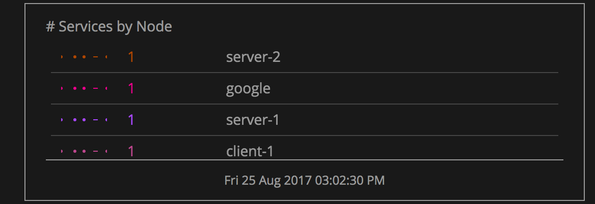](./img/chart_services_by_node.png)

  - **Number of Nodes by Service**: Descending list showing the number of nodes that are providing a given service in the datacenter.

    [](./img/chart_nodes_by_service.png)

  - **Service health check results**: A list showing the results of service health checks that are registered with Consul. Checks can result in 3 states - passing, warning and critical.

    [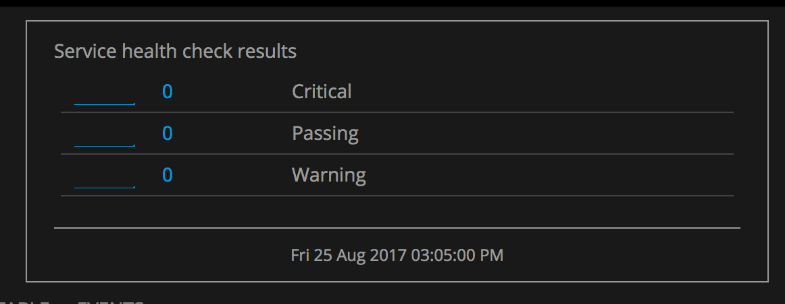](./img/chart_service_health_check.png)

  - **Node health check results**: Node checks are done on the individual host level. If a host fails a check, all services registered with it are marked as failed and Consul no longer returns the node in service discovery requests. The chart is a list showing the results of node health checks. Checks can result in 3 states - passing, warning and critical.

    [](./img/chart_node_health_check.png)

  - **Total Peers**: Number of consul Raft peers or consul agents in server mode in a given datacenter.

    [](./img/chart_total_peers.png)

  - **Consul Server Map**: Displays the followers and leader in given datacenter.

    [](./img/chart_consul_server_map.png)

  - **Mean node network latency**: Shows the average latency of a given node from other nodes in the Consul cluster. The dimension consul\_node corresponds to the source node. The maximum and minimum values for this metric are also available.

    [](./img/chart_mean_node_latency.png)

  - **Mean datacenter latency**: Average datacenter latency between 2 datacenters. This metric has the additional dimension destination\_dc dimension. The latency is calculated between this destination datacenter and the agent's datacenter given by the datacenter dimension. The maximum and minimum values for this metric are also available.

    [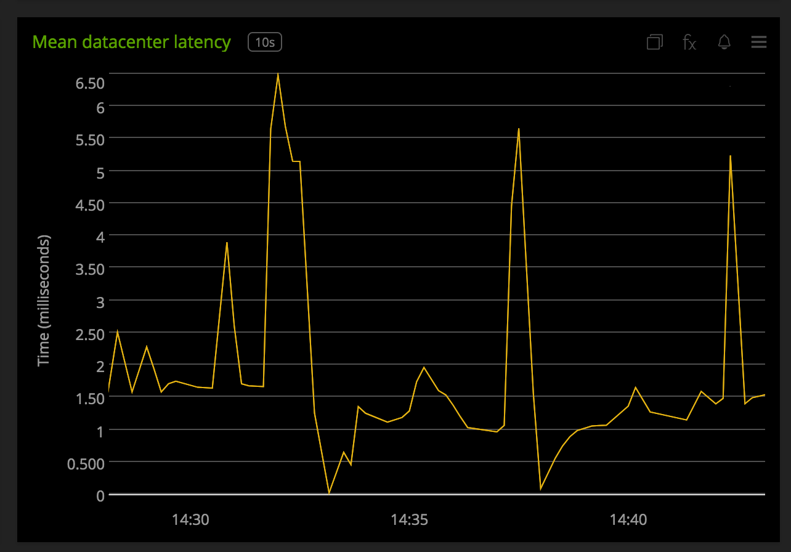](./img/chart_mean_dc_latency.png)

- **CONSUL HEALTH**:

  - **Leadership Change Event**: Event feed showing leader tranisiton events. The event has the new and old leader node name as dimensions.

    [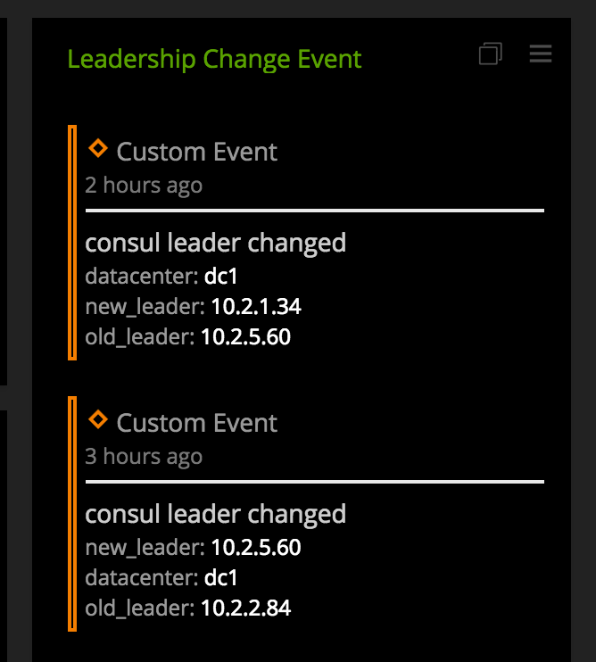](./img/chart_leader_change_event.png)

  - **Leadership Transitions**: Tracks number of leadership transitions. If there are frequent leadership changes this may be an indication that the servers are overloaded and aren't meeting the soft real-time requirements for Raft, or that there are networking problems between the servers.

    [](./img/chart_leader_transition.png)

  - **Leader last contact with followers**: This shows the time since the leader was last able to contact the follower nodes when checking its leader lease. It can be used as a measure for how stable the Raft timing is and how close the leader is to timing out its lease.

    [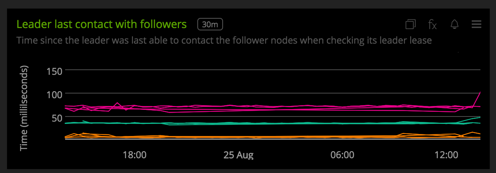](./img/chart_leader_last_contact.png)

  - **Leader latency to commit to disk**: Time it takes for the leader to write log entries to disk.

    [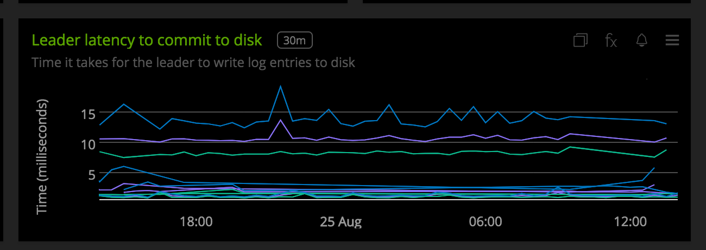](./img/chart_leader_disk_commit.png)

  - **Raft commit time**: Time it takes to commit a new entry to the Raft log on the leader.

    [](./img/chart_raft_commit_time.png)

  - **Number of Raft Transactions**: This is a general indicator of the write load on the Consul servers.

    [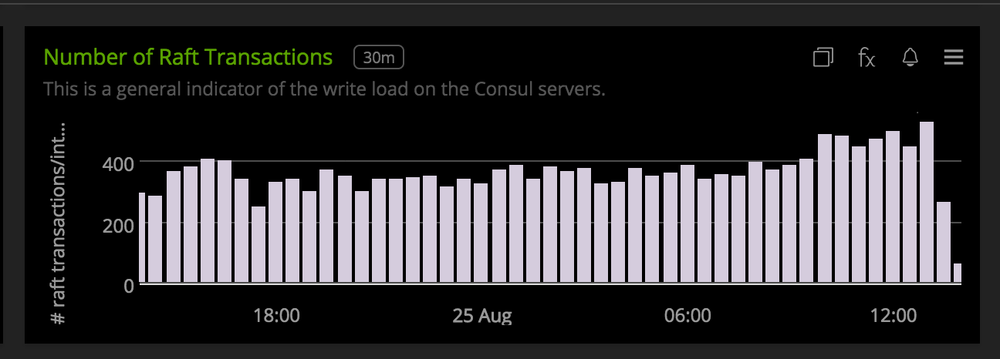](./img/chart_raft_transactions.png)

  - **Leader Time to Append Entries**: This measures the time it takes the leader to replicate log entries to followers. This is a general indicator of the load pressure on the Consul servers, as well as the performance of the communication between the servers.

    [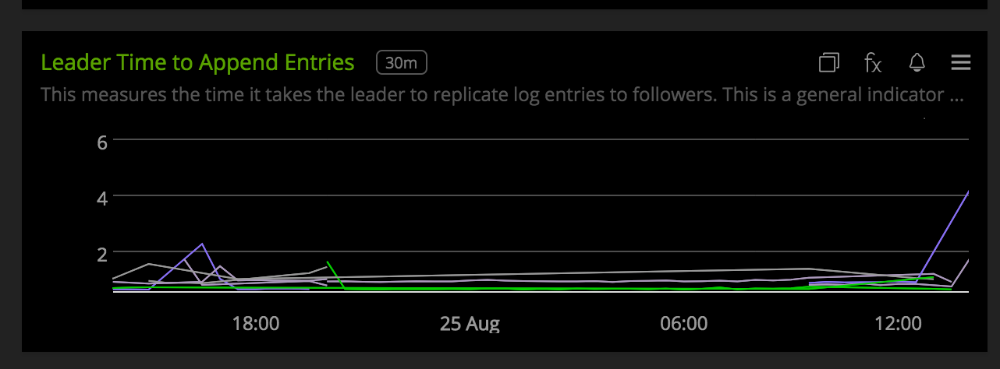](./img/chart_time_to_append_entries.png)

  - **Number of RPC queries**: Total number of rpc queries per interval. This is a general measure of all read volume.

    [](./img/chart_number_of_rpc_queries.png)

  - **Cluster Joins and Leaves**: This chart tracks successful node joins and leaves in the Serf memberlist.

    [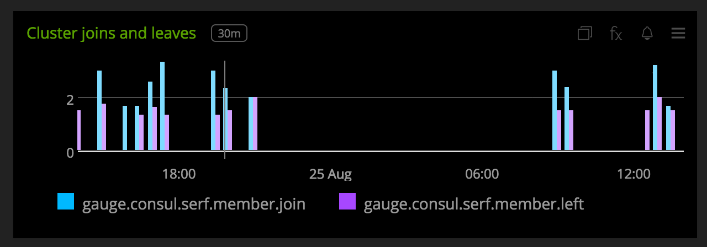](./img/chart_join_leave.png)

  - **Leader time to reconcile**: Shows the time it takes for the leader to reconcile Serf membership and what is reflected in Consul's store.

    [](./img/chart_leader_reconcile.png)

  - **Serf Events**: Consul provides an event feature by which custom events can be propagated across your entire datacenter. This chart shows the number of events processed by Consul agents per interval. Using this chart you can track if triggered events were processed by a consul node. Additinally, you can also easily setup a chart to track events for a selected node in the CLIENT and SERVER dashboard.

    [](./img/chart_serf_events.png)

  - **Serf Event Queue**: Shows the avg and max number of backlog of serf events in queue of Consul agents.

    [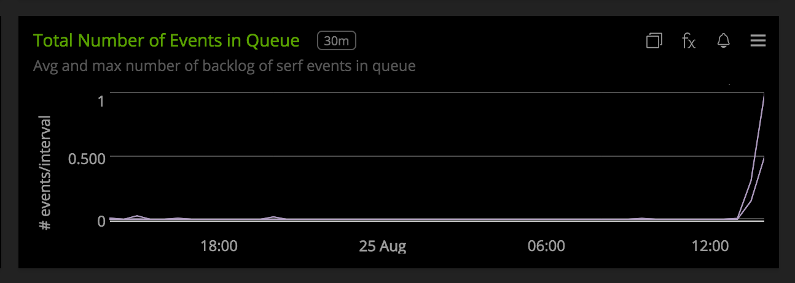](./img/chart_serf_event_queue.png)

- **CONSUL CLIENT**

  - **Number of allocated heap objects**: Gives the number of heap objects allocated to the consul process. Indicates memory pressure on a Consul node.

    [](./img/chart_heap_objects.png)

  - **Allocated Bytes**: Number of allocated bytes to the Consul process.

    [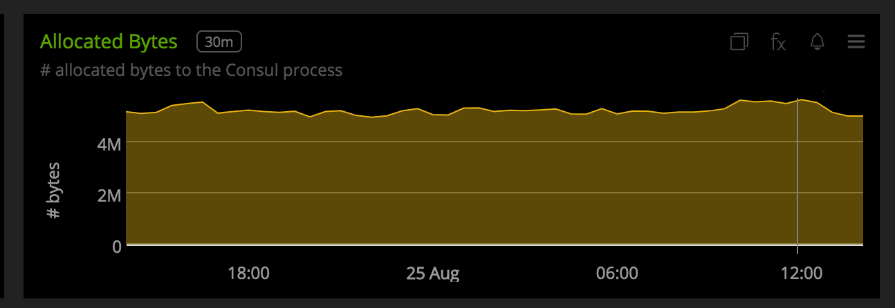](./img/chart_allocated_bytes.png)

  - **Number of GO routines**: The number of GO routines Consul is running. This is a general load pressure indicator for Consul agent.

    [](./img/chart_go_routines.png)

  - **Network Latency**: Shows the avg, max and min network latency between the node and other nodes in the datacenter.

    [](./img/chart_network_latency.png)

  - **Time to service DNS queries**: Consul provides both DNS and HTTP interfaces for service discovery. This shows the time it takes to service forward and reverse DNS lookups by the selected node.

    [](./img/chart_dns_queries.png)

- **CONSUL SERVER**
All charts metioned in the Client dashboard are also present in the Server dashboard. In addition to those, the following charts are present

  - **Raft candidate state**: This chart tracks if the selected Consul server starts an election. If this metric increments without a leadership change occurring it could indicate that a single server is overloaded or is experiencing network connectivity issues.

    [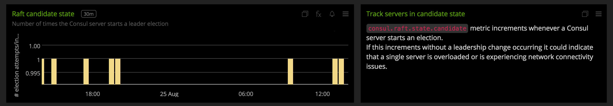](./img/chart_raft_candidate.png)

All metrics reported by the Consul collectd plugin will contain the following dimensions by default:

* `datacenter`, this is the datacenter to which the Consul agent belongs to. The value for this dimension is read from the agents configuration
* `consul_node`, this is the Consul node name as seen in Consul agents configuration
* `consul_mode`, consul agent is in client or server mode

The metric `consul.is_leader` is reported by consul servers and have the dimension - `consul_server_state` which can be either leader or follower.

Additional default metrics to track

  - `consul.memberlist.msg.suspect` - This metric counts the number of times an agent suspects another as failed when executing random probes as part of the gossip protocol. These can be an indicator of overloaded agents, network problems, or configuration errors where agents can not connect to each other on the <a target="_blank" href="https://www.consul.io/docs/agent/options.html#ports">required ports</a>.

  - `consul.serf.member.flap` -  This metric tracks when an agent is marked dead and then recovers within a short time period. This can be an indicator of overloaded agents, network problems, or configuration errors where agents can not connect to each other on the <a target="_blank" href="https://www.consul.io/docs/agent/options.html#ports">required ports</a>.

  - `consul.dns.stale_queries` - This metric tracks when an agent serves a DNS query based on information from a server that is more than 5 seconds out of date.


A few other details:

* `plugin` is always set to `consul`
* To add additional metrics from the telemetry stream or ```/agent/metrics``` endpoint, use the configuration options mentioned in [configuration](#configuration). If metrics are being included individually, make sure to give valid prefixes. For e.g., to add metrics which track time taken to serve http requests, Consul emits these metrics in the form `consul.http.<verb>.<path>`. So to enable metrics which track time taken to service GET requests on Key/Value endpoint, add this `consul.http.GET.v1.kv` to the IncludeMetric cofiguration. If you want to allow metrics which track time taken to service all GET requests, add `consul.http.GET` to the configuration. When enhance metrics are enabled, you can block metrics in a similar manner.
* The metrics from `/agent/metric` endpoint are aggregated over an interval of 10 seconds. Keep this in mind when changing the default collectd interval from 10 seconds.

### LICENSE

This integration is released under the Apache 2.0 license. See [LICENSE](./LICENSE) for more details.
