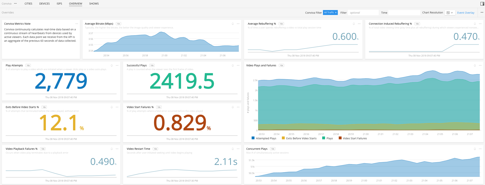

#  Conviva

- [Description](#description)
- [Requirements and Dependencies](#requirements-and-dependencies)
- [Installation](#installation)
- [Configuration](#configuration)
- [Usage](#usage)
- [Metrics](#metrics)
- [License](#license)

### DESCRIPTION

<a target="_blank" href="https://www.conviva.com/">Conviva</a> is a service for monitoring video playing experience on the Internet. The <a target="_blank" href="https://github.com/signalfx/integrations/tree/master/signalfx-agent">SignalFx Smart Agent</a> monitor called **Conviva** was developed for Conviva integration. The conviva monitor can be configured to pull <a target="_blank" href="https://github.com/signalfx/integrations/blob/master/conviva/docs/conviva_metrics.md">Real-Time/Live Conviva metrics</a> using the <a target="_blank" href="https://community.conviva.com/site/global/apis_data/experience_insights_api/index.gsp">Conviva Experience Insights REST APIs</a>. Conviva Developer Community credentials are required to access this Conviva API documentation link. The Live Conviva metrics are converted to SignalFx metrics with dimensions for the name of the Conviva account and the name(s) of the applied filter(s). For MetricLens metrics, the MetricLens dimensions are mapped one-to-one to SignalFx dimensions with the values of these dimensions derived from the values of the associated MetricLens dimension entities.

#### REQUIREMENTS AND DEPENDENCIES

Only Live Conviva metrics are supported. Conviva MetricLens metrics require MetricLens-enabled filters. MetricLens-enabled filters are listed in the <a target="_blank" href="https://pulse.conviva.com/filters/">table of filters</a> with a checkmark in the `ML` column. Conviva Pulse credentials are required to access the link to the table of filters.

This monitor requires:

| Software          | Version        |
|-------------------|----------------|
| Conviva Experience Insights API |     2.4+       |

### INSTALLATION

Install the latest version of the SignalFx Smart Agent as described in [SignalFx Smart Agent](https://github.com/signalfx/integrations/tree/master/signalfx-agent).

### CONFIGURATION

1. Open the SignalFX Smart Agent `agent.yaml`configuration file.
2. Edit the <a target="_blank" href="https://docs.signalfx.com/en/latest/integrations/agent/monitors/conviva.html">monitors</a> section.
3. Add the <a target="_blank" href="https://docs.signalfx.com/en/latest/integrations/agent/monitors/conviva.html#conviva-monitor-metric-parameters-and-metrics">metric parameters</a> as values for `metricParameter`.

### USAGE

The Conviva monitor emits Live Conviva metrics which can then be used to create dashboards such as the one below showing an overview of real-time video quality metrics.

#### Special considerations 

The Conviva API response may return with filters listed in fields **filters_not_exist**, **filters_warmup** and **filters_incomplete_data**. This means data for these filters may be wholly or partially unavailable. When this happens it is logged in the SignalFx Smart Agent log file.

Configuration validation will fail when a non-MetricLens enabled filter is listed in a MetricLens metric configuration.

The select all filters in combination with select all dimensions options should be used with care because of the potential to generate a large amount of datapoints (in other words, metric time series (MTS)).

### LICENSE

This integration is released under the Apache 2.0 license. See [LICENSE](./LICENSE) for more details.
