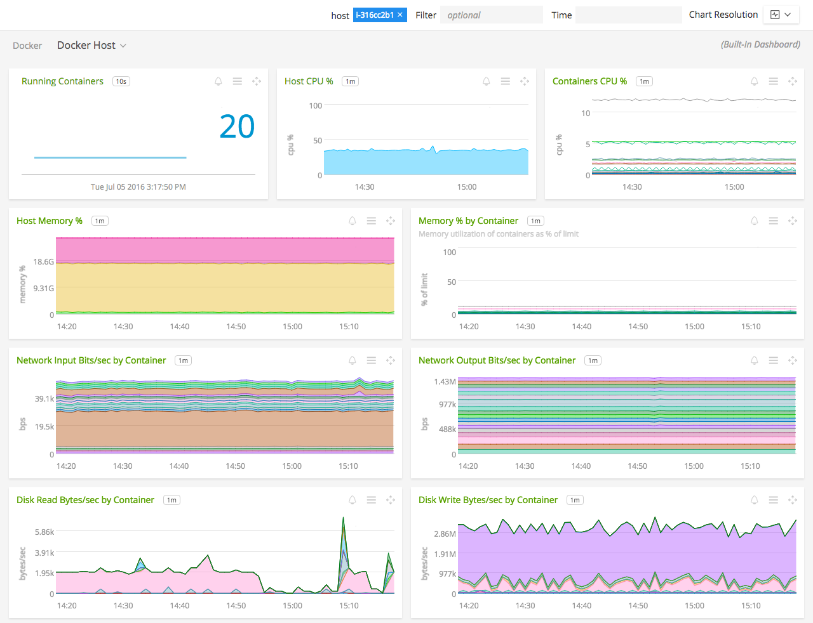
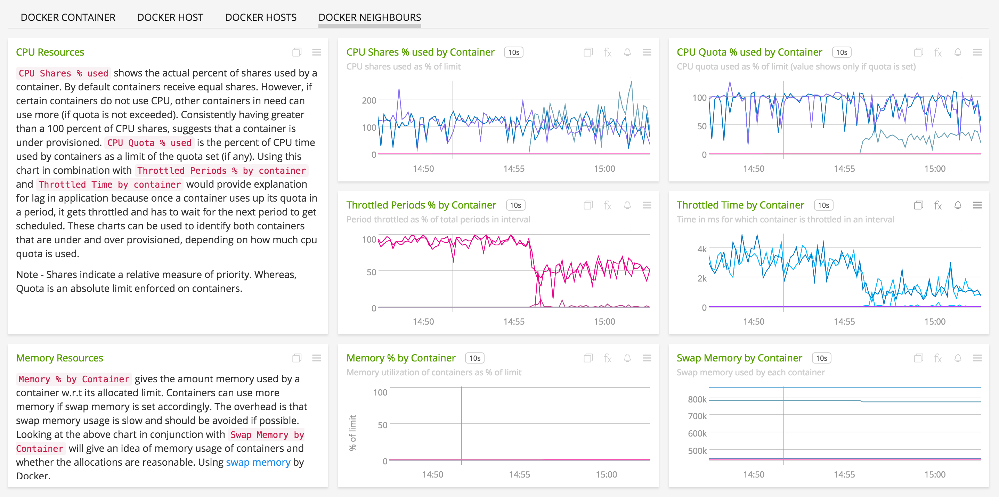

#  Docker

- [Description](#description)
- [Requirements and Dependencies](#requirements-and-dependencies)
- [Installation](#installation)
- [Configuration](#configuration)
- [Usage](#usage)
- [Metrics](#metrics)
- [License](#license)

#### FEATURES

##### Built-in dashboards

- **Docker Hosts**: Overview of all data from Docker hosts.

  

- **Docker Host**: Focus on a single Docker host.

  

- **Docker Container**: Focus further on a single running Docker container.

  

- **Docker Neighbors**: (Optional Dashboard) Container resource allocation metrics.

  

### USAGE

Sample of built-in dashboard in SignalFx:

### METRICS

For documentation of the metrics and dimensions emitted by this plugin, [click here](./docs).

### LICENSE

This integration is released under the Apache 2.0 license. See [LICENSE](./LICENSE) for more details.
