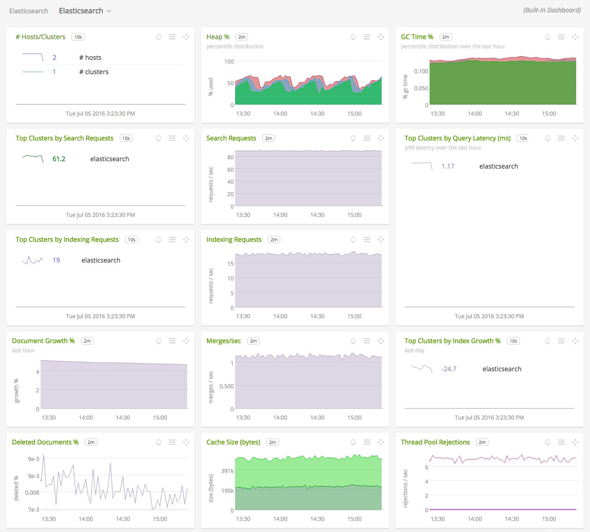
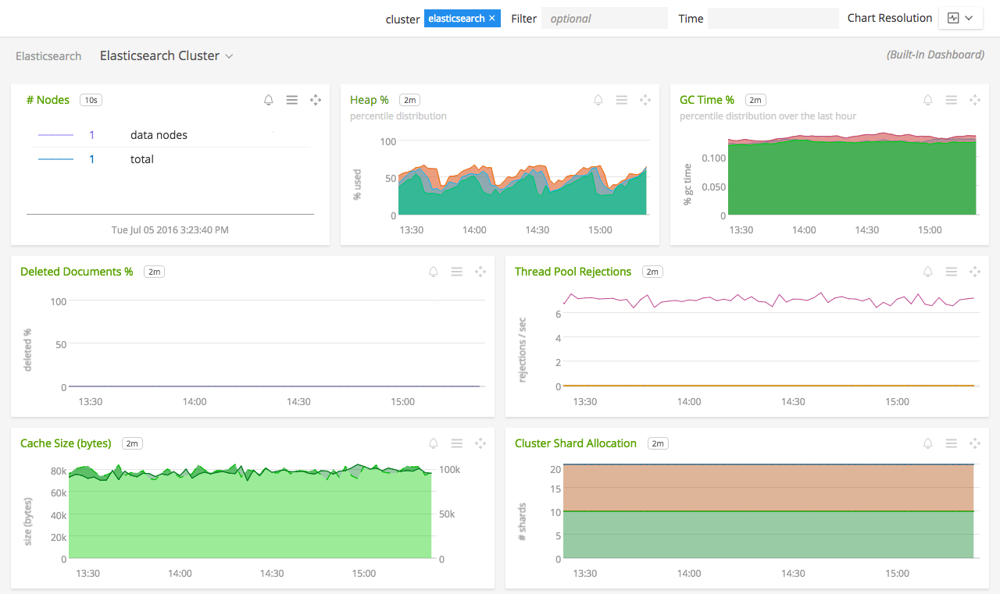
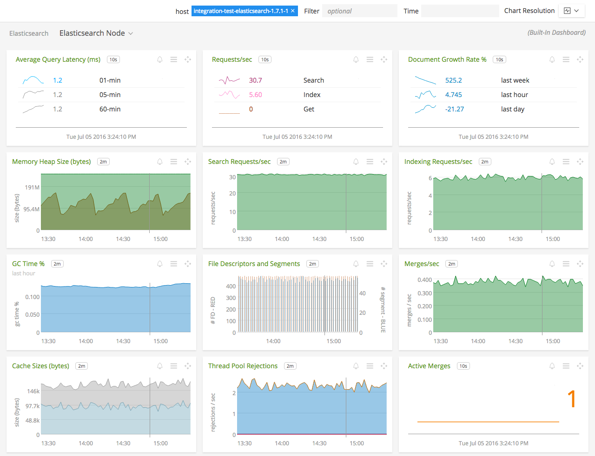
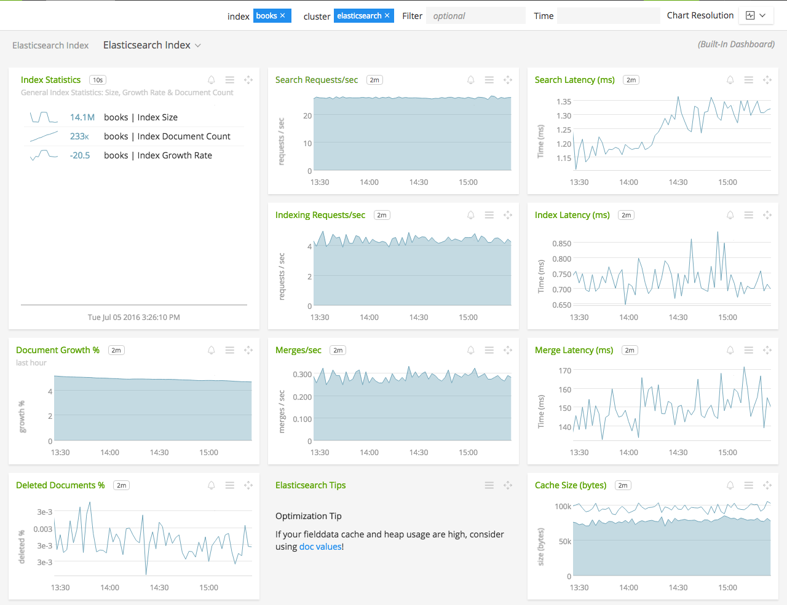

#  Elasticsearch

#### FEATURES

##### Built-in dashboards

- **Elasticsearch**: Overview of all data from Elasticsearch hosts.

  

- **Elasticsearch Cluster**: Focus on a single Elasticsearch cluster.

  

- **Elasticsearch Node**: Focus further on a single Elasticsearch node.

  

- **Elasticsearch Indexes**: Overview of all Elasticsearch indexes.

  

- **Elasticsearch Index**: Focus on a single Elasticsearch index.

  

### USAGE

Sample of built-in dashboard in SignalFx:

### LICENSE

This integration is released under the Apache 2.0 license. See [LICENSE](./LICENSE) for more details.
