#  etcd

- [Description](#description)
- [Requirements and Dependencies](#requirements-and-dependencies)
- [Installation](#installation)
- [Configuration](#configuration)
- [Usage](#usage)
- [Metrics](#metrics)
- [License](#license)

#### FEATURES

##### Built-in dashboards

- **ETCD CLUSTER**: Provides a high-level overview of metrics for a single etcd cluster.

  [](./img/etcd-cluster-dashboard-top.png)

  [](./img/etcd-cluster-dashboard-bottom.png)  

- **ETCD INSTANCE**: Provides metrics from a single etcd instance.

  [](./img/etcd-instance-dashboard.png)  

- **ETCD INSTANCES**: Provides metrics from hosts on a particular host.

  [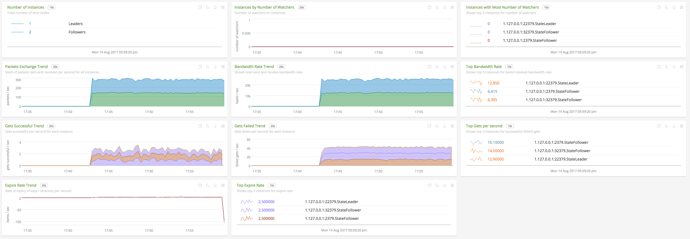](./img/etcd-instance-dashboard.png)


### USAGE

#### Interpreting Built-in dashboards

- **ETCD CLUSTER**:

  - **Number of Followers**: Shows the number of followers in the cluster. A cluster that is expected to have 2n + 1 members, can tolerate failure of n members. By virtue of raft consensus algorithm, a cluster should have at least 3 members.

    [](./img/chart-etcd-cluster-number-followers.png)

  - **Number of Watchers**: Shows the total number of watchers on all the members of the cluster put together. Gives an overview of memory consumption by the watchers on the cluster as a whole.

    [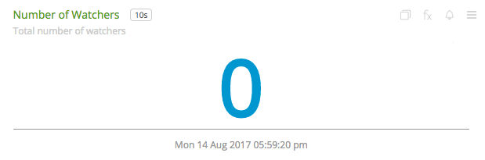](./img/chart-etcd-cluster-number-watchers.png)

  - **Followers with Max Number of Watchers**: Get an overview of the members that are being requested for watching. Watching is memory intensive. The list gives information about the members (```host:port``` information) and the corresponding states.

    [](./img/chart-etcd-cluster-Max-Watchers.png)

  - **Top Current Latency**: Gives an overview of the followers (```host:port```) with max current latency with the leader. Since raft relies on log replication throughout all the members, this is helps in flushing out followers that have max latency.

    [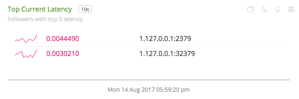](./img/chart-etcd-cluster-top-latency.png)

  - **Total RPC Requests (successful/failed)**: A stacked chart that shows successful (in green) and failed (in red) RPC requests per second across all the followers. Leader sends RPC requests and followers receive.

    [](./img/chart-etcd-cluster-total-rpcs.png)

  - **Per Member Failed RPCs**: A stacked chart showing failed RPC requests per second on a per follower basis. On comparing this chart with one above, followers that cause more failures can be flushed out.

    [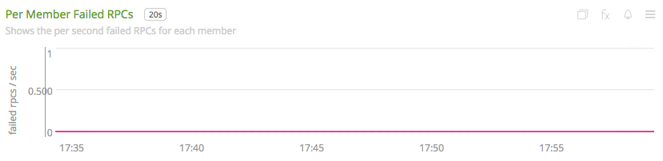](./img/chart-etcd-cluster-member-rpc-failure.png)

  - **Top RPC Requests**: Followers with top RPC requests, both successful and failed.

    [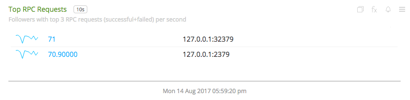](./img/chart-etcd-cluster-top-rpcs.png)

  - **Store operations (successful/failed)**: This includes the following charts: Creates, Sets, Updates, Deletes, Compare-and-Swaps and Compare-and-Deletes. These charts are stacked charts that show successful operations (in green) and failed operations (in red) per second. This gives an idea of the ratio between success and failure for each operation type.

    [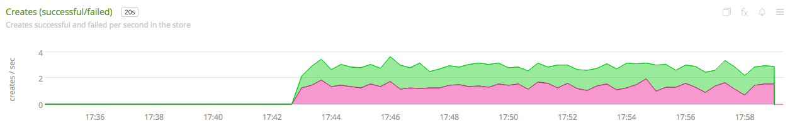](./img/chart-etcd-cluster-creates.png)
    [](./img/chart-etcd-cluster-sets.png)
    [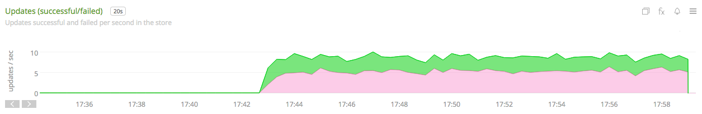](./img/chart-etcd-cluster-updates.png)
    [](./img/chart-etcd-cluster-deletes.png)
    [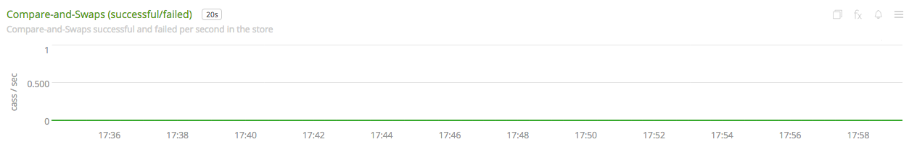](./img/chart-etcd-cluster-cas.png)
    [](./img/chart-etcd-cluster-cad.png)

  - **Receive Packet Rate**: Stacked chart of the packets received per second for each follower. At given point in time, followers receive packets from the leader (leader sends information as part of log replication).

    [](./img/chart-etcd-cluster-packet-recv.png)

  - **Receive Append Requests**: Stacked chart of the append requests received per second for each follower. At given point in time, followers receive append requests from the leader (leader sends information as part of log replication).

    [](./img/chart-etcd-cluster-append-recv.png)

  - **Send Packet Rate**: Chart for the packets sent per second for the leader. At given point in time, only leader sends packets. In the ideal world, every packet sent by the leader should be received by one of the followers. Comparing this chart with **Receive Packet Rate** would explain if packets are not received by followers (or an individual follower). Latency can also be observed through these charts.

    [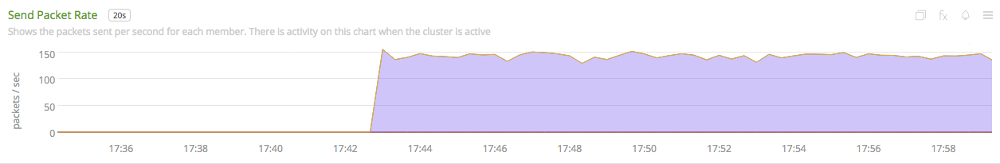](./img/chart-etcd-cluster-packet-sent.png)

  - **Send Append Requests**: Chart for the append requests sent per second for the leader. At given point in time, only leader sends append requests. In the ideal world, all append requests sent by the leader should be received by one of the followers. Comparing this chart with **Receive Append Requests** would explain if append requests are not received by followers (or an individual follower). Latency can also be observed through these charts.

    [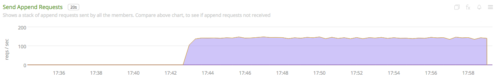](./img/chart-etcd-cluster-append-sent.png)

- **ETCD INSTANCE**:

  - **Number of Watchers**: Shows the number of watchers on this particular instance. Watching is memory intensive and might explain high memory utilization.

    [](./img/chart-etcd-instance-number-watchers.png)

  - **Expire Rate**: The number of keys and directories that expire per second. This is common to the distributed key-value store. However, when a member leaves the cluster, this metric becomes instance specific.

    [](./img/chart-etcd-instance-expire-rate.png)

  - **Gets (successful/failed)**: A stacked chart that shows successful gets (in green) and failed gets (in red) per second. This gives insight to the ratio between successful and failed get requests per second for the instance. It is possible that a high fail count for gets is because of a high expire rate.

    [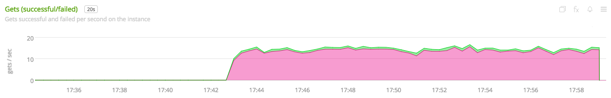](./img/chart-etcd-instance-gets.png)

  - **Receive / Send Bandwidth Rate** A line graph showing both, sent (in blue) and received (in green) bandwidth rate for the instance. Followers receive and Leader sends.

    [](./img/chart-etcd-instance-bandwidth.png)

  - **Receive / Send Append Requests** A line graph showing both, sent (in blue) and received (in green) append requests per second for the instance. Followers receive and Leader sends.

    [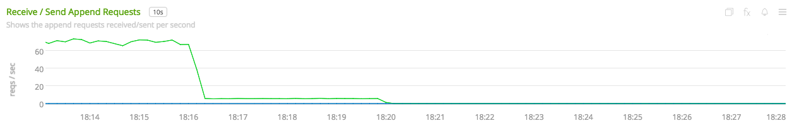](./img/chart-etcd-instance-appends.png)

- **ETCD INSTANCES**: Provides metrics from hosts on a particular host.

  - **Number of instances**: The total number of etcd isntances running on the host, group by type (follower/leader).

    [](./img/chart-etcd-instances-number-instances.png)

  - **Instances by Number of Watchers**: A line graph that shows number of watchers on each of the instances on the host. Instances with more number of watchers consume more memory.

    [](./img/chart-etcd-instances-number-watchers.png)

  - **Instances with Most Number of Wacthers**: Shows the instances with most number of watchers. Watching is memory intensive.

    [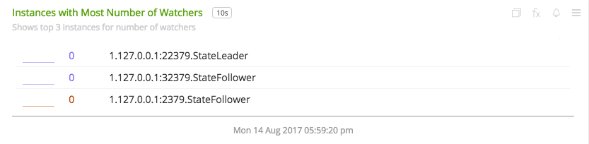](./img/chart-etcd-instances-most-watchers.png)

  - **Packets Exchange Trend**: A stacked chart showing packets sent (in blue) and received (in green) across all instances on the host. Gives an idea of bandwidth usage.

    [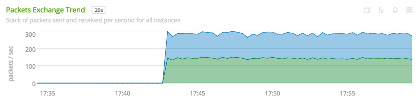](./img/chart-etcd-instances-packets.png)

  - **Bandwidth Trend Rate**: A stacked chart showing send bandwidth (in blue) and receive bandwidth (in green) rates across all instances on the host. Gives an idea of bandwidth usage and should shows similar trends as the above chart.

    [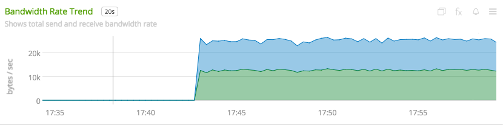](./img/chart-etcd-instances-bandwidth.png)

  - **Top Bandwidth Rate**: Gives a list of the instances that consume max bandwidth, both for sending and receiving put together.

    [](./img/chart-etcd-instances-top-bandwidth.png)

  - **Gets Successful Trend**: A stacked chart showing the number of successful get operations per second for each of the instances running on the host.

    [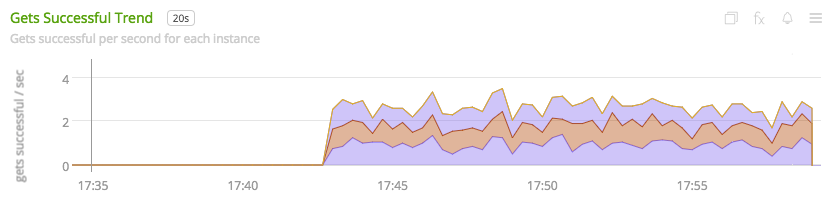](./img/chart-etcd-instances-gets-success.png)

  - **Gets Failed Trend**: A stack chart showing the number of failed get operations per second for each of the instances running on the host. Compare with above chart to analyze the success ratio.

    [](./img/chart-etcd-instances-gets-fail.png)

  - **Top Gets per second** A list of the instances on the host that perform the max number of gets per second, both successful and failed gets put together.

    [](./img/chart-etcd-instances-gets-top.png)

  - **Expire Rate Trend**: A line chart showing the rate of expiry of keys/directories for all the instances on host.

  [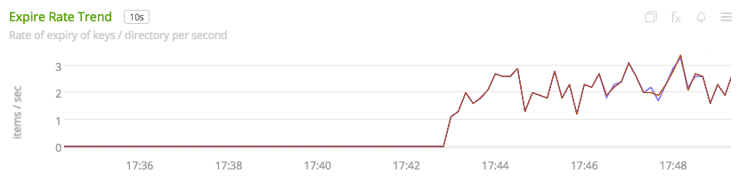](./img/chart-etcd-instances-expire-trend.png)

  - **Top Expire Rate**: A list of instances with top expire rates. Can be used to analyze if gets fail due to a high expiry rate.

    [](./img/chart-etcd-instances-top-expire.png)

All metrics reported by the etcd collectd plugin will contain the following dimensions by default:

* `state`, whether the member is a follower or a leader
* `cluster`, human readable cluster name used to group by members by cluster
* `follower`, metrics from the leader endpoint will have this dimension to group by follower

A few other details:

* `plugin` is always set to `etcd`
* `plugin_instance` will contain the IP address and the port of the member given in the configuration
* To add metrics from the `/metrics` endpoint, use the configuration options mentioned in [configuration](#configuration). If metrics are being included individually, make sure to give names that are valid. For example, `etcd_debugging_mvcc_slow_watcher_total` or `etcd_network_peer_sent_bytes_total`


### ADDITIONAL METRIC INFO
By default, metrics about a member, leader and store are provided. For documentation of the metrics and dimensions emitted by this plugin, [click here](./docs). Metrics from `/metrics` endpoint can be activated through the configuration file. Note, that SignalFx does not support `histogram` and `summary` metric types (hence, metrics of these will be skipped if provided in the configuration). See [usage](#usage) for details.


#### Metric naming
`<metric type>.etcd.<endpoint name>.<name of metric>`. This is the format of default metric names reported by the plugin. Optional metrics are named as available from the `/metrics` endpoint with `_` replaced by `.`.


### LICENSE

This integration is released under the Apache 2.0 license. See [LICENSE](./LICENSE) for more details.
