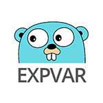
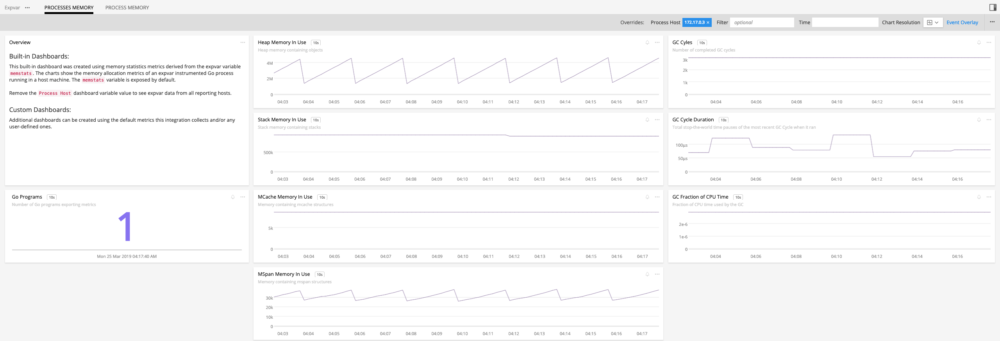
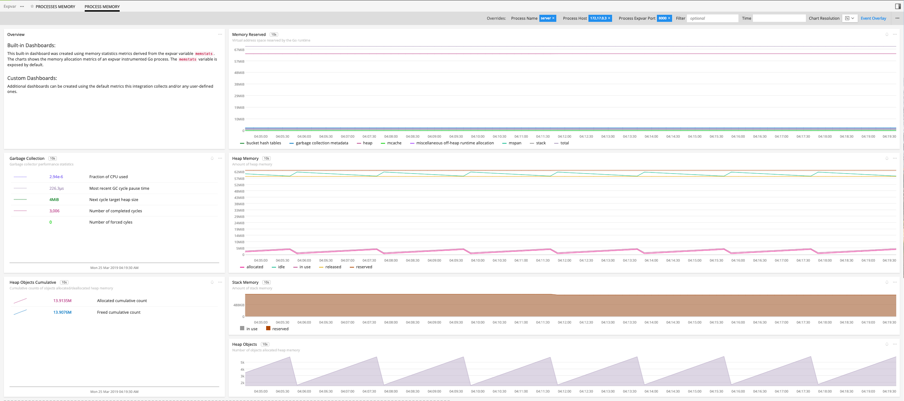

# 

- [Description](#description)
- [Requirements and Dependencies](#requirements-and-dependencies)
- [Installation](#installation)
- [Configuration](#configuration)
- [Usage](#usage)
- [Metrics](#metrics)
- [License](#license)

### DESCRIPTION

<a target="_blank" href="https://golang.org/pkg/expvar/">expvar</a> is a standard Go package for exposing variables at an HTTP endpoint in JSON format. 
The name expvar is derived from <b>exp</b>ose <b>var</b>iables. The default HTTP endpoint path is `/debug/vars`. An expvar instrumented Go process 
exposes variables `memstat` and `cmdline` out of the box by default. `memstat` contains statistics about memory allocation and `cmdline` has the command 
that started the process. 

The <a target="_blank" href="https://github.com/signalfx/integrations/tree/master/signalfx-agent">SignalFx Smart Agent</a> monitor expvar scrapes expvar 
variables and exports them as metrics to SignalFx.

### REQUIREMENTS AND DEPENDENCIES

| Software | Version |
|----------|---------|
| Go       | 1+      |

### INSTALLATION

Install the latest version of the SignalFx Smart Agent as described [here](https://github.com/signalfx/integrations/tree/master/signalfx-agent).

### CONFIGURATION

Find the SignalFx Smart Agent configuration file `agent.yaml`. Edit it and configure the expvar monitor as described <a target="_blank" href="https://github.com/signalfx/signalfx-agent/blob/master/docs/monitors/expvar.md">here</a>.

### USAGE

Sample of built-in dashboard in SignalFx:

### METRICS

For documentation of the metrics emitted, [click here](./docs).

### LICENSE

This integration is released under the Apache 2.0 license. See [LICENSE](./LICENSE) for more details.