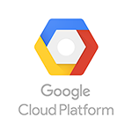

#  Google Cloud Platform

- [Description](#description)
- [Configuration](#configuration)
- [Usage](#usage)
- [Metrics](#metrics)
- [License](#license)

## DESCRIPTION

Use SignalFx to monitor Google Cloud Platform (GCP) services through StackDriver monitoring. This integration enables data collection from all GCP web services that report to StackDriver.

## FEATURES

Connecting to GCP lets you take advantage of SignalFx’s extensive GCP support.

- SignalFx can sync metadata about your GCP hosts to enrich metrics reported by StackDriver or the [SignalFx collectd agent](https://docs.signalfx.com/en/latest/integrations/collectd-info.html).
- SignalFx provides built-in dashboards for many GCP services that report to StackDriver, such as [Google Compute Engine](https://docs.signalfx.com/en/latest/integrations/integrations-reference/integrations.google.compute.engine.html) and [Google Cloud Datastore](https://docs.signalfx.com/en/latest/integrations/integrations-reference/integrations.google.cloud.datastore.html).

## CONFIGURATION

Before you begin, you must be an administrator of your SignalFx account.

To connect SignalFx to GCP, you must:

1. Create a new GCP project service account key for SignalFx to use.
2. Specify the services to monitor in SignalFx.

For detailed instructions, see <a target="_blank" href="https://docs.signalfx.com/en/latest/integrations/google-cloud-platform.html#connect-to-gcp">Connect to Google Cloud Platform</a>.

## USAGE

See <a target="_blank" href="https://docs.signalfx.com/en/latest/integrations/gcp-info.html">our detailed GCP integration guide</a> for more information.

## METRICS

For more information about the metrics emitted by GCP StackDriver, see the documentation for individual services.

#### LICENSE

This integration is released under the Apache 2.0 license. See [LICENSE](./LICENSE) for more details.
