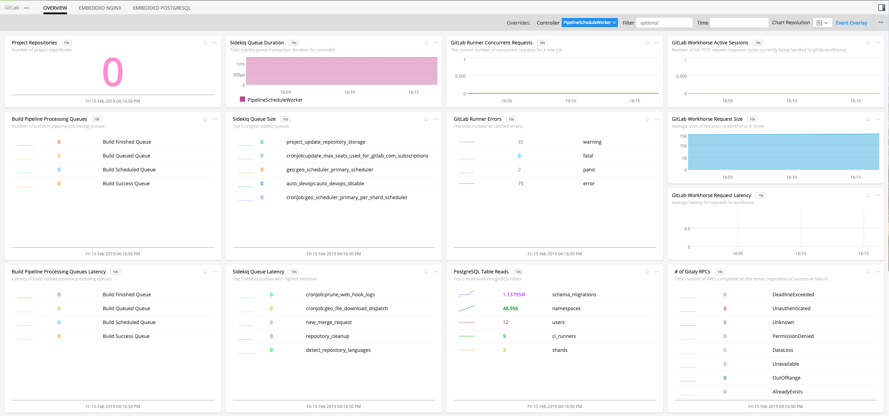
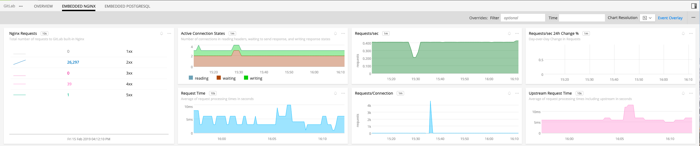
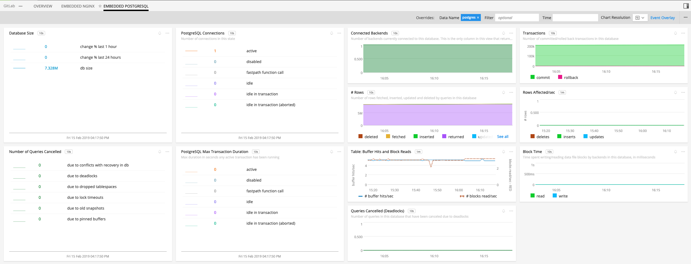

# 

- [Description](#description)
- [Requirements and Dependencies](#requirements-and-dependencies)
- [Installation](#installation)
- [Configuration](#configuration)
- [Usage](#usage)
- [Metrics](#metrics)
- [License](#license)

### DESCRIPTION

GitLab is an open-source web-based git repository manager developed by GitLab Inc. GitLab has built-in features for creating wiki pages, issue-tracking and CI/CD pipelines. GitLab is bundled with <a target="_blank" href="https://docs.gitlab.com/ee/administration/monitoring/prometheus/index.html">Prometheus exporters</a> that can be configured to export performance metrics of itself and that of the bundled software that GitLab depends on. These exporters publish Prometheus metrics at endpoints which can be scraped by the <a target="_blank" href="https://github.com/signalfx/signalfx-agent/blob/master/docs/monitors/prometheus-exporter.md">prometheus-exporter</a> monitor of the <a target="_blank" href="https://github.com/signalfx/integrations/tree/master/signalfx-agent">SignalFx Smart Agent</a>.

### REQUIREMENTS AND DEPENDENCIES

| Software | Version |
|----------|---------|
| GitLab   | 9.3+    |

### INSTALLATION

Install the latest version of the SignalFx Smart Agent for your environment as described [here](https://github.com/signalfx/signalfx-agent#installation).

Note that configuring GitLab by editing `/etc/gitlab/gitlab.rb` should be accompanied by running the command `gitlab-ctl reconfigure` in order for the changes to take effect.

Also, Nginx configuration by editing file `/var/opt/gitlab/nginx/conf/nginx-status.conf` for instance, should be accompanied by running command `gitlab-ctl restart`. Note that changes to the configuration file `/var/opt/gitlab/nginx/conf/nginx-status.conf` in particular are erased by subsequent runs of command `gitlab-ctl reconfigure` because `gitlab-ctl reconfigure` restores the original configuration file. 

### CONFIGURATION
#### GitLab Configuration

Follow the instructions <a target="_blank" href="https://docs.gitlab.com/ee/administration/monitoring/prometheus/index.html">here</a> to configure the GitLab's Prometheus exporters to expose metric endpoint targets. For GitLab Runner monitoring configuration go <a target="_blank" href="https://docs.gitlab.com/runner/monitoring/README.html">here</a>. Below is a list of some of the Prometheus endpoint targets with links to their respective configuration pages. Note that target `gitlab_monitor` metrics are just targets `gitlab_monitor_database`, `gitlab_monitor_process` and `gitlab_monitor_sidekiq` metrics combined.

| Target                                                                                                                                                     | Default Port | Path       |
|------------------------------------------------------------------------------------------------------------------------------------------------------------|--------------|------------|
| <a target="_blank" href="https://docs.gitlab.com/ee/administration/gitaly/#doc-nav">gitaly</a>                                                             | 9236         | /metrics   |
| <a target="_blank" href="https://docs.gitlab.com/ee/administration/monitoring/prometheus/index.html">gitlab-sidekiq</a>                                    | 8082         | /metrics   |
| <a target="_blank" href="https://docs.gitlab.com/ee/administration/monitoring/prometheus/gitlab_metrics.html#unicorn-metrics-available">gitlab-unicorn</a> | 8080         | /-/metrics |
| <a target="_blank" href="https://docs.gitlab.com/ee/administration/monitoring/prometheus/index.html">gitlab-workhorse</a>                                  | 9229         | /metrics   |
| <a target="_blank" href="https://docs.gitlab.com/ee/administration/monitoring/prometheus/gitlab_monitor_exporter.html">gitlab_monitor_database</a>         | 9168         | /database  |
| <a target="_blank" href="https://docs.gitlab.com/ee/administration/monitoring/prometheus/gitlab_monitor_exporter.html">gitlab_monitor_process</a>          | 9168         | /process   |
| <a target="_blank" href="https://docs.gitlab.com/ee/administration/monitoring/prometheus/gitlab_monitor_exporter.html">gitlab_monitor_sidekiq</a>          | 9168         | /sidekiq   |
| <a target="_blank" href="https://docs.gitlab.com/ee/administration/monitoring/prometheus/gitlab_monitor_exporter.html">gitlab_monitor</a>                  | 9168         | /metrics   |
| <a target="_blank" href="https://docs.gitlab.com/ee/administration/monitoring/prometheus/index.html">nginx</a>                                             | 8060         | /metrics   |
| <a target="_blank" href="https://docs.gitlab.com/ee/administration/monitoring/prometheus/node_exporter.html">node</a>                                      | 9100         | /metrics   |
| <a target="_blank" href="https://docs.gitlab.com/ee/administration/monitoring/prometheus/postgres_exporter.html">postgres</a>                              | 9187         | /metrics   |
| <a target="_blank" href="https://docs.gitlab.com/ee/administration/monitoring/prometheus/index.html">prometheus</a>                                        | 9090         | /metrics   |
| <a target="_blank" href="https://docs.gitlab.com/ee/administration/monitoring/prometheus/redis_exporter.html">redis</a>                                    | 9121         | /metrics   |
| <a target="_blank" href="https://docs.gitlab.com/ee/administration/monitoring/prometheus/index.html">gitlab-runner</a>                                     | 9252         | /metrics   |

GitLab Prometheus exporters, Nginx and GitLab Runner must be configured to listen to IP address(es) that include the IP address of the host or docker container of the SignalFx Smart Agent. For example, the configuration below in `/etc/gitlab/gitlab.rb` configures the GitLab Postgres Prometheus exporter to allow network connections on port `9187` from any IP address. 
```
postgres_exporter['listen_address'] = '0.0.0.0:9187'
```
The above configuration can also be written as:
```
postgres_exporter['listen_address'] = ':9187'
```

Below is part of file `/var/opt/gitlab/nginx/conf/nginx-status.conf` showing the `location /metrics` block for metric related configuration. This file configures Nginx. The statement `allow 172.17.0.0/16;` allows network connection in the `172.17.0.0/16` IP range. The assumption is that the IP address associated with the SignalFx Smart Agent is in that IP range.
```
server {
    ...
    location /metrics {
    ...
    allow 172.17.0.0/16;
    deny all;
    }
}
```

Below is part of the global section of `/etc/gitlab-runner/config.toml`. This file configures GitLab Runner. The statement below configures GitLab Runner's Prometheus metrics HTTP server to allows network connection on port `9252` from any IP address.
```
listen_address = "0.0.0.0:9252"
...
```

For the `gitlab-unicorn` target, the IP address of the SignalFx Smart Agent container or host depending on the environment, needs to be whitelisted as described <a target="_blank" href="https://docs.gitlab.com/ee/administration/monitoring/ip_whitelist.html">here</a> in order for the agent to access the endpoint.

#### Smart Agent Configuration

Find and edit the SignalFx Smart Agent configuration file `agent.yaml` to configure <a target="_blank" href="https://github.com/signalfx/signalfx-agent/blob/master/docs/monitors/prometheus-exporter.md">prometheus-exporter</a> monitors for the Prometheus endpoint targets. For example, you can define a prometheus-exporter monitor per endpoint target as shown below. Though verbose, it is the only way to configure metricPath, extraDimension, metricsToExclude etc per endpoint target. 
```yaml
...
monitors:
  - type: prometheus-exporter
    discoveryRule: port == 9236
    metricPath: /metrics
    extraDimensions:
      metric_source: gitlab-gitaly
  - type: prometheus-exporter
    discoveryRule: port == 8082
    metricPath: /metrics
    extraDimensions:
      metric_source: gitlab-sidekiq
  - type: prometheus-exporter
    discoveryRule: port == 8080
    metricPath: /-/metrics
    extraDimensions:
      metric_source: gitlab-unicorn
...
```

The SignalFx prometheus-exporter monitor scrapes all Prometheus metrics at an endpoint by default. It is strongly recommended to include only the desired metrics in order to reduce cost. Below is an example of a configuration block that includes the metrics listed under `metricNames` and filters out the rest. Go <a target="_blank" href="https://github.com/signalfx/signalfx-agent/blob/master/docs/filtering.md">here</a> for more information about filtering.
```yaml
...
metricsToExclude:
  - metricNames:
      - pg_stat_table_n_tup_ins
      - pg_stat_table_n_tup_del
      - grpc_server_handled_total
      - gitlab_transaction_sidekiq_queue_duration_total
      - sidekiq_queue_size
      - sidekiq_queue_latency
      - gitaly_supervisor_health_checks
      - gitlab_transaction_sidekiq_queue_duration_total
      - gitlab_workhorse_http_request_size_bytes
      - gitlab_workhorse_http_request_size_bytes_count
      - gitlab_workhorse_git_http_sessions_active
      - gitlab_workhorse_http_request_duration_seconds
      - gitlab_workhorse_http_request_duration_seconds_count
      - process_count
      - pg_stat_table_idx_tup_fetch
      - pg_stat_table_seq_tup_read
      - pg_stat_table_n_tup_upd
      - nginx_vts_server_requests_total
      - nginx_vts_server_request_seconds
      - nginx_vts_main_connections
      - nginx_vts_upstream_request_seconds
      - pg_total_relation_size_bytes
      - pg_stat_activity_count
      - pg_stat_database_tup_*
      - pg_stat_database_blks_*
      - pg_stat_database_numbackends
      - pg_stat_database_xact_*
      - pg_stat_database_blk_read_time
      - pg_stat_database_blk_write_time
      - pg_stat_database_conflicts*
      - pg_stat_activity_max_tx_duration
      - pg_stat_database_temp_*
    negated: true
...
```

Also, alternatively the prometheus-exporter monitor configuration block can be written more compactly as shown below when the configuration fields (i.e. `metricPath`, `extraDimensions` etc) are common among the monitors.

```yaml
...
monitors:
  - type: prometheus-exporter
    discoveryRule: port == 9236 || port == 8082 || port == 9229 || port == 9168 || port == 8060 || port == 9100 || port == 9187 || port == 9090  || port == 9121
    metricPath: /metrics 
    extraDimensions:
      metric_source: gitlab
...
```

### USAGE

Sample of built-in dashboard in SignalFx:







### METRICS

For documentation of the metrics emitted, [click here](./docs).

### LICENSE

This integration is released under the Apache 2.0 license. See [LICENSE](./LICENSE) for more details.