#  Google App Engine

- [Description](#description)
- [Installation](#installation)
- [Usage](#usage)
- [Metrics](#metrics)
- [License](#license)

### DESCRIPTION

Use SignalFx to monitor Google App Engine via [Google Cloud Platform](https://github.com/signalfx/integrations/tree/master/gcp).

#### FEATURES

##### Built-in dashboards

- **App Engine System**: Overview of system level metrics for App Engine.

  [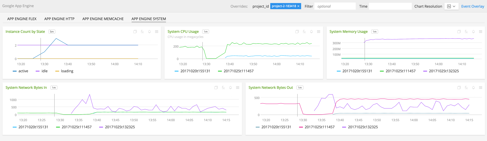](./img/appengine_system.png)

- **App Engine Flex**: Flex environment specfic metrics for Google App Engine.

  [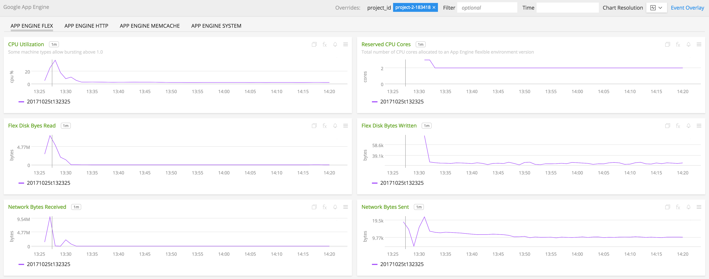](./img/appengine_flex.png)

- **App Engine Memcache**: Memcache environment specfic metrics for Google App Engine.

  [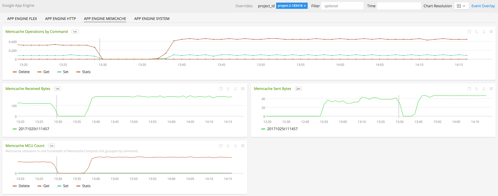](./img/appengine_memcache.png)

- **App Engine HTTP**: HTTP specific metrics for Google App Engine

  [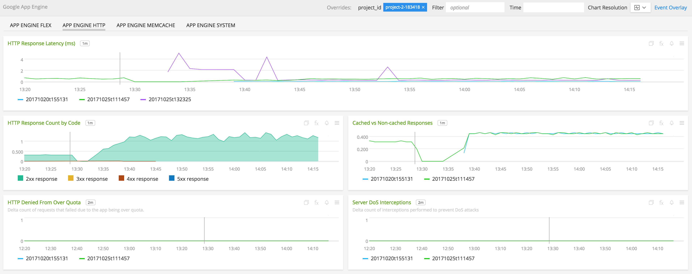](./img/appengine_http.png)

### INSTALLATION

To access this integration, [connect to Google Cloud Platform](https://github.com/signalfx/integrations/tree/master/gcp).

### USAGE

#### Interpreting Built-in dashboards

**App Engine Flex**

- **CPU Utilization** - Percentage of allocated CPU in use across an App Engine flexible environment version.

  [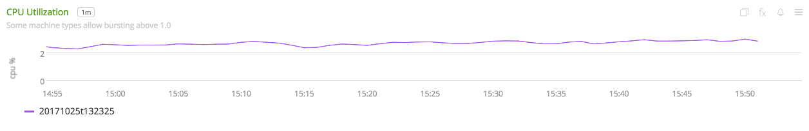](./img/flex-cpu-util.png)

- **Reserved CPU Cores** - Total number of CPU cores allocated to an App Engine flexible environment version.

  [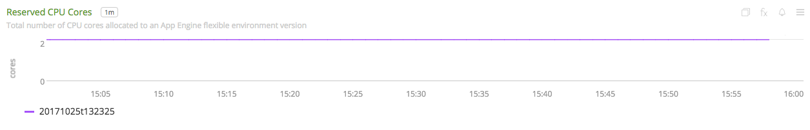](./img/flex-reserved-cpu-cores.png)

- **Flex Disk Bytes Read** - Number of bytes read from disk across an App Engine flexible environment version.

  [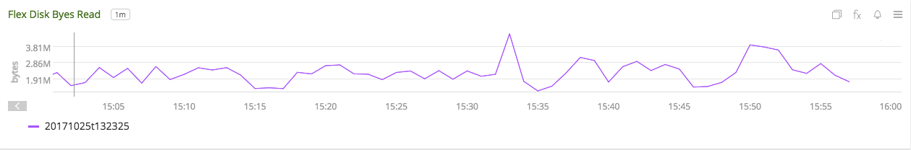](./img/flex-disk-bytes-read.png)

- **Flex Disk Bytes Written** - Number of bytes written from disk across an App Engine flexible environment version.

  

- **Network Bytes Received** - Number of incoming network bytes across all VMs in an App Engine flexible environment version.

  

- **Network Bytes Sent** - Number of outgoing network bytes across all VMs in an App Engine flexible environment version.

  [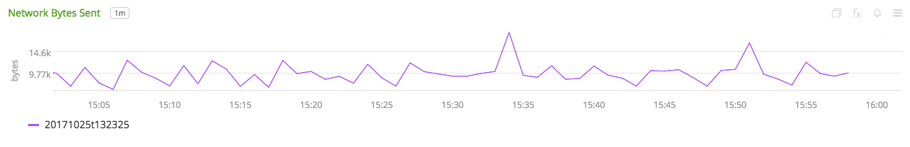](./img/flex-network-bytes-sent.png)

**App Engine http**

- **HTTP Response Latency (ms)** - HTTP response latency.

  [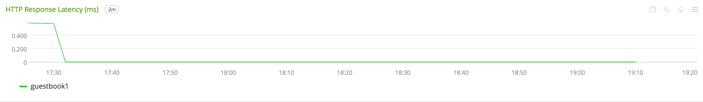](./img/http-response-latency.png)

- **HTTP Response Count by Code** - HTTP response codes aggregated by response code.

  [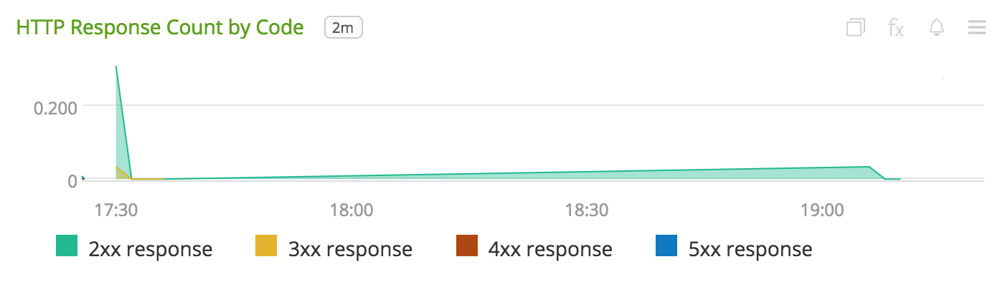](./img/http-response-count-by-code.png)

- **Cached vs Non-cached Responses** - HTTP response counts aggregated by HTTP serve style.

  [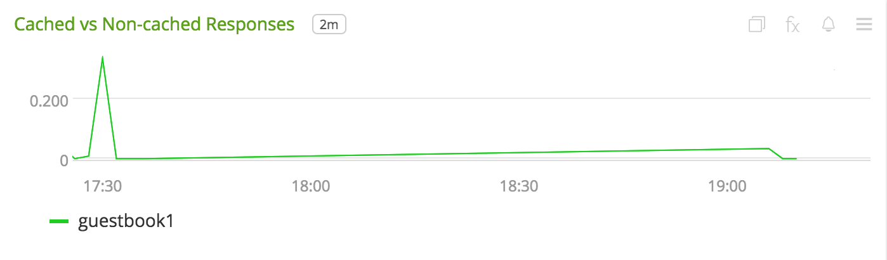](./img/cached-vs-non-cached-responses.png)

- **HTTP Denied From Over Quota** - Number of requests that failed due to the app being over quota.

  [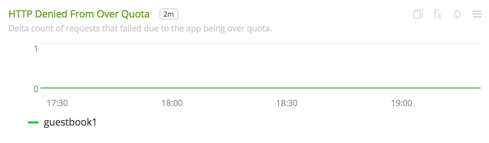](./img/http-denied-from-over-quota.png)

- **Server DoS Interceptions** - Number of interceptions performed to prevent DoS attacks.

  [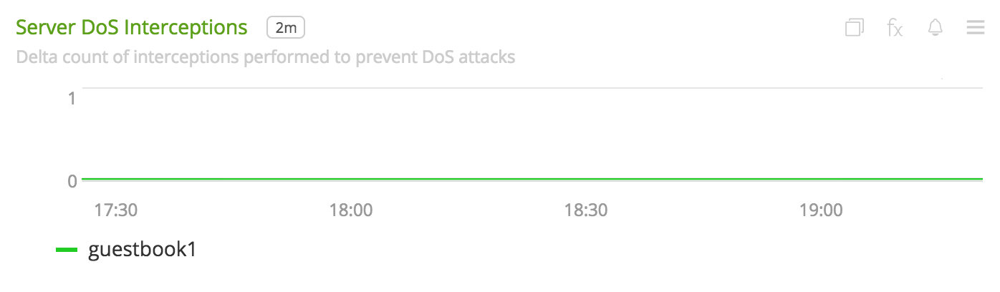](./img/http-server-dos-interceptions.png)

**App Engine Memcache**

- **Memcache Operations by Command** - Number of memcache key operations aggregatedby command.

  [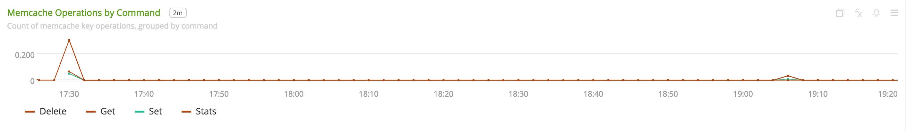](./img/memcache-operations-by-command.png)

- **Memcache Received Bytes** - Number of bytes received by app from the memcache API aggregated by version.

  [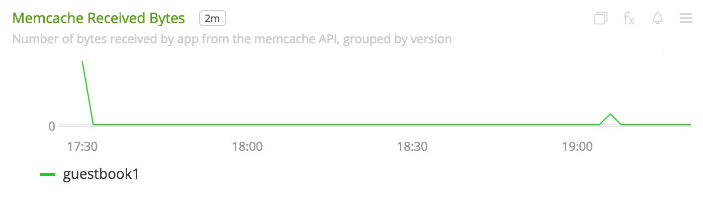](./img/memcache-received-bytes.png)

- **Memcache Sent Bytes** - Number of bytes sent by app from the memcache API aggregated by version.

  [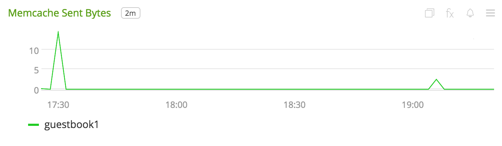](./img/memcache-sent-bytes.png)

- **Memcache MCU Count** - Memcache utilization in one hundredth of Memcache Compute Unit aggregated by command.

  [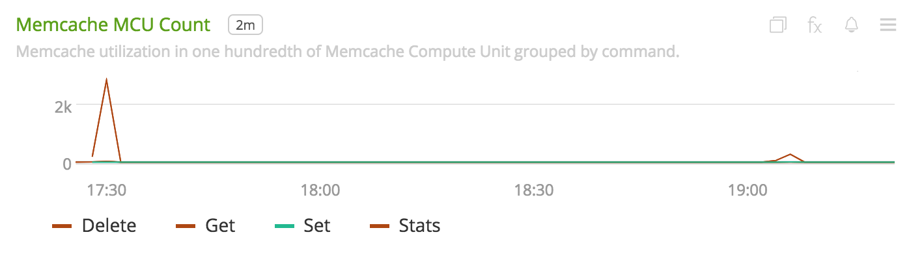](./img/memcache-mcu-count.png)

**App Engine System**

- **Instance Count by State** - Number of instances aggregated by state.

  [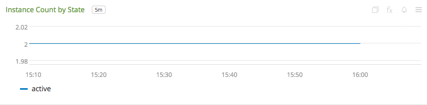](./img/system-instance-count-by-state.png)

- **System CPU Usage** - CPU usage in megacycles aggregated by `version_id`.

  [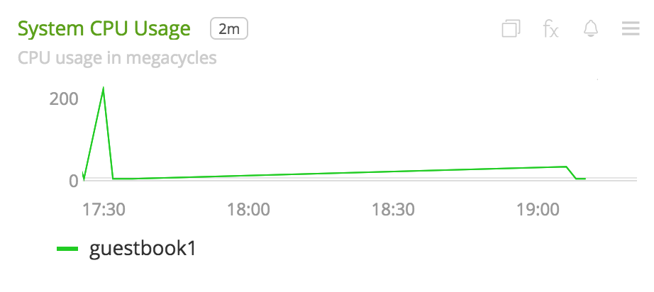](./img/system-cpu-usage.png)

- **System Memory Usage** - Memory usage of running instances aggregated by `version_id`.

  

- **System Network Bytes In** - Incoming network bandwidth aggregated by `version_id`.

  [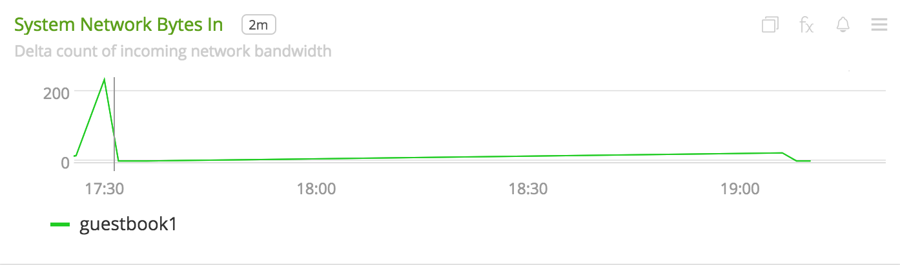](./img/system-network-bytes-in.png)

- **System Network Bytes Out** - Outgoing network bandwidth aggregated by `version_id`.

  [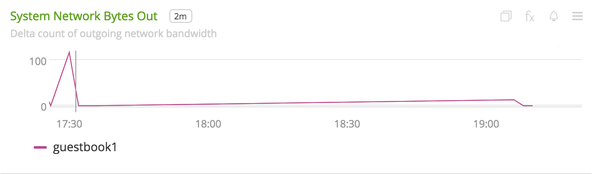](./img/system-network-bytes-out.png)

### METRICS

For more information about the metrics emitted by Google App Engine, visit the service's metric page at <a target="_blank" href="https://cloud.google.com/monitoring/api/metrics#gcp-appengine">https://cloud.google.com/monitoring/api/metrics#gcp-appengine</a>

### LICENSE

This integration is released under the Apache 2.0 license. See [LICENSE](./LICENSE) for more details.
