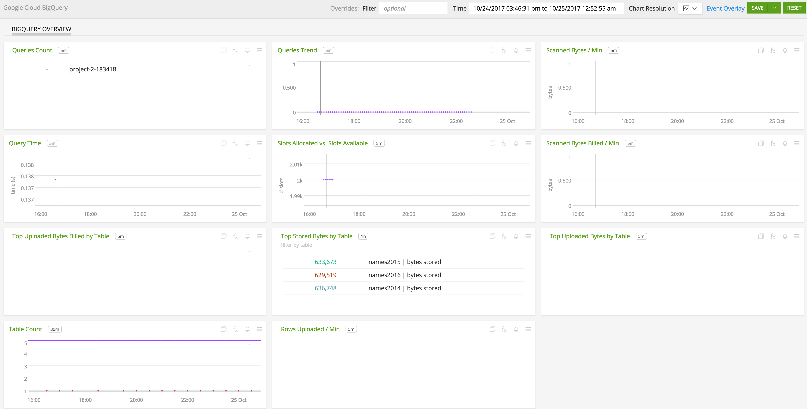

#  Google BigQuery

- [Description](#description)
- [Installation](#installation)
- [Usage](#usage)
- [Metrics](#metrics)
- [License](#license)

### DESCRIPTION

Use SignalFx to monitor Google BigQuery via [Google Cloud Platform](https://github.com/signalfx/integrations/tree/master/gcp).

#### FEATURES

##### Built-in dashboards

- **BigQuery Overview**: Overview of project level metrics for Google BigQuery.

  

### INSTALLATION

To access this integration, [connect to Google Cloud Platform](https://github.com/signalfx/integrations/tree/master/gcp).

### USAGE

#### Interpreting Built-in dashboards

**BigQuery Overview**

- **Queries Count** - Number of in flight queries.

- **Queries Trend** - Shows the trend of number of in flight queries.

- **Scanned Bytes / min** - Number of bytes scanned per minute.

- **Average Execution Time** - Distribution of queries execution times in seconds.

- **Slots Allocated vs. Slots Available** - Number of BigQuery slots currently allocated for the project vs total number of BigQuery slots available for the project.

- **Scanned Bytes Billed / min** - Amount of Scanned bytes billed per minute.

- **Top Uploaded Bytes Billed per Table** - Tables with top 5 uploaded bytes billed per minute.

- **Top Stored Bytes per Table** - Tables with top 5 stored bytes.

- **Top Uploaded Bytes per Table** - Tables with top 5 uploaded bytes.

- **Table Count** - Total number of tables in the project.

- **Rows Uploaded / min per Table** - List number of rows uploaded per min aggregated by table.

### METRICS

For more information about the metrics emitted by Google BigQuery, visit the service's metric page at <a target="_blank" href="https://cloud.google.com/monitoring/api/metrics#gcp-bigquery">https://cloud.google.com/monitoring/api/metrics#gcp-bigquery</a>

### LICENSE

This integration is released under the Apache 2.0 license. See [LICENSE](./LICENSE) for more details.
