#  Google Cloud Bigtable

- [Description](#description)
- [Installation](#installation)
- [Usage](#usage)
- [Metrics](#metrics)
- [License](#license)

### DESCRIPTION

Use SignalFx to monitor Google Cloud Bigtable via [Google Cloud Platform](https://github.com/signalfx/integrations/tree/master/gcp).

#### FEATURES

##### Built-in dashboards

- **Bigtable Overview**: Overview of project level metrics for Google Cloud Bigtable.

  [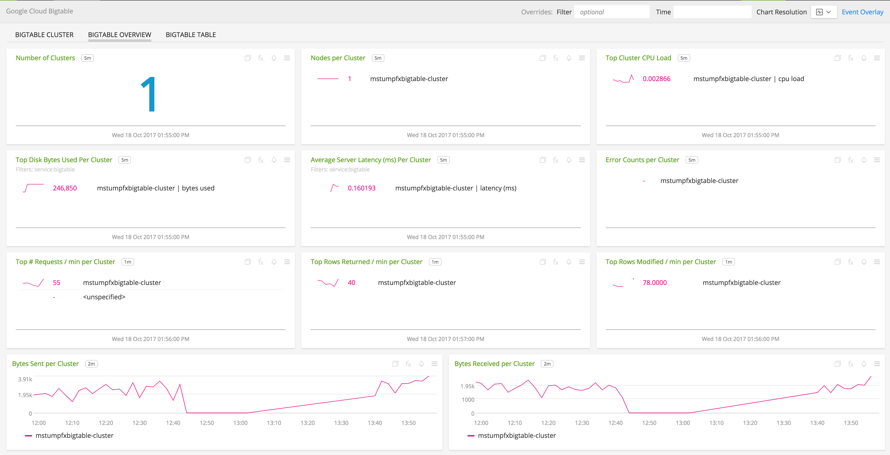](./img/bigtable_overview.png)

- **Bigtable Cluster**: Overview of a cluster metrics for Google Cloud Bigtable.

  [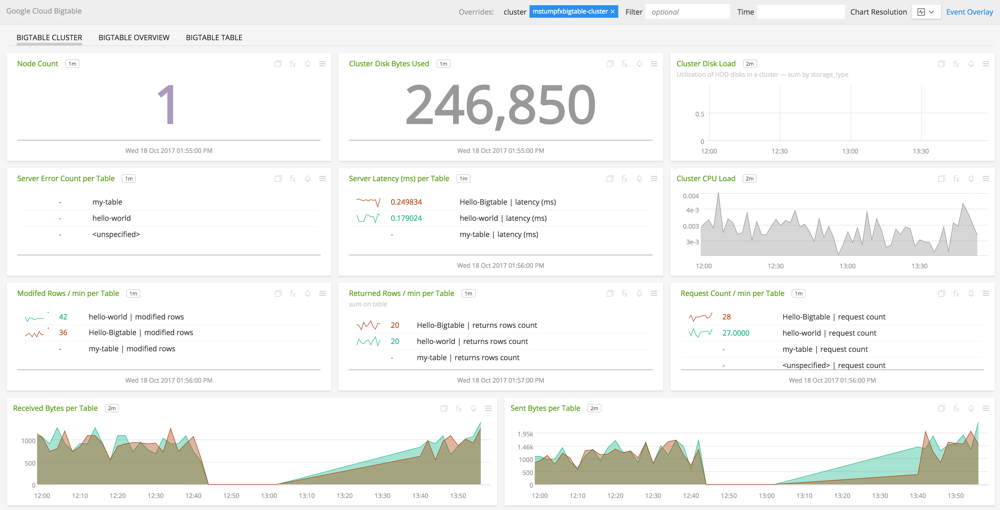](./img/bigtable_cluster.png)

- **Bigtable Table**: A table level look at metrics for Google Cloud Bigtable.

  [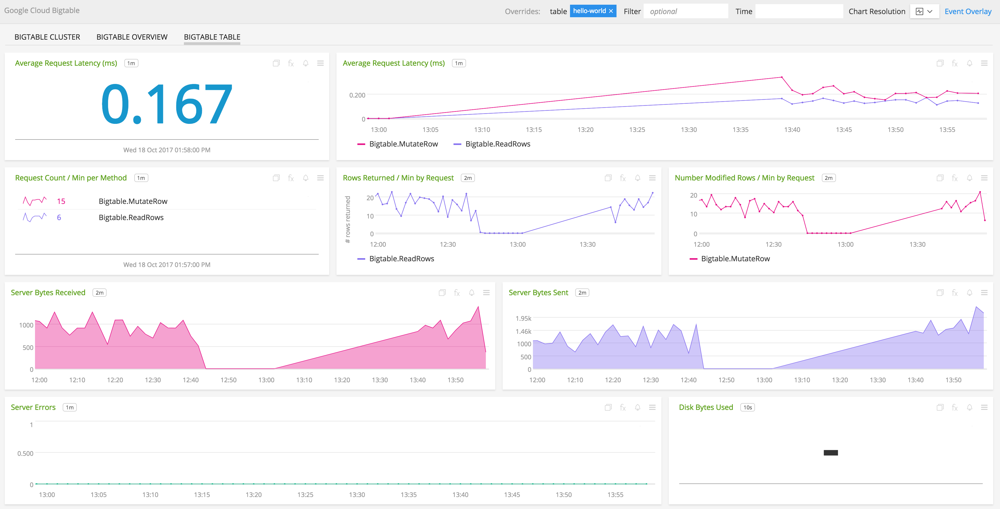](./img/bigtable_table.png)

### INSTALLATION

To access this integration, [connect to Google Cloud Platform](https://github.com/signalfx/integrations/tree/master/gcp).

### USAGE

**BigTable Cluster**

- **Node Count** - Number of nodes in the cluster.

  [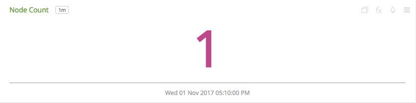](./img/cluster-node-count.png)

- **Cluster Disk Bytes Used** - Amount of compressed data stored in a cluster.

  [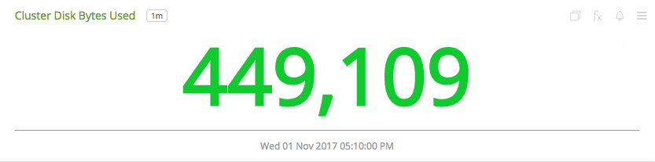](./img/cluster-disk-bytes-used.png)

- **Cluster Disk Load** - Utilization of HDD disks in a cluster.

  [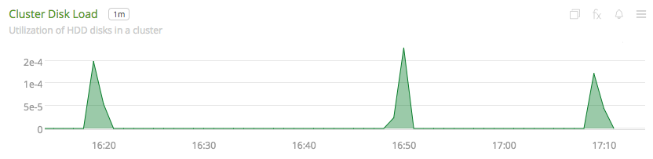](./img/cluster-disk-load.png)

- **Server Error Count per Table** - Number of server requests for a table that failed with an error aggregated by Table.

  [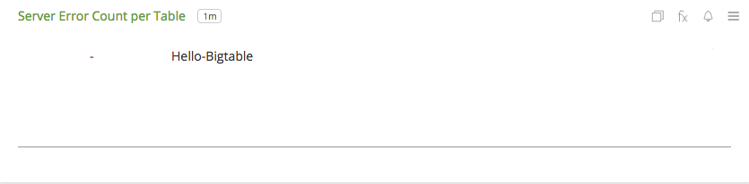](./img/cluster-error-count-per-table.png)

- **Server Latency(ms) per Table** - Distribution of server request latencies aggregated by Table.

  [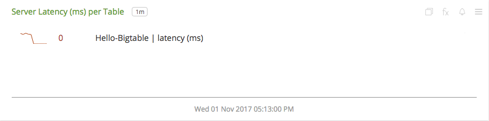](./img/cluster-server-latency-per-table.png)

- **Cluster CPU Load** - CPU load of the cluster.

  [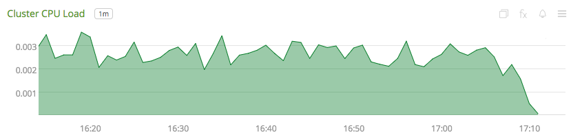](./img/cluster-cpu-load.png)

- **Modified Rows / min per Table** - Rate at which rows are modified aggregated by table.

  [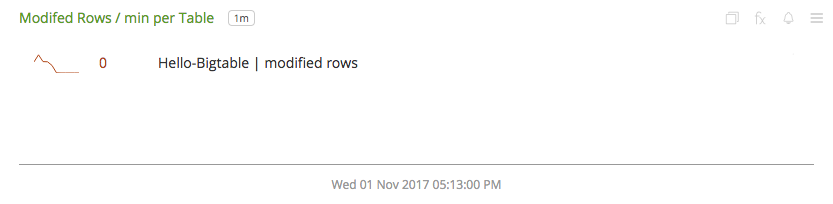](./img/cluster-modified-rows-per-table.png)

- **Returned Rows / min per Table** - Rate at which rows are returned by server requests aggregated by table.

  [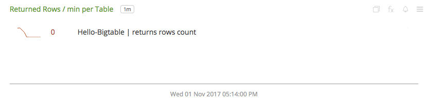](./img/cluster-returned-rows-per-table.png)

- **Requests / min per Table** - Rate at which server makes requests aggregated by table.

  [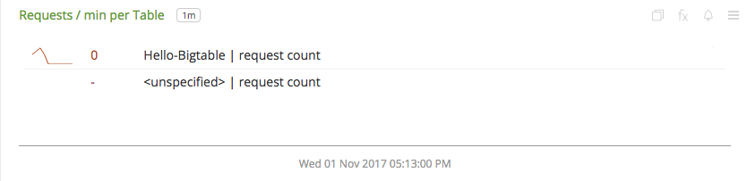](./img/cluster-reqs-table.png)

- **Received Bytes per Table** - Rate of uncompressed bytes of response data received by servers.

  [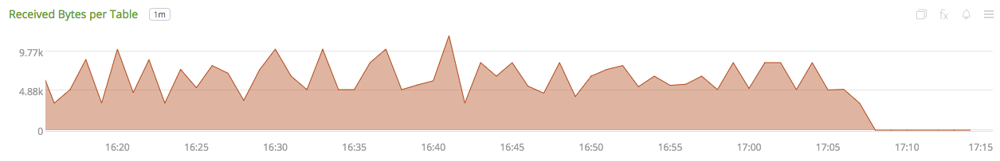](./img/cluster-received-bytes-table.png)

- **Sent Bytes per Table** - Rate of uncompressed bytes of response data sent by servers.

  [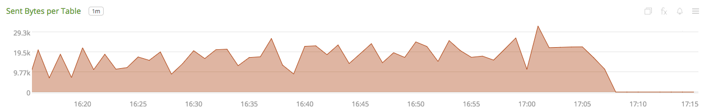](./img/cluster-sent-bytes-table.png)

**BigTable Overview**

- **Number of Clusters** - Number of clusters.

  [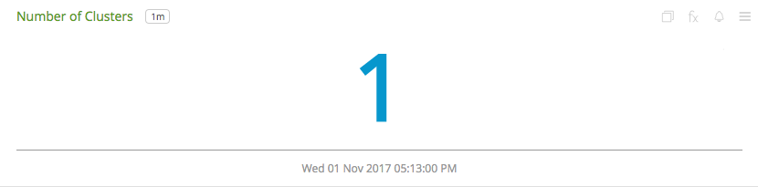](./img/overview-number-of-clusters.png)

- **Nodes per Cluster** - Number of nodes aggregated by cluster.

  [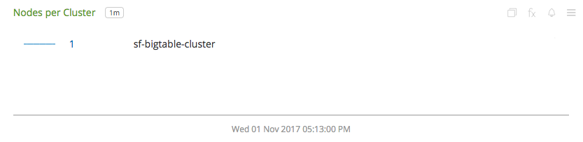](./img/overview-nodes-per-cluster.png)

- **Top Cluster CPU Load** - Top 5 clusters based on CPU load.

  [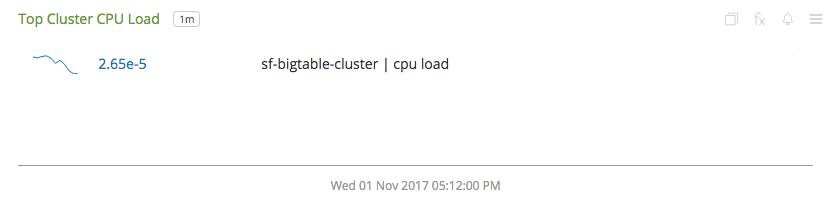](./img/overview-top-cluster-cpu-load.png)

- **Top Disk Bytes Used Per Cluster** - Top 5 clusters based on disk bytes used.

  [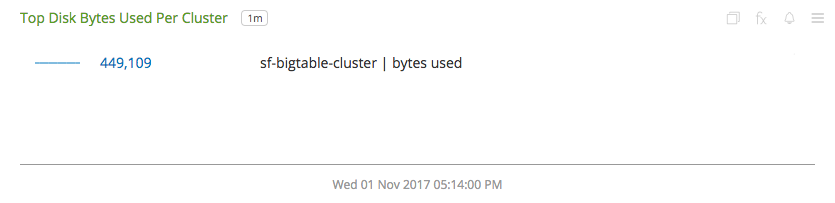](./img/overview-top-disk-per-cluster.png)

- **Average Server Latency(ms) Per Cluster** - Average server latency aggregated by cluster.

  [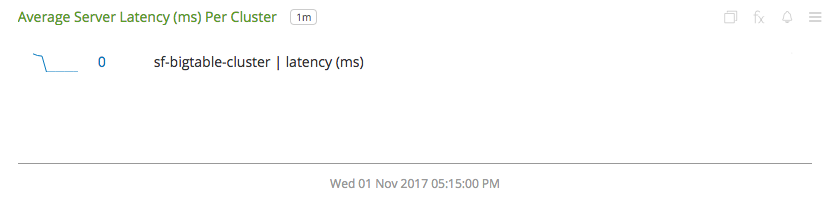](./img/overview-avg-server-latency-cluster.png)

- **Error Counts per Cluster** - Error counts aggregated by cluster.

  [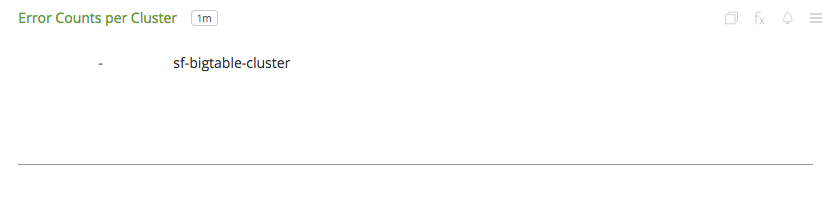](./img/overview-error-counts-per-cluster.png)

- **Top Number of Requests / min per Cluster** - Clusters with top 5 rate of requests.

  [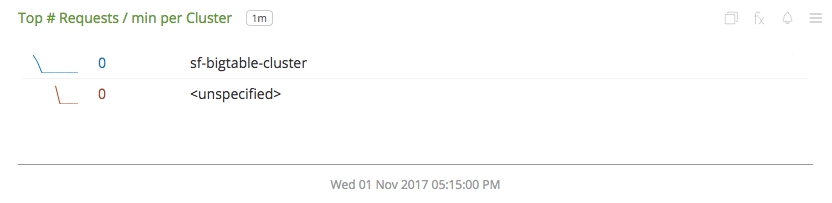](./img/overview-number-of-reqs-per-cluster.png)

- **Top Number of Rows Returned / min per Cluster** - Clusters with top 5 rate of rows returned by server requests.

  [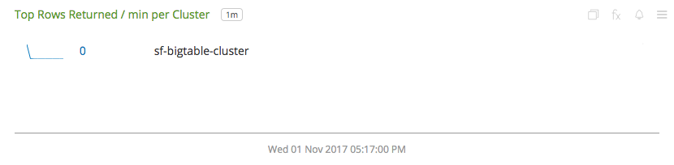](./img/overview-rows-per-cluster.png)

- **Top Number of Rows Modified / min per Cluster** - Clusters with top 5 rate of rows modified by server requests.

  [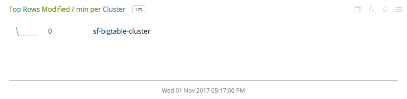](./img/overview-rows-modified-per-cluster.png)

- **Bytes Received per Cluster** - Rate of uncompressed bytes of response data received by servers aggregated by cluster.

  [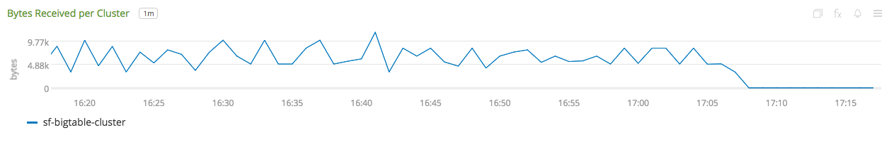](./img/cluster-received-bytes-table.png)

- **Bytes Sent per Table** - Rate of uncompressed bytes of response data sent by servers aggregated by cluster.

  [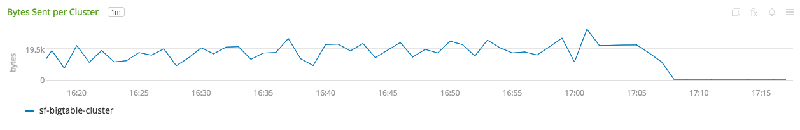](./img/overview-bytes-sent-cluster.png)

**BigTable Table**

- **Average Request Latency (ms)** - Average latency of server requests for a table.

  [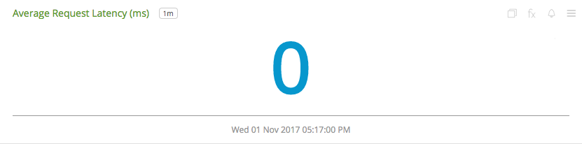](./img/table-avg-req-latency.png)

- **Average Request Latency (ms) Trend** - Trend of average latency of server requests for a table.

  [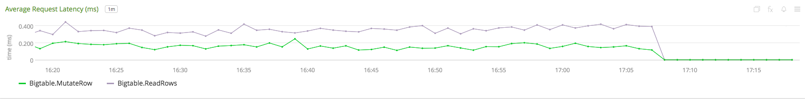](./img/table-req-latency-trend.png)

- **Requests / min per Method** - Rate of server requests aggregated by method for the table.

  [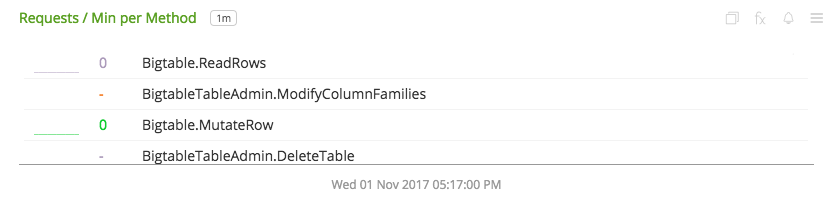](./img/table-req-per-method.png)

- **Rows Returned / min by Resquest** - Rate at which rows are returned by server requests aggregated by request.

  [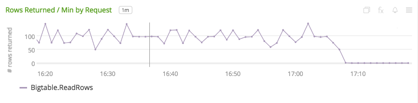](./img/table-rows-returned-by-request.png)

- **Modified Rows / min by Resquest** - Rate at which rows are modified by server requests aggregated by request.

  [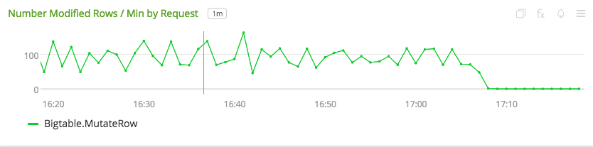](./img/table-modified-rows-by-request.png)

- **Server Bytes Received** - Rate of uncompressed bytes of response data received by servers.

  [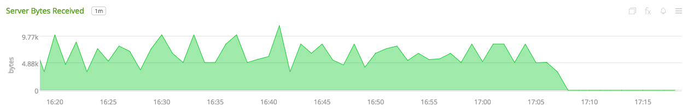](./img/table-server-bytes-received.png)

- **Server Bytes Sent** - Rate of uncompressed bytes of response data sent by servers.

  [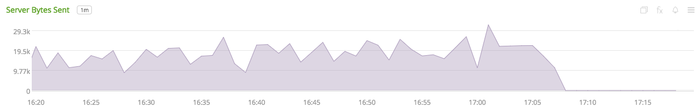](./img/table-server-bytes-sent.png)

- **Server Errors** - Number of server requests for the table that failed with an error.

  [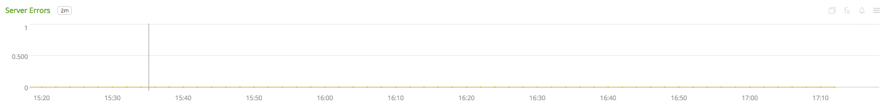](./img/table-server-errors.png)

- **Disk Bytes Used** - Amount of disk used by the table

### METRICS

For more information about the metrics emitted by Google Cloud Bigtable, visit the service's metric page at <a target="_blank" href="https://cloud.google.com/monitoring/api/metrics#gcp-bigtable">https://cloud.google.com/monitoring/api/metrics#gcp-bigtable</a>

### LICENSE

This integration is released under the Apache 2.0 license. See [LICENSE](./LICENSE) for more details.
