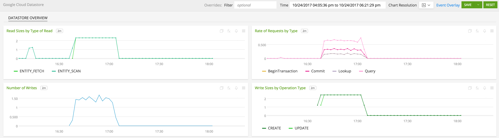
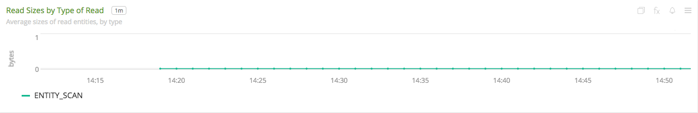

#  Google Cloud Datastore

- [Description](#description)
- [Installation](#installation)
- [Usage](#usage)
- [Metrics](#metrics)
- [License](#license)

### DESCRIPTION

Use SignalFx to monitor Google Cloud Datastore via [Google Cloud Platform](https://github.com/signalfx/integrations/tree/master/gcp).

#### FEATURES

##### Built-in dashboards

- **Datastore Overview**: Overview of project level metrics for Google Datastore

  

### INSTALLATION

To access this integration, [connect to Google Cloud Platform](https://github.com/signalfx/integrations/tree/master/gcp).

### USAGE

#### Interpreting Built-in dashboards

**Datastore Overview**

- **Read Sizes by Type of Read** - Average sizes of read entities by type.

  

- **Number of Requests per API Method Call** - Number of requests made by method.

  

- **Number of Writes** - Number of Datastore index writes.

  

- **Write Sizes by Operation Type** - Average size of written entites by operation.

  

### METRICS

For more information about the metrics emitted by Google Cloud Datastore, visit the service's metric page at <a target="_blank" href="https://cloud.google.com/monitoring/api/metrics#gcp-datastore">https://cloud.google.com/monitoring/api/metrics#gcp-datastore</a>

### LICENSE

This integration is released under the Apache 2.0 license. See [LICENSE](./LICENSE) for more details.
