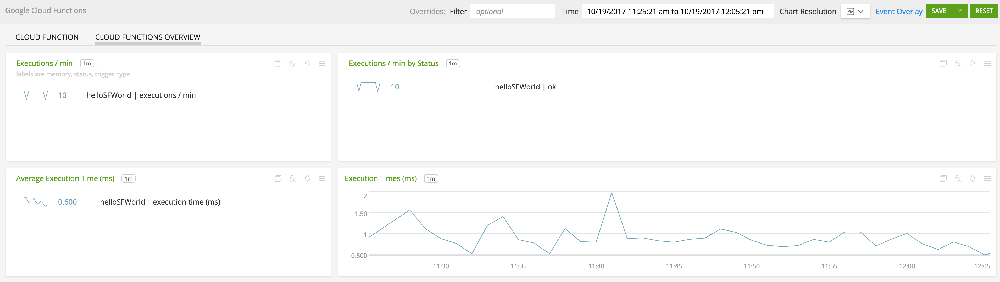
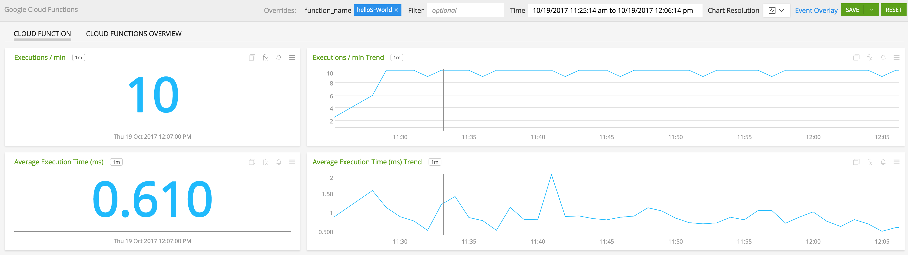
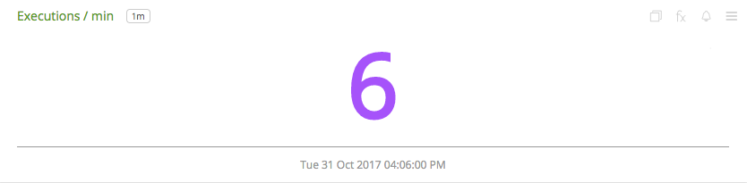
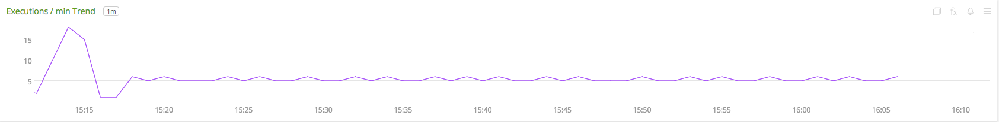
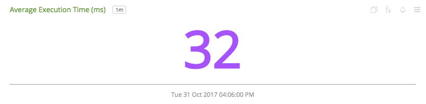
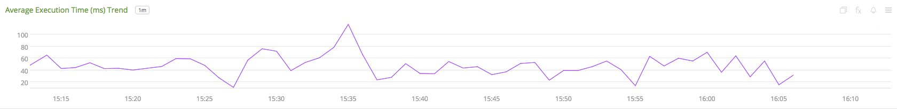
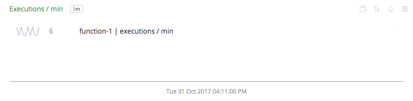
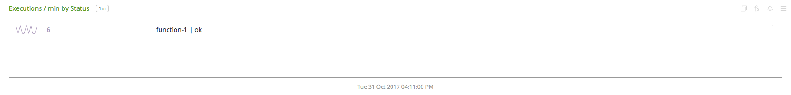
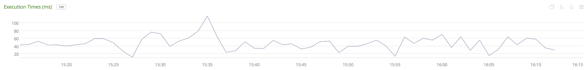

#  Google Cloud Functions

- [Description](#description)
- [Installation](#installation)
- [Usage](#usage)
- [Metrics](#metrics)
- [License](#license)

### DESCRIPTION

Use SignalFx to monitor Google Cloud Functions via [Google Cloud Platform](https://github.com/signalfx/integrations/tree/master/gcp).

#### FEATURES

##### Built-in dashboards

- **Cloud Functions Overview**: Overview of project level metrics for Google Cloud Functions

  

- **Cloud Function**: Metrics for a single cloud function

  

### INSTALLATION

To access this integration, [connect to Google Cloud Platform](https://github.com/signalfx/integrations/tree/master/gcp).

### USAGE

#### Interpreting Built-in dashboards

**Cloud Function**

- **Executions / min** - Count of function executions per minute.

  

- **Executions / min Trend** - Trend of function executions per minute.

  

- **Average Execution Time (ms)** - Average execution time for a function.

  

- **Average Execution Time (ms) Trend** - Average execution time trend for a function.

  

**Cloud Functions Overview**

- **Executions / min** - List of executions per minute for all functions.

  

- **Executions / min by Status** - List of function executions per minute grouped by status.

  

- **Average Execution Time (ms)** - List of average execution times for all functions.

  

- **Execution Time (ms)** - Trend of average execution times for all functions.

  

### METRICS

For more information about the metrics emitted by Google Cloud Functions, visit the service's metric page at <a target="_blank" href="https://cloud.google.com/monitoring/api/metrics#gcp-cloudfunctions">https://cloud.google.com/monitoring/api/metrics#gcp-cloudfunctions</a>

### LICENSE

This integration is released under the Apache 2.0 license. See [LICENSE](./LICENSE) for more details.
