#  Google Cloud Pub/Sub

- [Description](#description)
- [Installation](#installation)
- [Usage](#usage)
- [Metrics](#metrics)
- [License](#license)

### DESCRIPTION

Use SignalFx to monitor Google Cloud Pub/Sub via [Google Cloud Platform](https://github.com/signalfx/integrations/tree/master/gcp).

#### FEATURES

##### Built-in dashboards

- **Pub/Sub Overview**: Overview of project level metrics for Google Cloud Pub/Sub

  [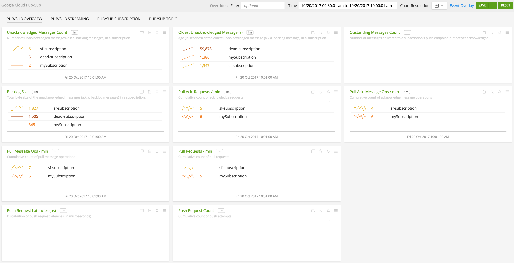](./img/pubsub_overview.png)

- **Pub/Sub Subscription**: Metrics for a single subscription from Google Cloud Pub/Sub

  [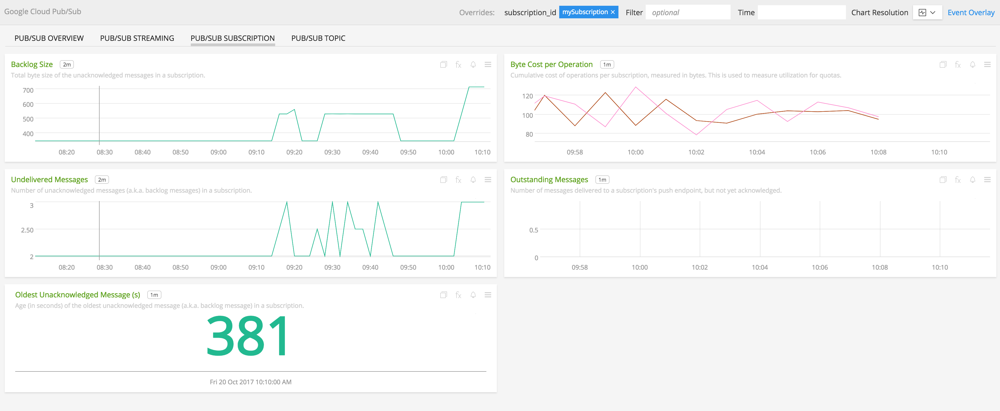](./img/pubsub_subscription.png)

- **Pub/Sub Topic**: Metrics for a single topic from Google Cloud Pub/Sub

  [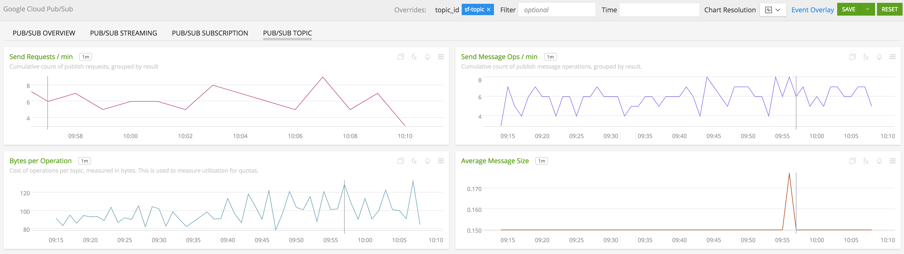](./img/pubsub_topic.png)

- **Pub/Sub Streaming**: Metrics for Pub/Sub if the service is being used for data streaming.

### INSTALLATION

To access this integration, [connect to Google Cloud Platform](https://github.com/signalfx/integrations/tree/master/gcp).

### USAGE

#### Interpreting Built-in dashboards

**Pub/Sub Overview**

- **Unacknowledged Messages Count** - Number of unacknowledged messages aggregated by subscription.

  [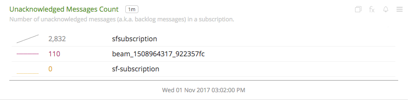](./img/overview-unack-messages-count.png)

- **Oldest Unacknowledged Message(s)** - Age, in seconds, of the oldest unacknowledged message for each subscription.

  [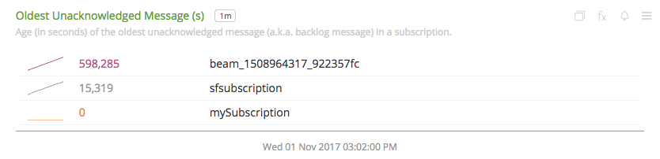](./img/overview-oldest-unack-message.png)

- **Outstanding Messages Count** - Number of messages delivered to a subscription's push endpoint, but not yet acknowledged.

- **Backlog Size** - Total size in bytes of unacknowledged messages aggregated by subscription.

  

- **Subscription Pull Ack. Requests** - Cumulative counts of acknowledge requests aggregated by subscription.

  [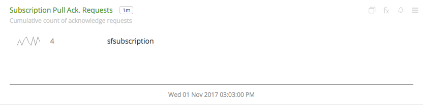](./img/overview-subscription-pull-ack-req.png)

- **Subscription Pull Ack. Message Ops** - Cumulative counts of acknowledge message ops aggregated by subscription.

  [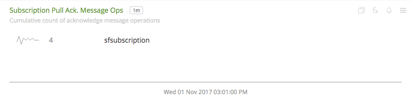](./img/overview-subscription-pull-ack-ops.png)

- **Subscription Pull Message Ops** - Cumulative counts of pull message ops aggregated by subscription.

  [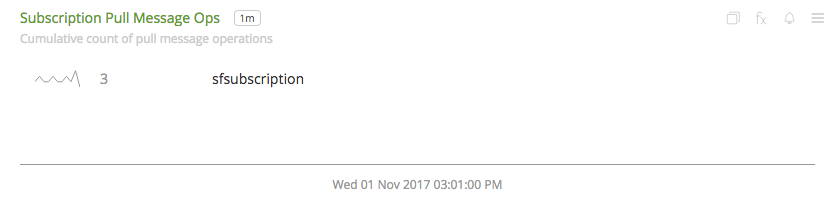](./img/overview-subscription-pull-message-ops.png)

- **Subscription Pull Requests** - Cumulative counts of pull requests aggregated by subscription.

  [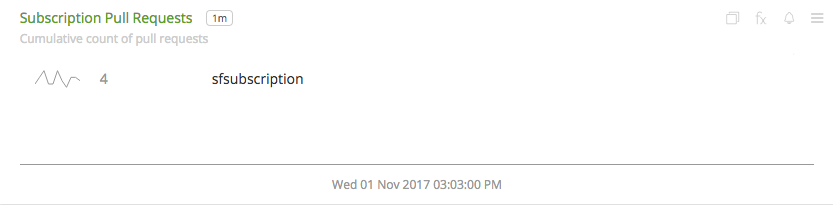](./img/overview-subscription-pull-request.png)

**Pub/Sub Subscription**

- **Backlog Size** - Total byte size of the unacknowledged messages in a subscription.

  [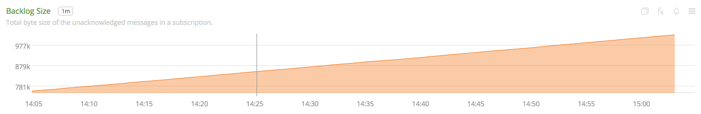](./img/subscription-backlog-size.png)

- **Cost per Operation** - Cumulative cost of operations per subscription, measured in bytes. This is used to measure utilization for quotas.

  [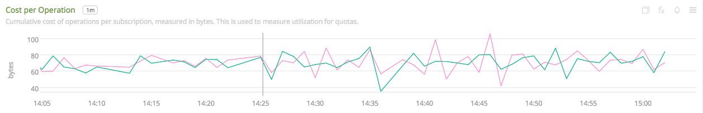](./img/subscription-cost-per-operation.png)

- **Undelivered Messages** - Number of unacknowledged messages (a.k.a. backlog messages) in a subscription.

  

- **Outstanding Messages** - Number of messages delivered to a subscription's push endpoint, but not yet acknowledged.

- **Oldest Unacknowledged Message(s)** - Age (in seconds) of the oldest unacknowledged message (a.k.a. backlog message) in a subscription.

  [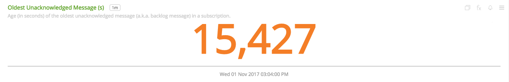](./img/subscription-unack-messages.png)

**Pub/Sub Topic**

- **Send Requests** - Number of publish requests.

  [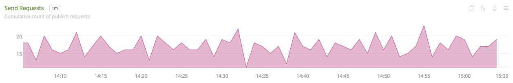](./img/topic-send-requests.png)

- **Send Message Ops** - Number of publish message operations.

  [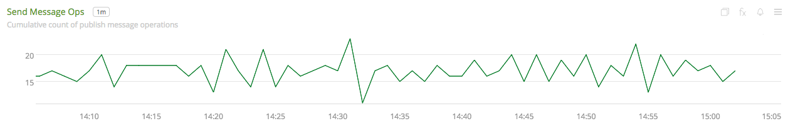](./img/topic-send-message-ops.png)

- **Bytes per Operation** - Cost of operations per topic, measured in bytes. This is used to measure utilization for quotas.

  [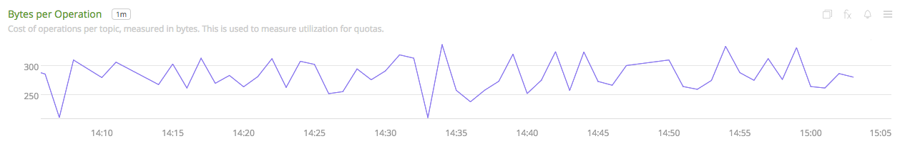](./img/topic-bytes-per-opertation.png)

- **Average Message Size** - Average of publish message sizes (in bytes).

  [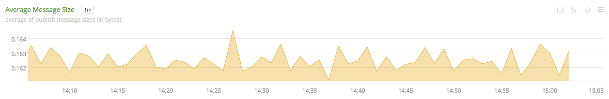](./img/topic-average-message-size.png)

### METRICS

For more information about the metrics emitted by Google Cloud Pub/Sub, visit the service's metric page at <a target="_blank" href="https://cloud.google.com/monitoring/api/metrics#gcp-pubsub">https://cloud.google.com/monitoring/api/metrics#gcp-pubsub</a>

### LICENSE

This integration is released under the Apache 2.0 license. See [LICENSE](./LICENSE) for more details.
