#  Google Cloud Router

- [Description](#description)
- [Installation](#installation)
- [Usage](#usage)
- [Metrics](#metrics)
- [License](#license)

### DESCRIPTION

Use SignalFx to monitor Google Cloud Router via [Google Cloud Platform](https://github.com/signalfx/integrations/tree/master/gcp).

#### FEATURES

##### Built-in dashboards

- **Router Overview**: Overview of project level metrics for Google Cloud Router

  [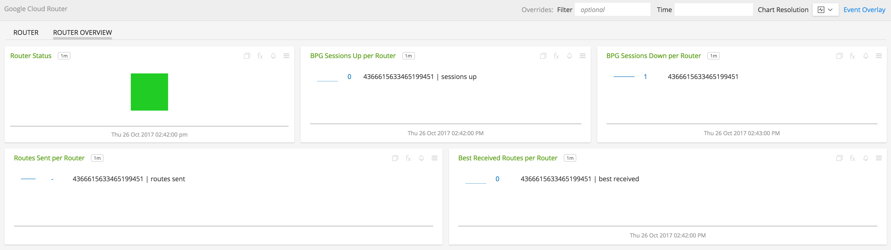](./img/router_overview.png)

- **Router**: Metrics for a single instance of Google Cloud Router

  [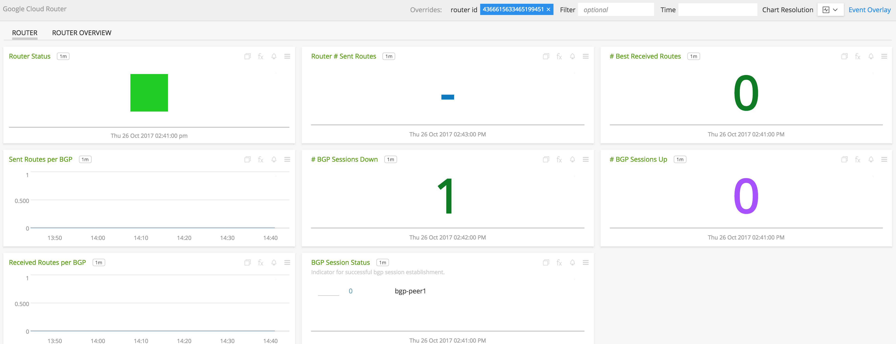](./img/router_router.png)

### INSTALLATION

To access this integration, [connect to Google Cloud Platform](https://github.com/signalfx/integrations/tree/master/gcp).

### USAGE

#### Interpreting Built-in dashboards

**Router**

- **Router Status** - Indicates whether or not the router is up.

  [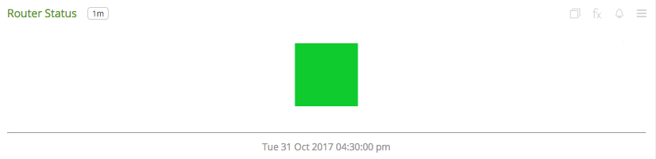](./img/router-status.png)

- **Router Number of Sent Routes** - Current number of routes sent on a bgp session.

  [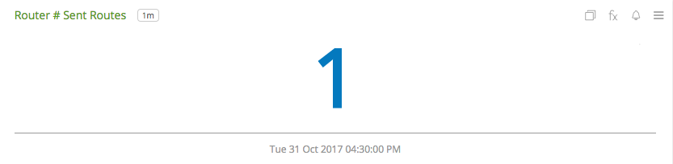](./img/router-number-of-sent-routes.png)

- **Number of Best Received Routes** - Current number of best routes received by router.

  [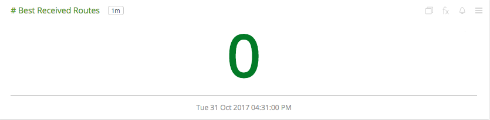](./img/router-number-of-best-received-routes.png)

- **Sent Routes per BGP** - Current number of routes sent aggregated by bgp session.

  [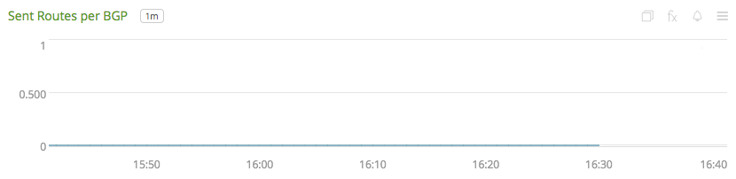](./img/router-sent-routes-per-bgp.png)

- **Number of BGP Sessions Down** - Number of BGP sessions on the router that are down.

  [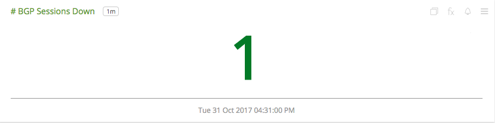](./img/router-number-of-sessions-down.png)

- **Number of BGP Sessions Up** - Number of BGP sessions on the router that are up.

  [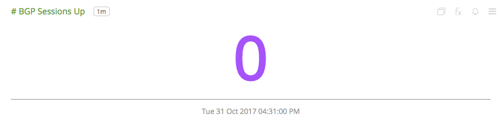](./img/router-number-of-bgp-sessions-up.png)

- **Received Routes per BGP** - Current number of routes received aggregated by bgp session.

  [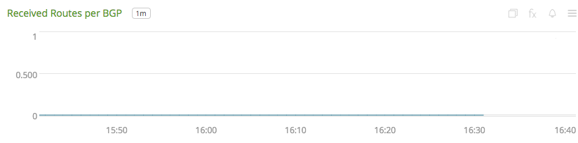](./img/router-received-routes-per-bgp.png)

- **BGP Session Status** - Indicator for successful bgp session establishment.

  [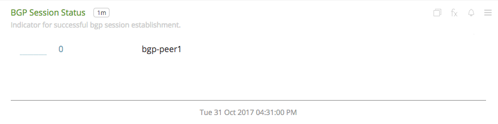](./img/router-bgp-session-status.png)

**Router Overview**

- **Router Status** - Indicates an whether or not majority of the routers are up.

  [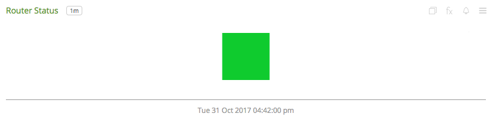](./img/router-overview-status.png)

- **BGP Session Up per Router** - List of number of bgp sessions up for each router.

  [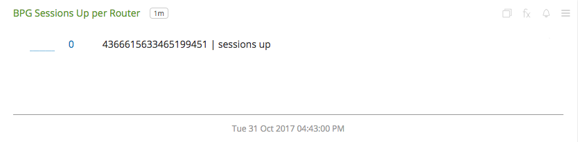](./img/router-overview-bgp-sessions-up-per-router.png)

- **BGP Session Down per Router** - List of number of bgp sessions down for each router.

  [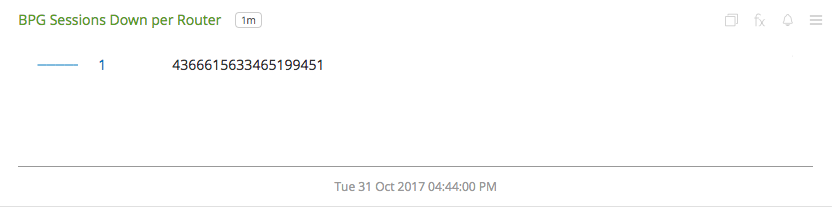](./img/router-overview-bgp-sessions-down-per-router.png)

- **Routes Sent per Router** - List of current number of routes sent aggregated by `router_id`.

  [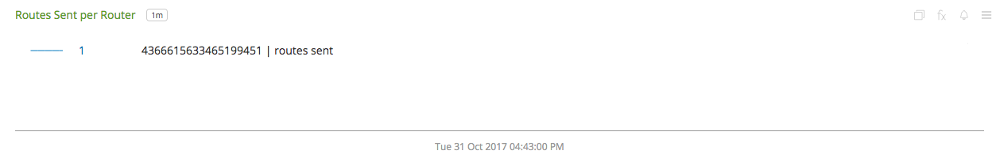](./img/router-overview-routes-sent-per-router.png)

- **Best Received Routes per Router** - List of current number of best routes received aggregated by `router_id`.

  

### METRICS

For more information about the metrics emitted by Google Cloud Router, visit the service's metric page at <a target="_blank" href="https://cloud.google.com/monitoring/api/metrics#gcp-router">https://cloud.google.com/monitoring/api/metrics#gcp-router</a>

### LICENSE

This integration is released under the Apache 2.0 license. See [LICENSE](./LICENSE) for more details.
