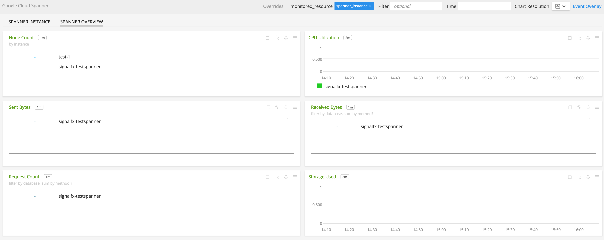
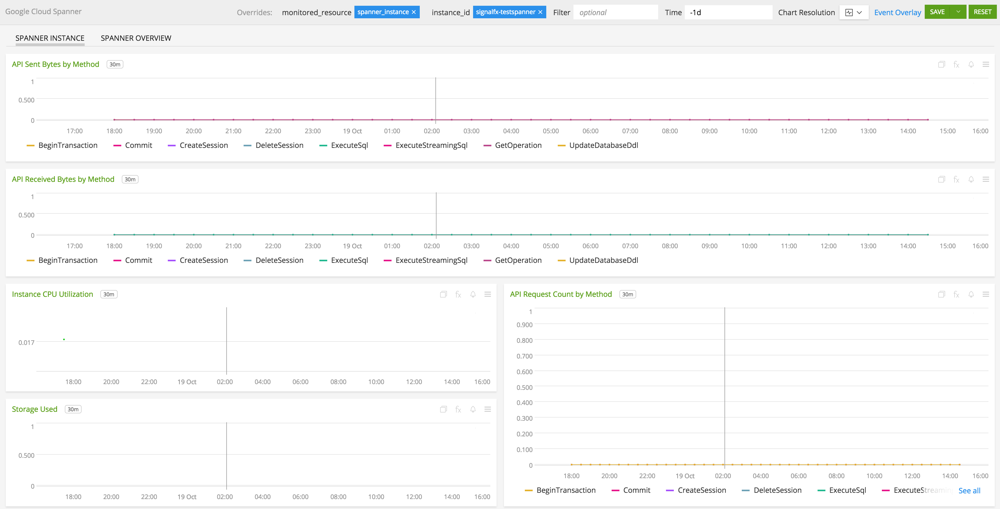
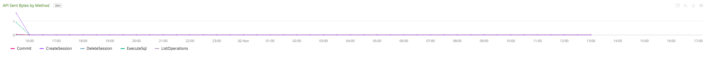
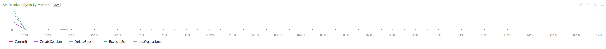
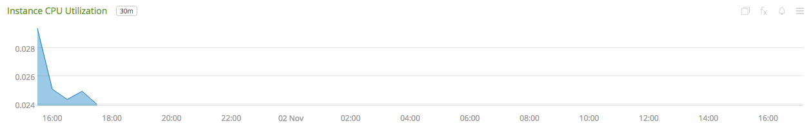
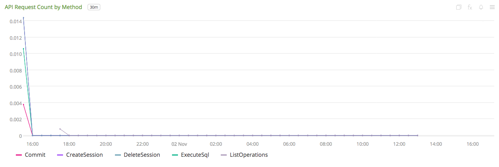
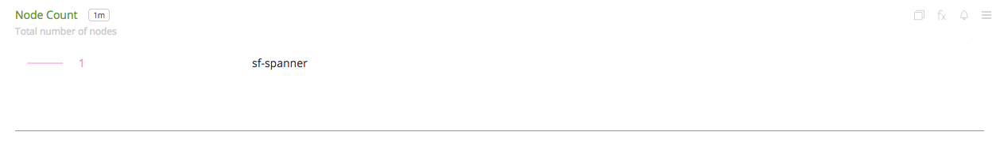
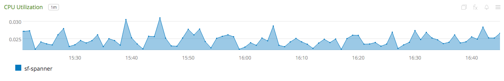
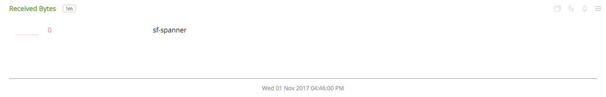
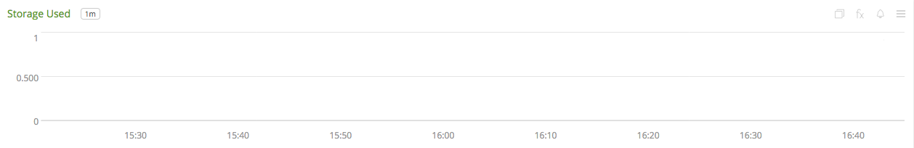

#  Google Cloud Spanner

- [Description](#description)
- [Installation](#installation)
- [Usage](#usage)
- [Metrics](#metrics)
- [License](#license)

### DESCRIPTION

Use SignalFx to monitor Google Cloud Spanner via [Google Cloud Platform](https://github.com/signalfx/integrations/tree/master/gcp).

#### FEATURES

##### Built-in dashboards

- **Spanner Overview**: Overview of project level metrics for Google Cloud Spanner

  

- **Spanner Instance**: Metrics for a single instance of Google Cloud Spanner

  

### INSTALLATION

To access this integration, [connect to Google Cloud Platform](https://github.com/signalfx/integrations/tree/master/gcp).

### USAGE

#### Interpreting Built-in dashboards

**Spanner Instance**

- **API Sent Bytes by Method** - Rate at which uncompressed response bytes sent by Cloud Spanner grouped by method.

  

- **API Received Bytes by Method** - Rate at which uncompressed response bytes received by Cloud Spanner grouped by method.

  

- **Instance CPU Utilization** - CPU utilization of the instance.

  

- **API Request Count by Method** - Rate of Cloud Spanner API requests grouped by method.

  

- **Storage Used** - Storage used in bytes by the instance.

**Spanner Overview**

- **Node Count** - Total number nodes in the project.

  

- **CPU Utilization** - Utilization of provisioned CPU by all instances.

  

- **Sent Bytes** - Rate at which uncompressed response bytes are sent by Cloud Spanner.

  

- **Received Bytes** - Rate at which uncompressed response bytes are received by Cloud Spanner.

  

- **Request Count** - Rate of Cloud Spanner API requests.

  

- **Storage Used** - Storage used in bytes by Cloud Spanner.

  

### METRICS

For more information about the metrics emitted by Google Cloud Spanner, visit the service's metric page at <a target="_blank" href="https://cloud.google.com/monitoring/api/metrics#gcp-spanner">https://cloud.google.com/monitoring/api/metrics#gcp-spanner</a>

### LICENSE

This integration is released under the Apache 2.0 license. See [LICENSE](./LICENSE) for more details.
