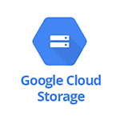
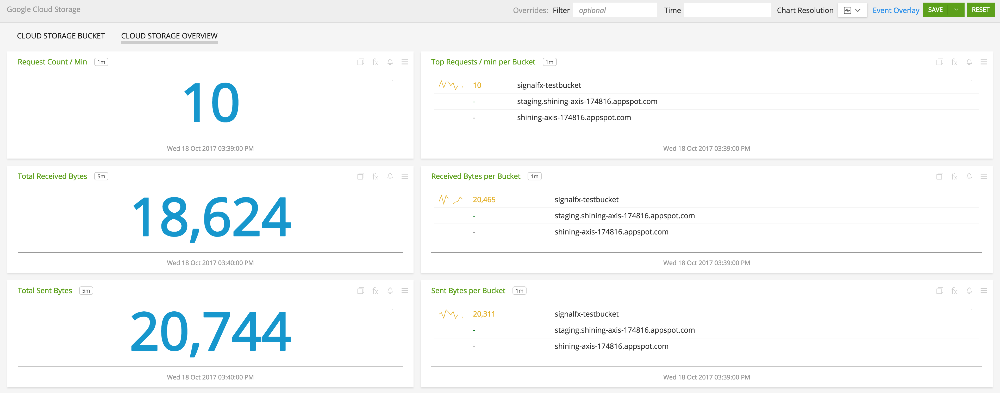
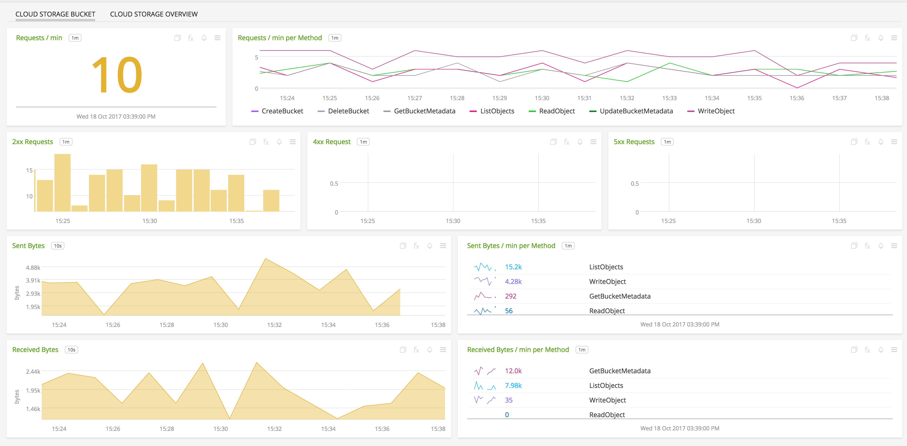

#  Google Cloud Storage

- [Description](#description)
- [Installation](#installation)
- [Usage](#usage)
- [Metrics](#metrics)
- [License](#license)

## DESCRIPTION

To monitor Google Cloud Storage, integrate SignalFx with [Google Cloud Platform](https://docs.signalfx.com/en/latest/integrations/google-cloud-platform.html#connect-to-gcp).

## FEATURES

### Built-in Dashboards

- **Storage Overview** - Overview of project-level metrics for Google Cloud Storage.

  

- **Storage Bucket** - Metrics for a specific Google Cloud Storage Bucket.

  

## INSTALLATION

To access this integration, [connect to Google Cloud Platform](https://docs.signalfx.com/en/latest/integrations/google-cloud-platform.html#connect-to-gcp).

### Prerequisites

None

## USAGE

### Interpreting Built-in Dashboards

**Cloud Storage Bucket**

- **Requests / min** - Total rate of API calls on bucket.

- **Requests / min per Method** - Rate of API calls on bucket grouped by method.

- **2xx Requests** - Number of requests that responded with a 2xx response.

- **4xx Requests** - Number of requests that responded with a 4xx response.

- **5xx Requests** - Number of requests that responded with a 5xx response.

- **Sent Bytes** - Amount of bytes sent over the network by the bucket.

- **Sent Bytes / min per Method** - Amount of bytes sent over the network by the bucket aggregated by Method.

- **Received Bytes** - Amount of bytes received over the network by the bucket.

- **Received Bytes / min per Method** - Amount of bytes received over the network by the bucket.

**Cloud Storage Overview**

- **Request Count / min** - Rate of total number of API calls.

- **Top Requests / min per Bucket** - Buckets with top 5 API calls.

- **Total Received Bytes** - Total bytes received by all buckets put together.

- **Received Bytes per Bucket** - Lists total bytes received by each bucket.

- **Total Sent Bytes** - Total bytes sent by all buckets put together.

- **Sent Bytes per Bucket** - Lists total bytes sent by each bucket.

## METRICS

For more information about the metrics emitted by Google Cloud Storage, visit the service's metric page at <a target="_blank" href="https://cloud.google.com/monitoring/api/metrics#gcp-storage">https://cloud.google.com/monitoring/api/metrics#gcp-storage</a>

#### LICENSE

This integration is released under the Apache 2.0 license. See [LICENSE](./LICENSE) for more details.
