#  Google Compute Engine

- [Description](#description)
- [Installation](#installation)
- [Usage](#usage)
- [Metrics](#metrics)
- [License](#license)

### DESCRIPTION

Use SignalFx to monitor Google Compute Engine via [Google Cloud Platform](https://github.com/signalfx/integrations/tree/master/gcp).

#### FEATURES

##### Built-in dashboards

- **Compute Instances**: Overview of all data from Google Compute Engine.

  [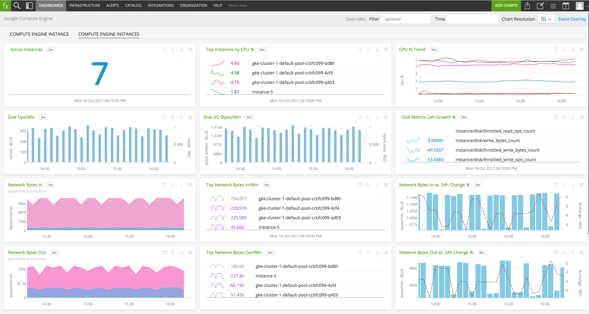](./img/compute_instances.png)

- **Compute Instance**: Focus on a single Compute Engine instance.

  [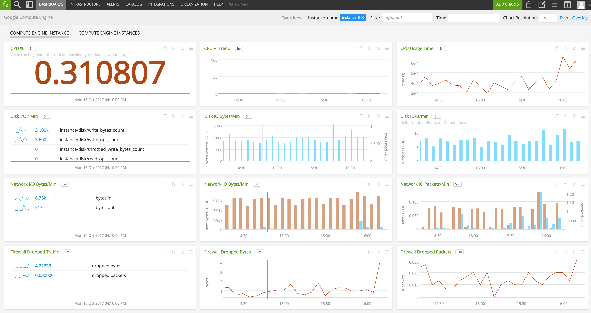](./img/compute_instance.png)

### INSTALLATION

To access this integration, [connect to Google Cloud Platform](https://github.com/signalfx/integrations/tree/master/gcp).

### USAGE

#### Interpreting Built-in dashboards

**Compute Engine Instance**

- **CPU Percent** - Percentage of CPU used by the instance.

  [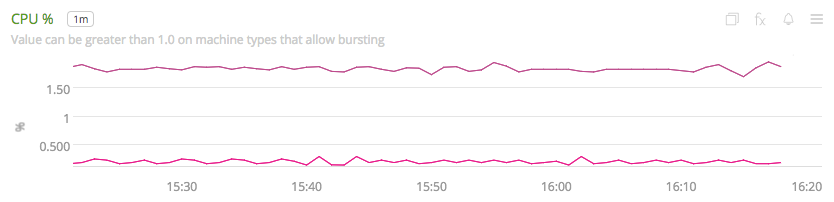](./img/instance-cpu-percent.png)

- **CPU Percent Trend** - Trend of percentage of CPU used by the instance.

  [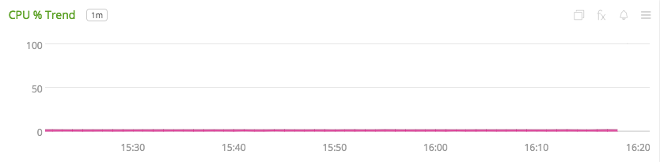](./img/instance-cpu-percent-trend.png)

- **Disk I/O Operations** - Number of read/write operations performed by the instance during each interval.

  [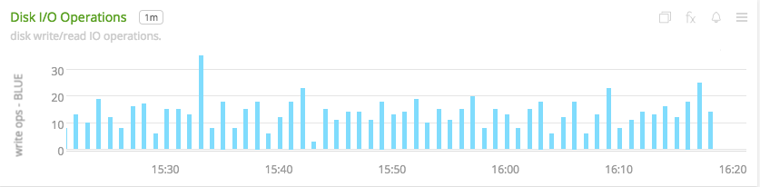](./img/instance-disk-io.png)

- **Disk I/O / min** - List of counts of all the different of disk operations by the instance.

  [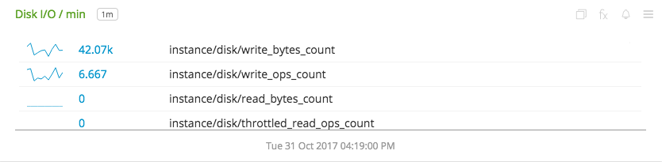](./img/instance-disk-io-per-min.png)

- **Disk I/O Bytes / min** - Number of bytes written to/read from disk per min.

  [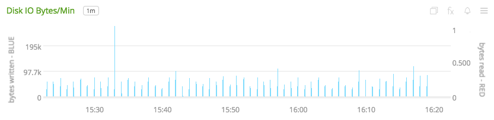](./img/instance-disk-io-bytes-per-min.png)

- **Network I/O Packets** - Number of packets received from/sent to the network.

  [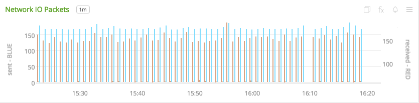](./img/instance-network-io-packets.png)

- **Network I/O Bytes / min** - Number of bytes received from/sent to the network by the instance.

  [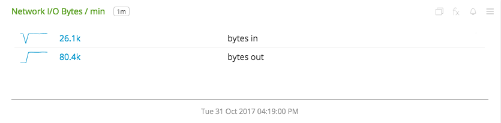](./img/instance-network-io-bytes-per-min.png)

- **Network I/O Bytes / min Trend** - Number of bytes received from/sent to the network by the instance.

  [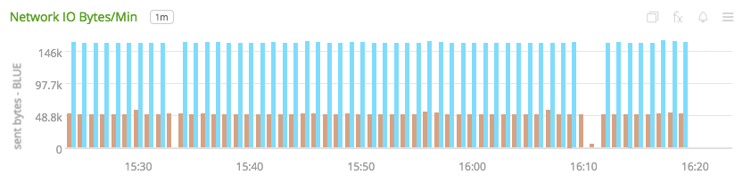](./img/instance-network-io-bytes-per-min-trend.png)

- **Firewall Dropped Packets** - Number of incoming packets dropped by the firewall.

  [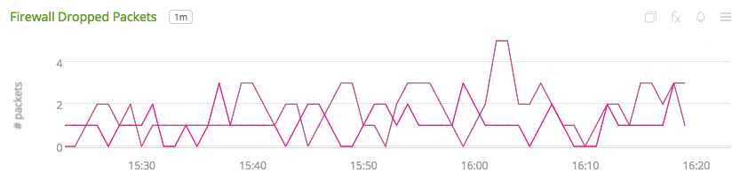](./img/instance-firewall-dropped-packets.png)

**Compute Engine Instances**

- **Active Instances** - Number of active instances.

  [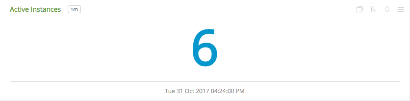](./img/instances-active-instances.png)

- **Top Instances by CPU Percent** - List of top 5 instances by percent of CPU used.

  [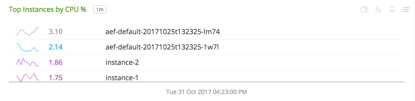](./img/instances-top-instances-by-cpu.png)

- **CPU Percent Trend** - Trend of percent CPU used by instances.

  [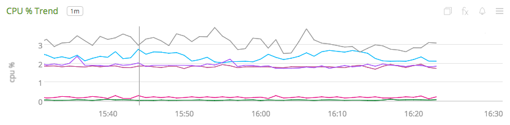](./img/instances-cpu-percent-trend.png)

- **Number of Disk Opertions** - Aggregated disk read/write operations of all instances.

  

- **Disk I/O** - Aggregated count of bytes read from/written to disk.

  [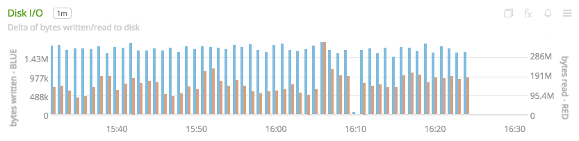](./img/instances-disk-io.png)

- **Disk Metrics 24h Growth Percent** - 24 hour growth percent of available disk metrics.

  [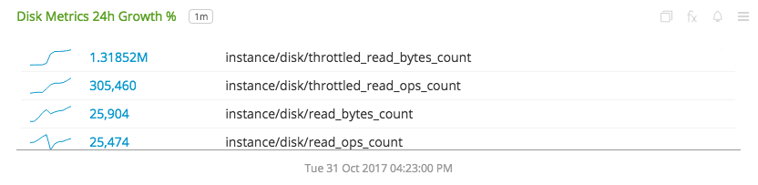](./img/instances-disk-metrics-growth.png)

- **Network Bytes In** - Percentile distribution of number of bytes received over the network.

  [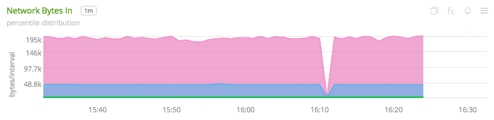](./img/instances-network-bytes-in.png)

- **Top Network Bytes In** - Top 5 instances based on the number of bytes received over the network.

  [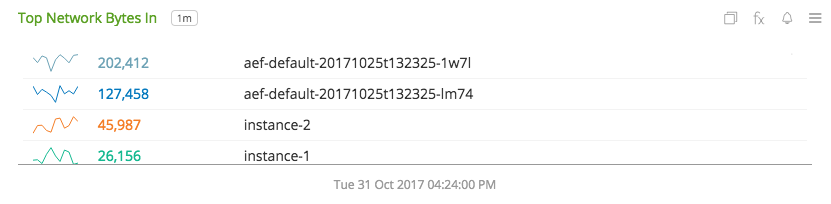](./img/instances-top-network-bytes-in.png)

- **Network Bytes In vs. 24h Change Percent** - Aggregated number of bytes received from the network across all instances vs. the 24 hour change in number of bytes received.

  [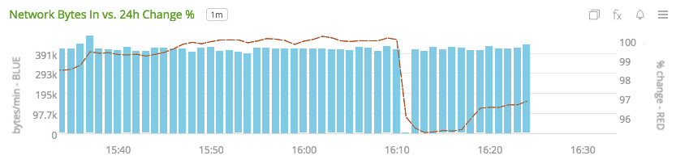](./img/instances-network-bytes-in-vs-change.png)

- **Network Bytes Out** - Percentile distribution of number of bytes sent over the network.

  [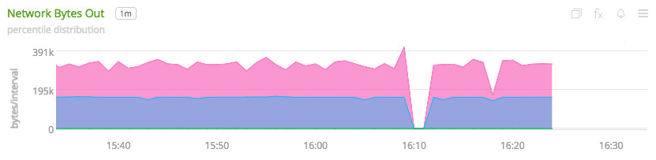](./img/instances-network-bytes-out.png)

- **Top Network Bytes Out** - Top 5 instances based on the number of bytes sent over the network.

  [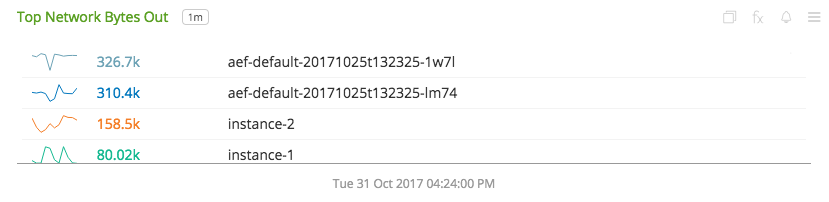](./img/instances-top-network-bytes-out.png)

- **Network Bytes Out vs. 24h Change Percent** - Aggregated number of bytes sent to the network across all instances vs. the 24 hour change in number of bytes sent.

  [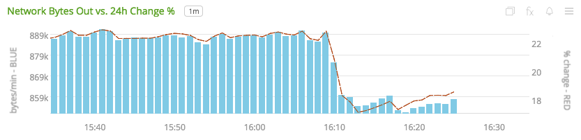](./img/instances-network-bytes-out-vs-change.png)

### METRICS

For more information about the metrics emitted by Google Compute Engine, visit the service's metric page at <a target="_blank" href="https://cloud.google.com/monitoring/api/metrics#gcp-compute">https://cloud.google.com/monitoring/api/metrics#gcp-compute</a>

### LICENSE

This integration is released under the Apache 2.0 license. See [LICENSE](./LICENSE) for more details.
