# 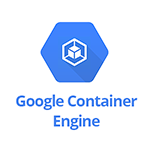 Google Container Engine

- [Description](#description)
- [Installation](#installation)
- [Usage](#usage)
- [Metrics](#metrics)
- [License](#license)

### DESCRIPTION

Use SignalFx to monitor Google Container Engine via [Google Cloud Platform](https://github.com/signalfx/integrations/tree/master/gcp).

#### FEATURES

##### Built-in dashboards

- **Container Engine**: Overview of project level metrics for Google Container Engine

  [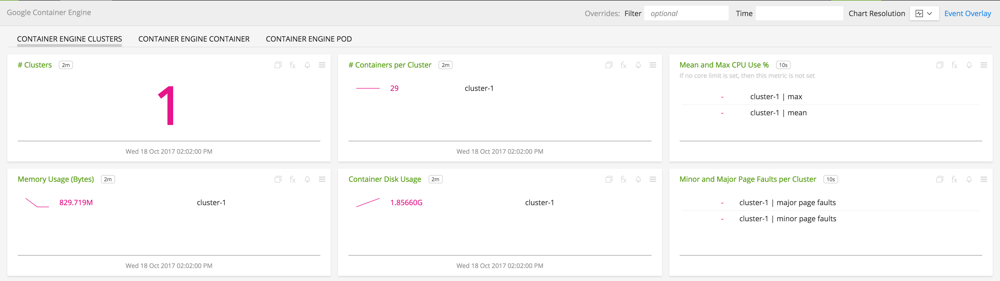](./img/container_engine.png)

- **Container Engine Container**: Metrics for a specific container in Google Container Engine

  [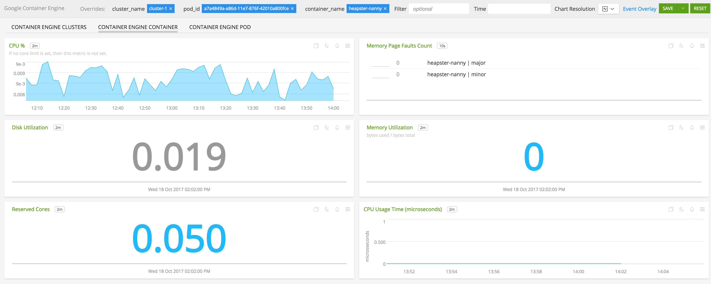](./img/container_engine_container.png)

- **Container Engine Pod**: Pod level metrics for Google Container Engine

  [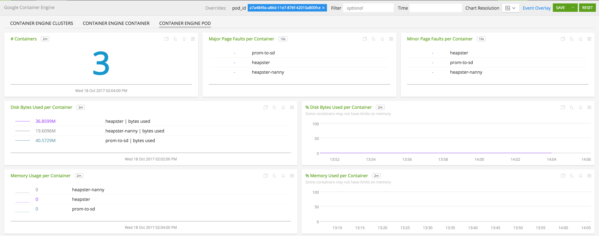](./img/container_engine_pod.png)

### INSTALLATION

To access this integration, [connect to Google Cloud Platform](https://github.com/signalfx/integrations/tree/master/gcp).

**Note**: Stackdriver Monitoring may not be enabled by default for your cluster. To enable it so that these metrics can be retrieved by SignalFx please see <a target="_blank" href="https://cloud.google.com/kubernetes-engine/docs/how-to/monitoring">this page</a>.

### USAGE

#### Interpreting Built-in dashboards

**Container Engine Overview**

- **Number of Clusters** - Number of clusters running in the project.

  [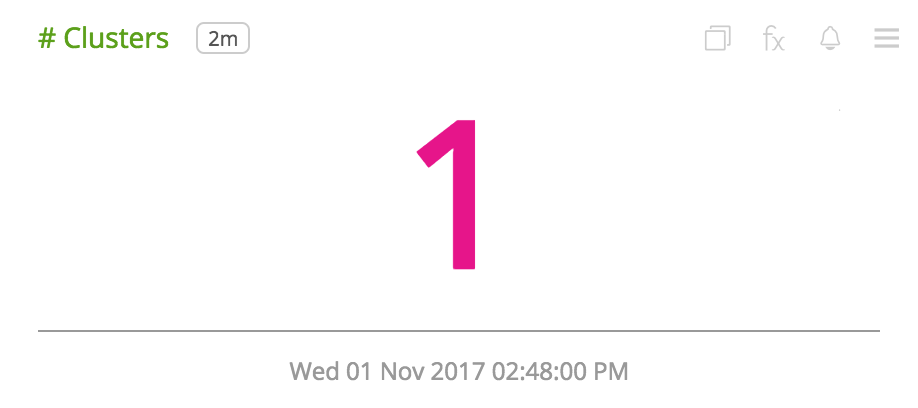](./img/overview-number-of-cluster.png)

- **Number of Containers per Cluster** - List of counts of number of containers in each cluster.

  [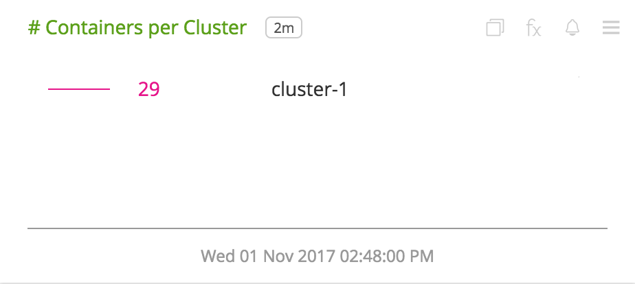](./img/overview-containers-per-cluster.png)

- **Mean and Max CPU Use Percent** - List of mean and max percent CPU used for each cluster.

  [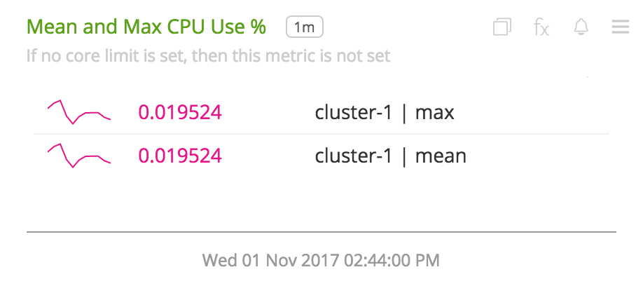](./img/overview-mean-max-cpu-use.png)

- **Memory Usage(Bytes)** - Memory usage in bytes for each cluster.

  [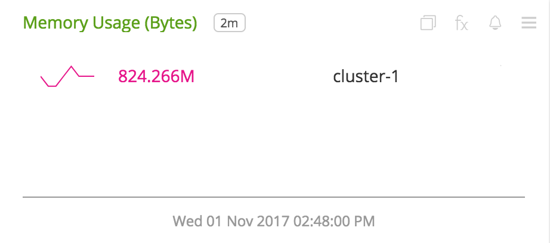](./img/overview-memory-usage.png)

- **Container Disk Usage** - Container disk usage aggregated by cluster.

  [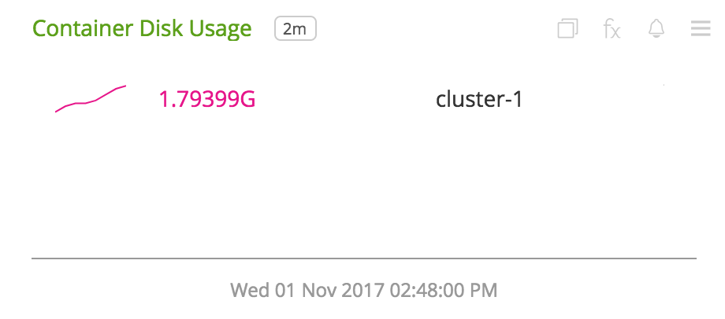](./img/overview-container-disk-usage.png)

- **Minor and Major Page Faults per Cluster** - Minor and major page faults aggregated by cluster.

  [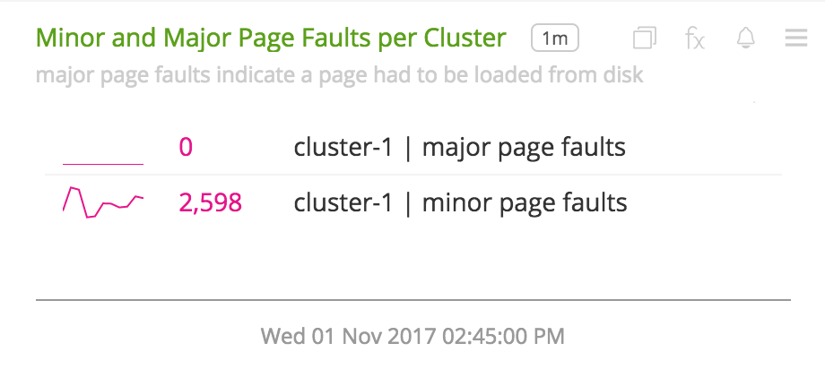](./img/overview-minor-major-page-faults-cluster.png)

**Container Engine Container**

- **CPU Percent** - Percent of CPU used by a container.

  [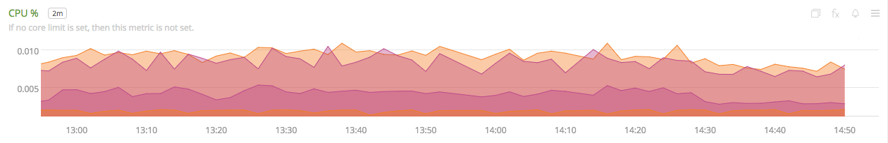](./img/container-cpu-percent.png)

- **Memory Page Faults Count** - Memory page fault counts grouped as major or minor.

  [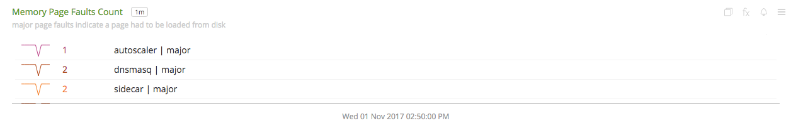](./img/container-memory-page-faults.png)

- **Disk Utilization Percent** - Percent disk utilization by the container.

  [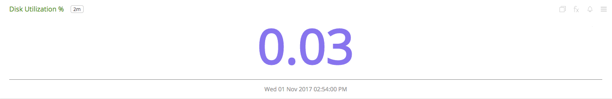](./img/container-disk-utilization-percent.png)

- **Memory Utilization Percent** - Percent memory utilization by the container.

  [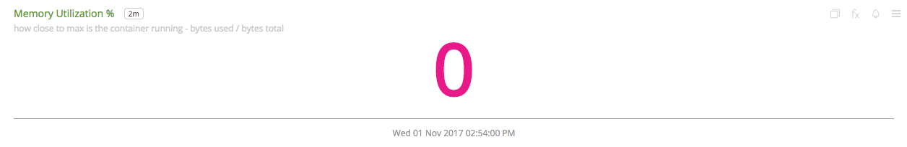](./img/container-memory-utilization.png)

- **Reserved Cores** - Number of reserved cores for the container.

  [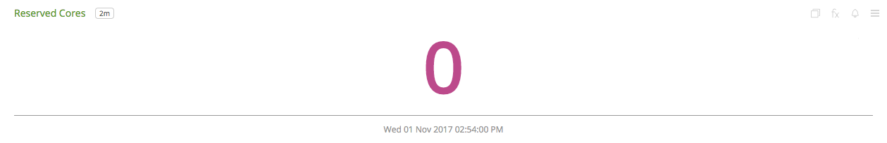](./img/container-reserved-cores.png)

**Container Engine Pod**

- **Disk Used per Container** - List of disk usages, measured in bytes, for all containers.

  [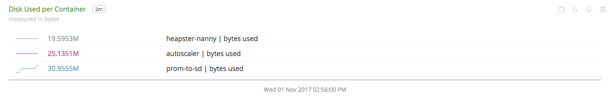](./img/pod-disk-used-per-container.png)

- **Percent Disk Used per Container** - Percent disk used aggregated by container.

  [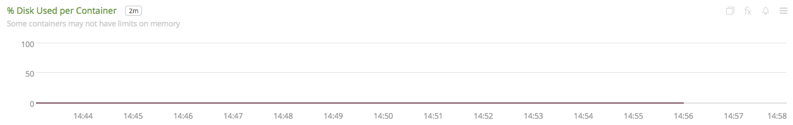](./img/pod-percent-disk-used-per-container.png)

- **Memory Usage per Container** - List of memory usages, measured in bytes, for all containers.

  [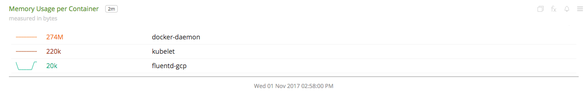](./img/pod-memory-usage-per-container.png)

- **Percent Memory Used per Container** - Percent memory used aggregated by container.

  [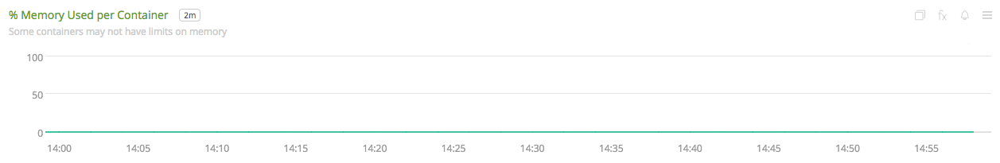](./img/pod-percent-memory-used-per-container.png)

- **Number of Containers** - Number of containers in the pod.

  [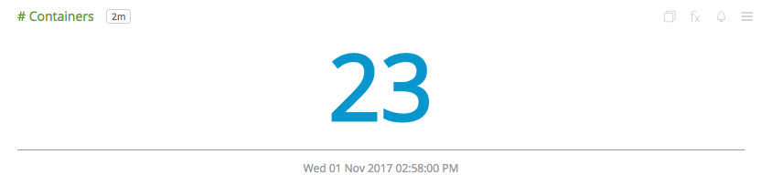](./img/pod-number-of-containers.png)

- **Minor Page Faults per Container** - Rate of minor page faults aggregated by container.

  [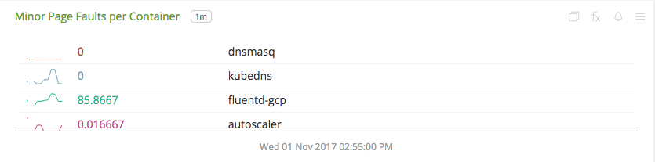](./img/pod-minor-page-faults-per-container.png)

- **Major Page Faults per Container** - Rate of major page faults aggregated by container.

  [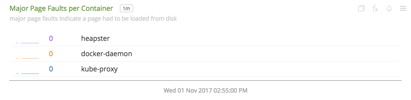](./img/pod-major-page-faults-per-container.png)

### METRICS

For more information about the metrics emitted by Google Container Engine, visit [the service's metric page](https://cloud.google.com/monitoring/api/metrics#gcp-container).

### LICENSE

This integration is released under the Apache 2.0 license. See [LICENSE](./LICENSE) for more details.
