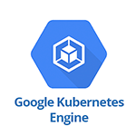
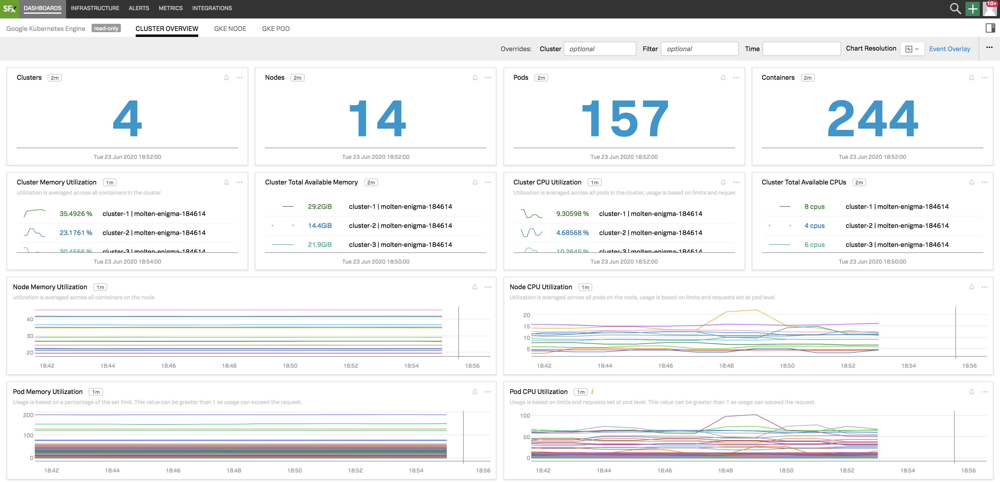
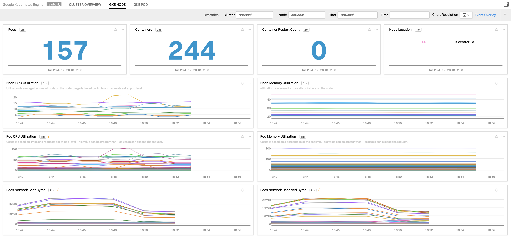
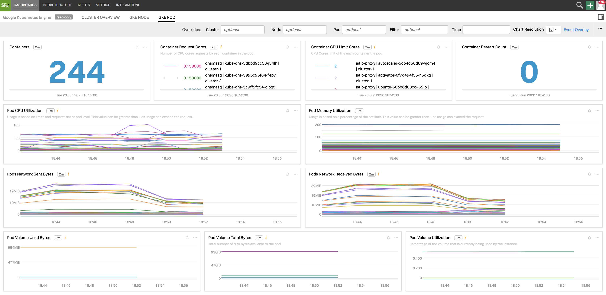

#  Google Kubernetes Engine

- [Description](#description)
- [Installation](#installation)
- [Usage](#usage)
- [Metrics](#metrics)
- [License](#license)

## FEATURES

### Built-in Dashboards

- **Cluster Overview:** - Overview of cluster-level metrics for Kubernetes Engine.

  

- **GKE Node:** - Metrics aggregated at an individual node level.

  

- **GKE Pod:** - Metrics for individual GKE pods

  

## INSTALLATION

To access this integration, [connect to Google Cloud Platform](https://docs.signalfx.com/en/latest/integrations/google-cloud-platform.html#connect-to-gcp).

### Prerequisites

**Required Permissions:**

To sync properties for GKE you need the following IAM permissions on the
service account associated with the GCP integration with SignalFx:

 - `container.clusters.get`
 - `container.clusters.list`
 - `container.pods.get`
 - `container.pods.getStatus`
 - `container.pods.list`
 - `container.nodes.get`
 - `container.nodes.getStatus`
 - `container.nodes.list`

## USAGE

Each metric synced from StackDriver is given a special `gcp_id` dimension that
uniquely identifies that resource (node, pod, or container) and on which
certain metadata properties will be set, which will cause those properties to
be propagated to all MTSs with that `gcp_id` dimension.

**k8s_node:**

The `gcp_id` dimension is in the format `<project_id>_<cluster_name>_<node_name>`.

The following properties are synced to `gcp_id`:

 - All labels on the node are synced to properties of the form: `gcp_<label_name>: <label_value>`
 - `gcp_node_uid`: The UID of that node

**k8s_pod:**

The `gcp_id` dimension is in the format `<project_id>_<cluster_name>_<namespace_name>_<pod_name>`.

The following properties are synced to `gcp_id`:

 - All pod labels are synced to properties of the form: `gcp_<label_name>: <label_value>`
 - `gcp_pod_uid`: The UID of the pod
 - `gcp_node_name`: The name of the node on which the pod is running

**k8s_container:**

The `gcp_id` dimension is in the format `<project_id>_<cluster_name>_<namespace_name>_<pod_name>_<container_name>`.

The following properties are synced to `gcp_id`:

 - `gcp_container_image`: The name of the image used by this container, as it appears in the pod spec
 - `gcp_node_name`: The name of the node on which the container is running

## DESCRIPTION

To monitor Google Kubernetes Engine, integrate SignalFx with [Google Cloud Platform](https://docs.signalfx.com/en/latest/integrations/google-cloud-platform.html#connect-to-gcp).

## METRICS

For more information about the metrics emitted by Google Kubernetes Engine, visit the service's metric page at <a target="_blank" href="https://cloud.google.com/monitoring/api/metrics_kubernetes">https://cloud.google.com/monitoring/api/metrics_kubernetes</a>

#### LICENSE

This integration is released under the Apache 2.0 license. See [LICENSE](./LICENSE) for more details.
