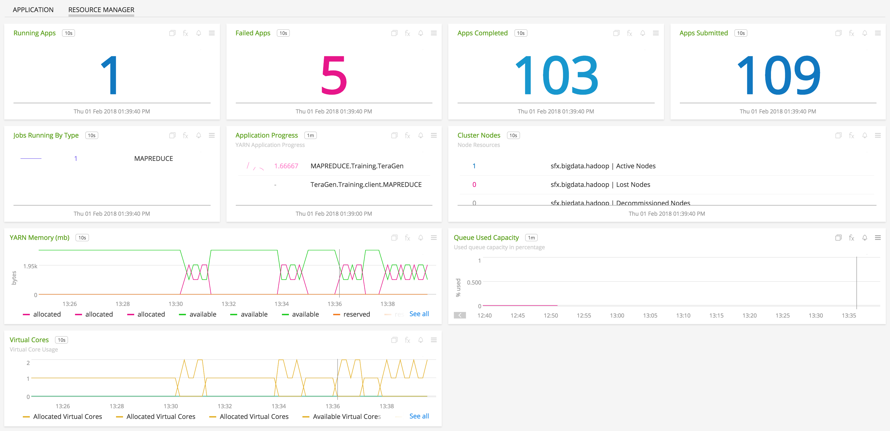
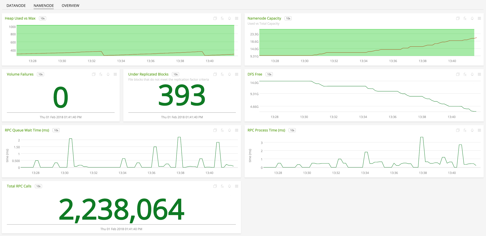

#  Apache Hadoop

An Apache Hadoop plugin for collectd which users can use to send metrics from Hadoop clusters to SignalFx

- [Description](#description)
- [Requirements and Dependencies](#requirements-and-dependencies)
- [Installation](#installation)
- [Usage](#usage)
- [Configuration](#configuration)
- [License](#license)

#### Features

##### Built-in Dashboards
- **Hadoop YARN** Resource Manager and Application metrics

  
  

- **Hadoop HDFS** HDFS Overview, NameNode, and DataNode metrics

  
  
  

- **Hadoop MapReduce** MapReduce applications, jobs, and resource usage

  
  
  

### USAGE
SignalFx provides several built-in dashboards for Hadoop YARN, HDFS, and MapReduce. Examples are shown below.

- **Hadoop YARN** Resource Manager and Application metrics

  
  

- **Hadoop HDFS** HDFS Overview, NameNode, and DataNode metrics

  
  
  

- **Hadoop MapReduce** MapReduce applications, jobs, and resource usage

  
  
  

### LICENSE

> This integration is released under the Apache 2.0 license. See [LICENSE](https://github.com/signalfx/collectd-example/blob/master/LICENSE) for more details.
