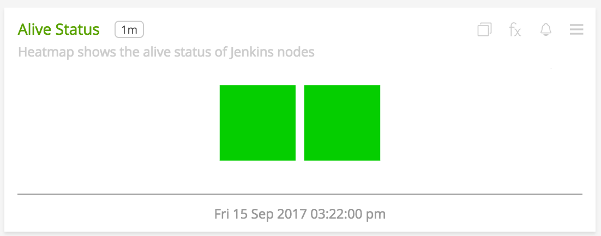
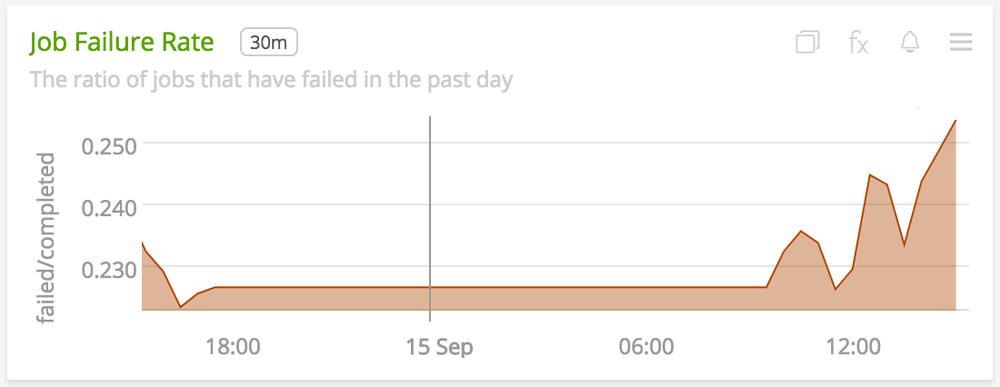
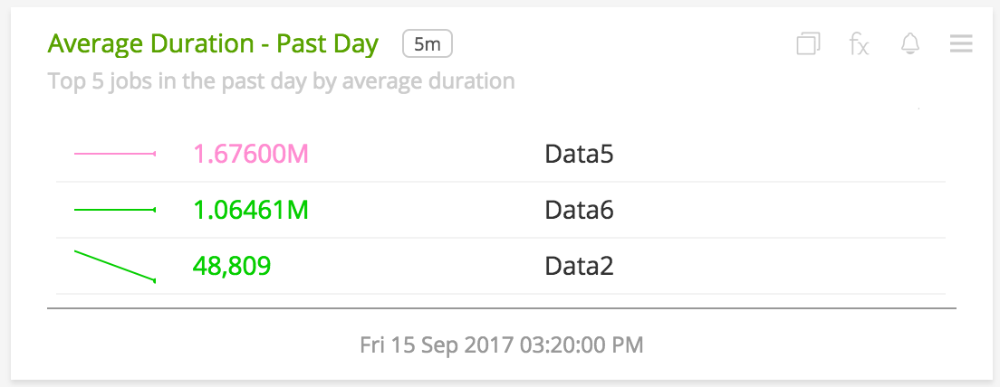
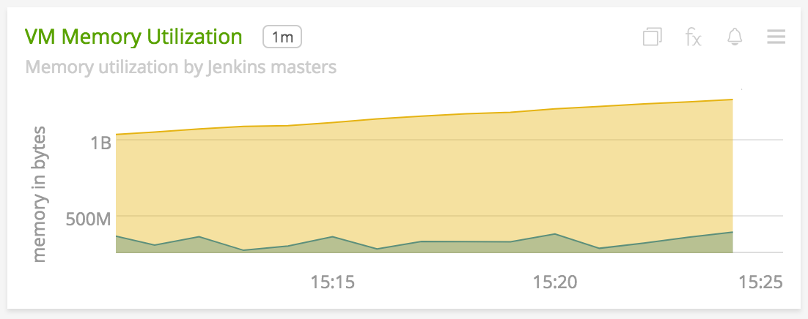

#  Jenkins

### FEATURES

#### Built-in dashboards

- **Jenkins**: Provides a high-level overview of metrics for a jenkins cluster.

  

    

- **Jenkins MASTER**: Provides metrics from jenkins instance(s) on a particular host.

    

### USAGE

#### Interpreting Built-in dashboards

- **Jenkins**:

  - **Alive Status**: Shows the number of Jenkins Masters that are alive.

    

  - **Health Score**: Shows the mean health score of each Jenkins instance on all hosts.

    

  - **Job Failure Rate**: Shows the rate of jobs failed in the past day.

    

  - **Executor Usage**: Shows the usage pattern of the executors. Gives an overview of the load on the Jenkins instances.

    

  - **Top 5 Failed Jobs**: Shows the top 5 failed jobs over the past day based on the total failure count.

    

  - **Busy Executors vs Pending Jobs**: A line graph showing comparison between in-use executors and pending jobs in queue. On comparing this chart with two above, reason for job failures can be narrowed down further quickly.

    

  - **Average Duration - Past Day**: Shows average duration of top 5 jobs that are taking the most time.

    

  - **Slave Status**: Shows the number of slave agents that are alive.

    

  - **VM Memory Utilization**: Area graph of the memory used by each Jenkins JVM.

    

  - **Heap Usage**: Line graph of the utilization percentage of Heap memory by each Jenkins instance.

    

  - **Non-Heap Used**: Line graph of the non-heap memory used by each Jenkins instance.

    

- **Jenkins Master**:

  - **Top 5 Failed Jobs**: Shows the top 5 failed jobs over the past day based on the total failure count in an instance(s).
    
    

  - **Health Checks**: The status of each health check as reported by DropWizard Metrics. This gives a quick overview of what's wrong with the instance.

    

  - **Slave Status**: Shows the number of slave agents of the instance(s) that are alive.
  
      

  - **Busy Executors vs Pending Jobs**: A line chart showing comparison between in-use executors and pending jobs in queue in an instance(s). On comparing this chart with two above, reason for job failures can be narrowed down further quickly.
  
      
  
  - **VM Memory Utilization**: Area chart of the memory used by the Jenkins JVM instance(s) on a host.
  
      

All DropWizard metrics reported by the jenkins collectd plugin will not contain any dimensions by default. Whereas, the job metrics sent will contain the following dimensions by default:

* `Job`, name of the job
* `Result`, the status of the job

A few other details:

* `plugin` is always set to `jenkins`
* `plugin_instance` will contain the IP address and the port of the member given in the configuration
* To add metrics from the `/metrics/<MetricsKey>/metrics` endpoint, use the configuration options mentioned in [configuration](#configuration). If metrics are being included individually, make sure to give names that are valid. For example, `vm.daemon.count` or `vm.terminated.count`

### ADDITIONAL METRIC INFO
By default, metrics about a job and instance are provided. Metrics from `/metrics/<MetricsKey>/metrics` endpoint can be activated through the configuration file. Note, that SignalFx does not support `histograms`, `meter` and `timer` metric types as they are too verbose in Jenkins and also values of type string and list(hence, metrics of these will be skipped if provided in the configuration). See [usage](#usage) for details.

#### Metric naming
`<metric type>.jenkins.node.<name of metric>`. This is the format of default metric names reported by the plugin. Optional metrics are named as available from the `/metrics/<MetricsKey>/metrics` endpoint.

### LICENSE

This integration is released under the Apache 2.0 license. See [LICENSE](./LICENSE) for more details.
