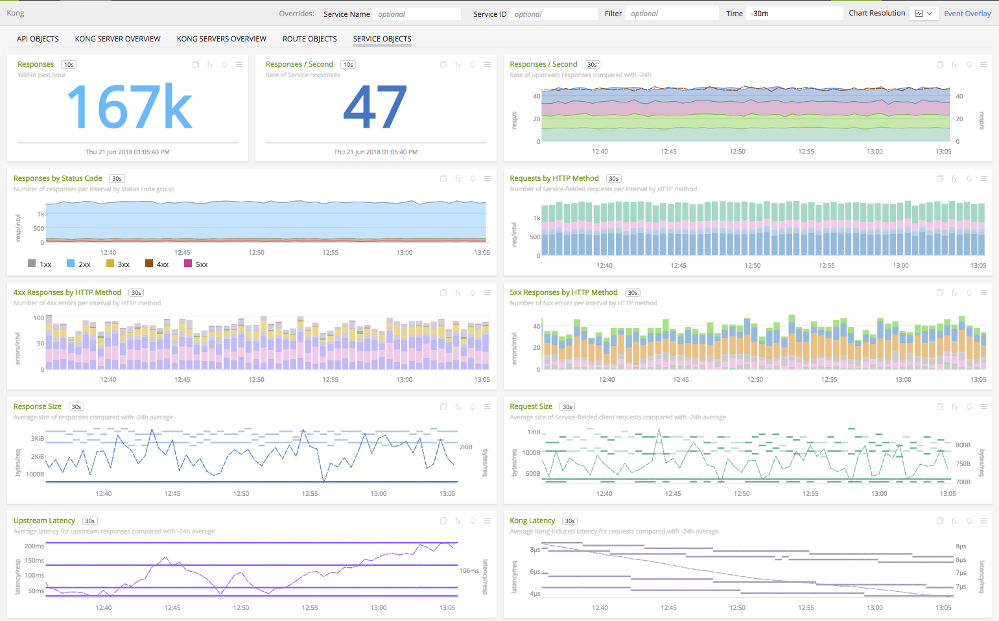
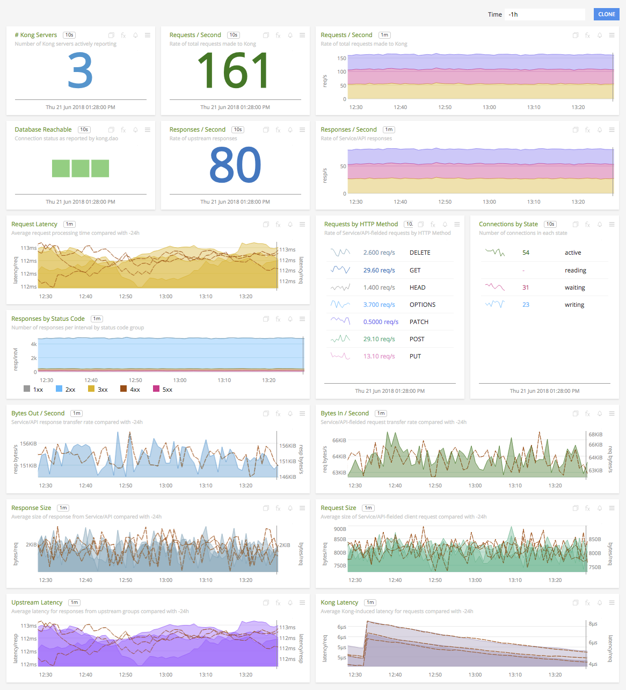

#  Kong

#### FEATURES

##### Built-in dashboards

- **Kong Servers Overview**: High-level Kong performance for all reporting servers

  

- **Kong Server Overview**: High-level Kong performance for an individual server

  

- **API Objects**: API object activity metrics

  

- **Service Objects**: Service object activity metrics

  

- **Route Objects**: Route object activity metrics

  

### USAGE

Sample of built-in dashboard in SignalFx:

### LICENSE

This integration is released under the Apache 2.0 license. See [LICENSE](https://github.com/signalfx/collectd-kong/blob/master/LICENSE) for more details.
