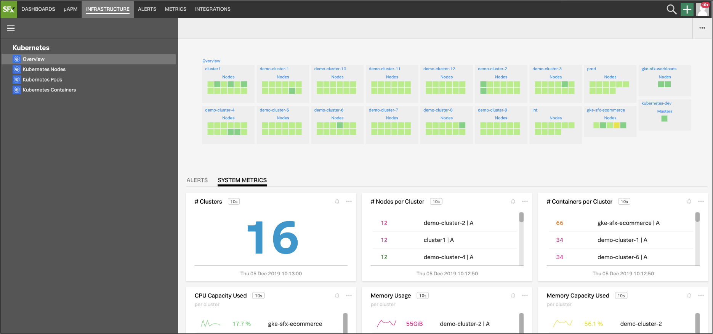
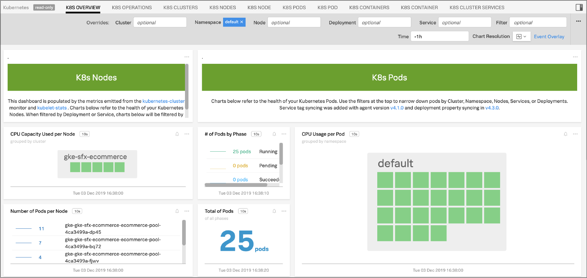
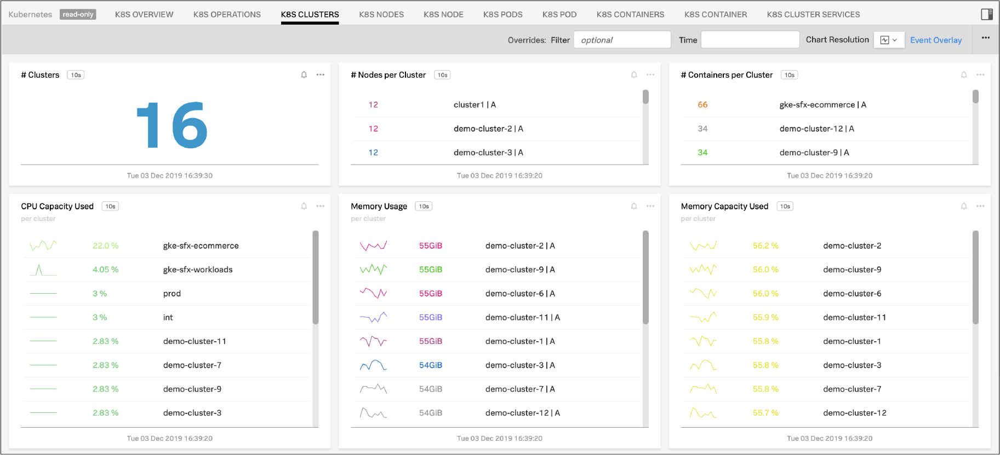

#  Kubernetes


### USAGE


Use the Kubernetes integration to monitor the health and performance of your microservices, the Kubernetes orchestration services, and the infrastructure that they are running on.

- Explore the relationships between the various layers of your infrastructure with the Navigator
- Discover and automatically configure the monitoring of supported services running in the containers
- Use the built-in dashboards to view key metrics that are indicators of the health of your infrastructure and the orchestrator

#### Infrastructure Navigator

The Infrastructure Navigator gives you an immediate, at-a-glance view of your Kubernetes overall architecture as well as nodes and pods, colored by critical health metrics.The Infrastructure Navigator also provides visibility all the way through the stack as you drill down and across elements of your environment, reflecting the fact that the infrastructure, Kubernetes control plane, containers, applications, and services are all related layers, not just individual system components.

  [](./img/Navigator.png)

#### Built-in Dashboards

SignalFx provides built-in dashboards for Kubernetes. Examples are shown below.

- **Kubernetes Overview**: This dashboard is populated by the metrics emitted from the ```kubernetes-cluster``` and ```kubelet-stats monitors```. Charts refer to the health of your Kubernetes nodes and pods. When filtered by Deployment or Service, charts will be filtered by the selected pods running on the nodes.

  [](./img/Overview.png)

- **Kubernetes Clusters**: Overview of multiple Kubernetes clusters.

  [](./img/Clusters.png)

#### Learning More

After data is flowing, try the <a target="_blank" href="https://docs.signalfx.com/en/latest/integrations/kubernetes/k8s-built-in.html#k8s-built-in">Kubernetes Built-in Content tour</a> to get familiar with the ways to visualize data from your nodes, pods, and network in the Infrastructure tab and built-in dashboards.

