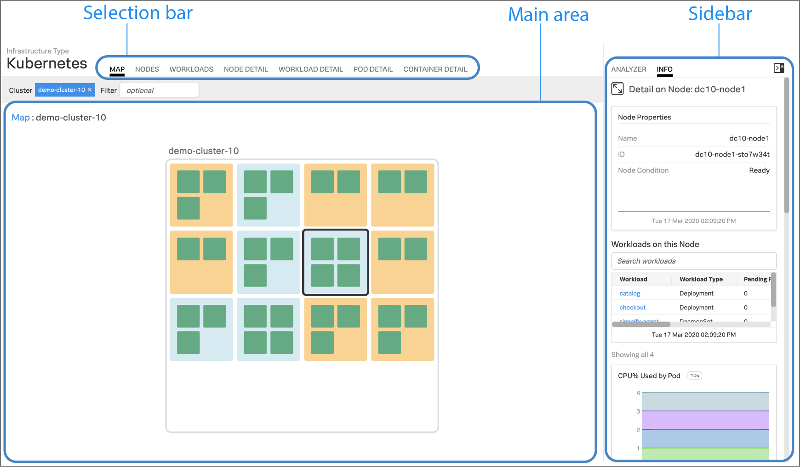
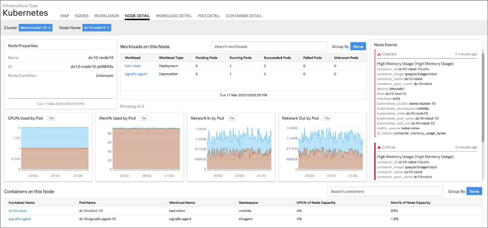
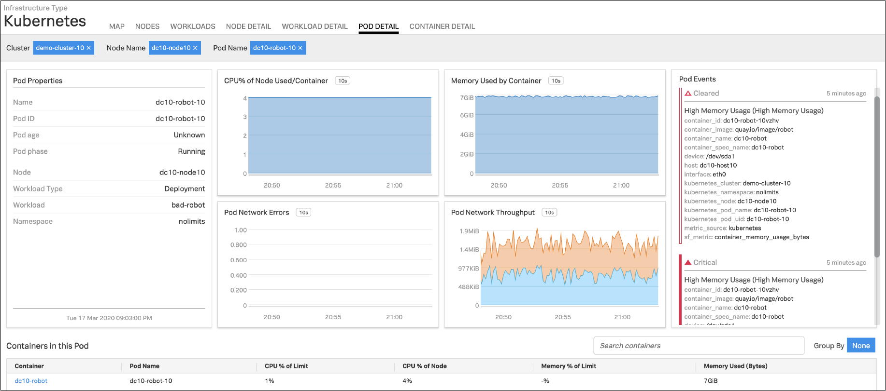

#  Kubernetes

### USAGE

Use the Kubernetes integration to monitor the health and performance of your microservices, the Kubernetes orchestration services, and the infrastructure that they are running on.

- Discover and automatically configure the monitoring of supported services running in the containers
- Use the built-in dashboards to view key metrics that are indicators of the health of your infrastructure and the orchestrator

#### Kubernetes Navigator

The new SignalFx Kubernetes Navigator gives you a real-time, at-a-glance view of the overall health and performance of your Kubernetes environment. It also provides visibility all the way through the stack as you drill down and across elements of your environment, reflecting the fact that the infrastructure, Kubernetes control plane, containers, applications, and services are all related layers, not just individual system components.

  

The Kubernetes Navigator selection bar provides several tabs for viewing information about your clusters, nodes, pods, containers, and workloads. Examples are shown below.

- **Node Detail**: The Node Detail tab displays detailed information about a selected node, including additional properties, workloads running on the node, containers on this node, and so on. The properties in the upper left are metadata about the node. If desired, you can specify a different cluster or node. The status of the workloads helps you understand the health of the workloads.

  

- **Pod Detail**: The Pod Detail tab displays detailed information about a selected pod, including its containers. Use this view to track the activity on one pod or across all pods in your cluster. The properties in the upper left are metadata about the pod. If desired, you can specify a different cluster, node, or pod.

  

#### Learning More

Once data is flowing, explore the <a target="_blank" href="https://docs.signalfx.com/en/latest/integrations/kubernetes/get-around-k8s-navigator.html">Kubernetes Navigator</a> to get familiar with the ways to visualize data from your nodes, pods, containers, and network.

