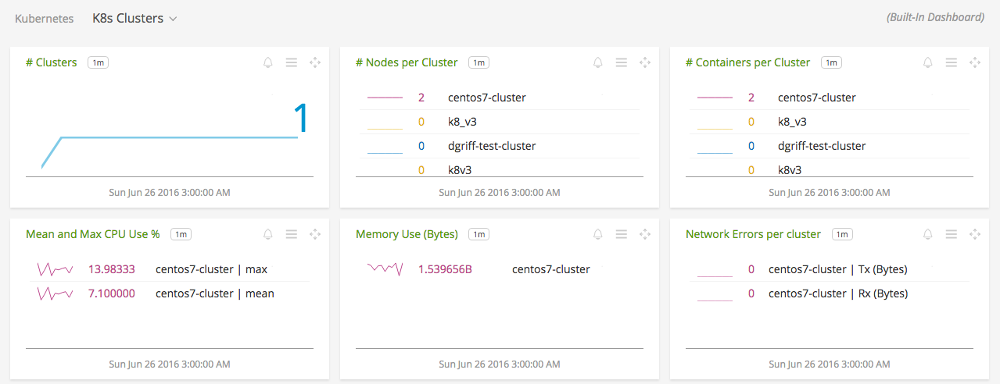
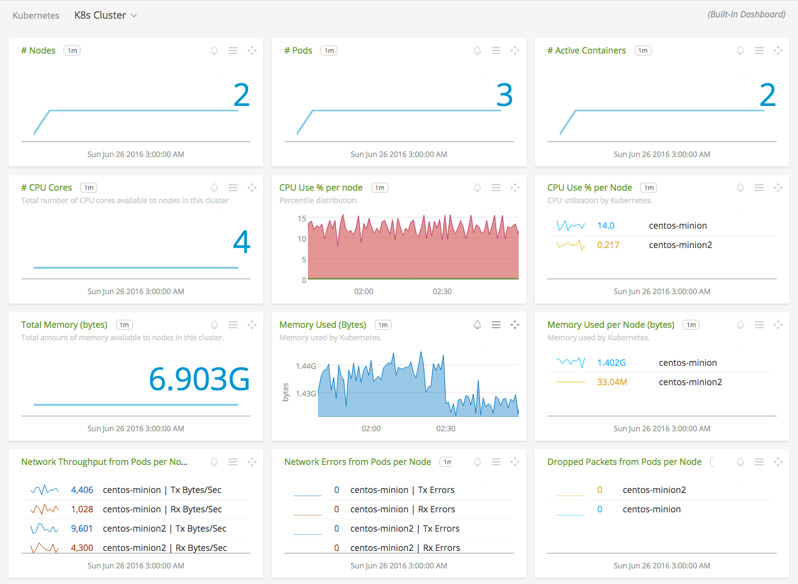
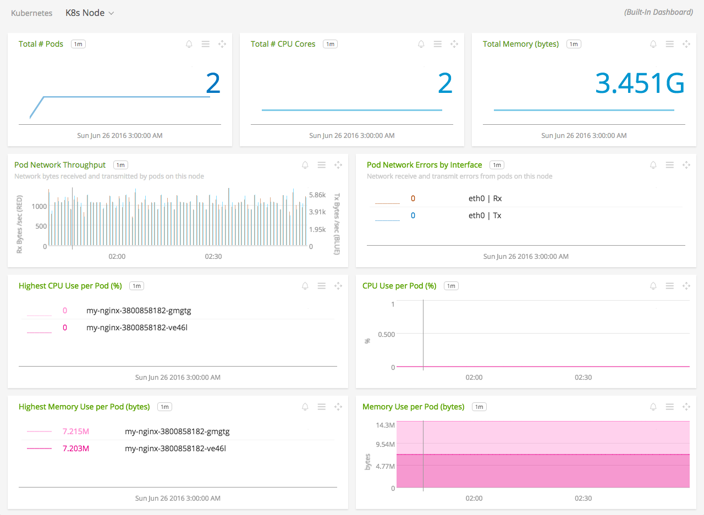
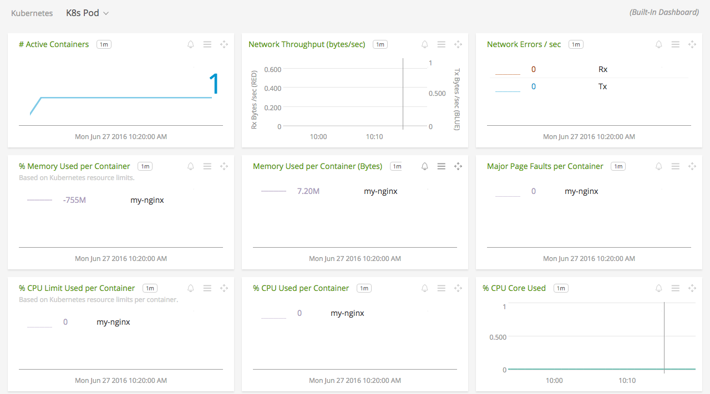

# Kubernetes   

_This is a directory that consolidates all the metadata associated with the Kubernetes integration. The relevant code for the project can be found [here](https://github.com/signalfx/cadvisor-integration)_

- [Description](#description)
- [Requirements and Dependencies](#requirements-and-dependencies)
- [Installation](#installation)
- [Configuration](#configuration)
- [Usage](#usage)
- [Metrics](#metrics)
- [License](#license)

### DESCRIPTION

Use this integration to monitor Kubernetes, using data gathered from cAdvisor. It is deployed as a single pod that monitors an entire Kubernetes cluster. 

This tool uses the Kubernetes API to discover pods, nodes, and containers, queries cAdvisor for performance metrics, and transmits data to SignalFx. 

#### FEATURES

##### Built-in dashboards

- **K8s Clusters**: Overview of data from all Kubernetes clusters reporting.

  [](./img/dashboard_k8s_clusters.png)

- **K8s Cluster**: Overview of one Kubernetes cluster.

  [](./img/dashboard_k8s_cluster.png)
	
- **K8s Node**: Focus on health of a single Kubernetes node. 

  [](./img/dashboard_k8s_node.png)

- **K8s Pod**: Focus on health of a single Kubernetes pod.

  [](./img/dashboard_k8s_pod.png)  

### REQUIREMENTS AND DEPENDENCIES

| Software          | Version        |
|-------------------|----------------|
| Kubernetes        | 1.2.0 or later   |

### INSTALLATION

This integration runs as a pod within the Kubernetes cluster. SignalFx provides a Docker image for this integration [hosted on quay.io](https://quay.io/repository/signalfx/cadvisor-integration?tag=latest). 

1. Create a configuration file `cadvisor-signalfx.yaml` for this service (or download SignalFx's [example configuration file](https://github.com/signalfx/integrations/tree/master/kubernetes/cadvisor-signalfx.yaml)), and supply values according to [Configuration](#configuration) below.

2. Run the following command to deploy the service to your cluster:

	```
	kubectl create -f cadvisor-signalfx.yaml
	```

### CONFIGURATION

Using the example [cadvisor-signalfx.yaml](https://github.com/signalfx/integrations/tree/master/kubernetes/cadvisor-signalfx.yaml) as a guide, provide values for the parameters below that make sense for your environment. Each of the following configuration options sets an environment variable with that name. 

**Note**: The example deployment file specifies using a replication controller to ensure at most 1 cadvisor-integration pod to oversee the entire cluster. 

| configuration option | definition | example value |
| ---------------------|------------|---------------|
| `SFX_SCRAPPER_API_TOKEN` | Your SignalFx API token. | MY\_API_TOKEN |
| `SFX_SCRAPPER_CLUSTER_NAME` | The name of the cluster to be monitored. Appears in SignalFx as the dimension `cluster`. | my\_k8s_cluster |
| `SFX_SCRAPPER_CADVISOR_PORT` | The port on which the Kubernetes cAdvisor listens.	| 4194 |
| `SFX_SCRAPPER_SEND_RATE` | The rate at which data is queried from cAdvisor and sent to SignalFx. Possible values: [10s 30s 1m 5m 1h 1s 5s] | "1s" |
| `SFX_SCRAPPER_NODE_SERVICE_DISCOVERY_RATE` | The rate at which data is queried from cAdvisor and sent to SignalFx. Possible values: [10s 30s 1m 5m 1h 1s 5s] | "5m" |

#### Accessing the Kubernetes API

The default configuration for this integration uses the credentials of the pod to communicate securely with the Kubernetes API server. If your Kubernetes cluster is not configured to accept API access from a pod, then additional configuration is required. Provide a host and port at which the integration can access the Kubernetes API in the `cadvisor-signalfx.yaml` configuration file, as follows:

```
name:  SFX_SCRAPPER_KUBERNETES_URL
value: <http(s)://KUBERNETES_MASTER_NODE_IP_ADDR:port>
```

### USAGE

This integration gathers data about the Kubernetes cluster to which it is deployed. Use SignalFx's built-in dashboards to monitor health and performance from the cluster down to the individual containers deployed in a pod. 

#### Monitoring infrastructure underlying Kubernetes
 
We support a [Docker image for the SignalFx collectd agent](https://github.com/signalfx/docker-collectd) that you can deploy to Kubernetes nodes as a daemon set. Using a daemon set, Kubernetes will ensure that the agent pod is deployed to every new node, and is destroyed when a node is removed. [Click here to read more about daemon sets in Kubernetes](http://kubernetes.io/docs/admin/daemons/). 

#### Monitoring applications running in a Kubernetes cluster

The [Docker image for the SignalFx collectd agent](https://github.com/signalfx/docker-collectd) can be configured to run as a "sidekick" within an application's pod. Extend the image to include just those integrations that monitor services running within the pod, then add the image to your application pod definition. [Click here to read more about extending the SignalFx collectd agent image](https://github.com/signalfx/docker-collectd/blob/master/docs/EXTENDING.md), or [contact SignalFx support](mailto:support@signalfx.com) for help. 

### LICENSE

This tool is released under the Apache 2.0 license. See [LICENSE](https://github.com/signalfx/cadvisor-integration/blob/master/LICENSE) for more details.
