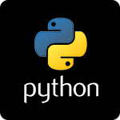

#  Python client library for SignalFx

- [Description](#description)

### DESCRIPTION

<code>signalfx-python</code> is a programmatic interface in Python for SignalFx's metadata and ingest APIs. It is meant to provide a base for communicating with SignalFx APIs that can be easily leveraged by scripts and applications to interact with SignalFx or report metric and event data to SignalFx. It is also the base for metric reporters that integrate with common Python-based metric collections tools or libraries.

For more information regarding installation, usage, and examples, see https://github.com/signalfx/signalfx-python.

This library is released under the Apache 2.0 license. See [LICENSE](https://github.com/signalfx/signalfx-python/blob/master/LICENSE) for more details.
