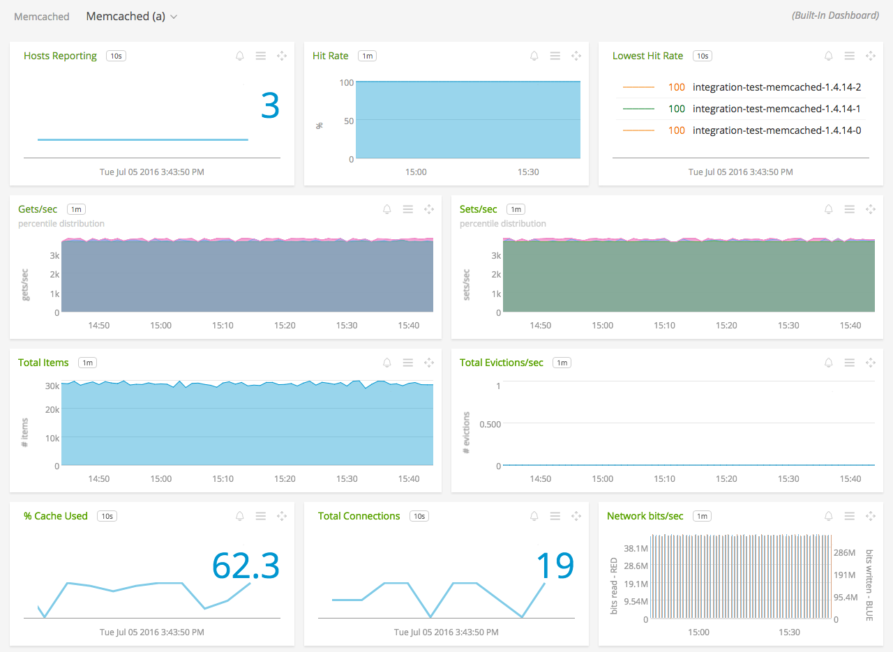

#  Memcached

#### FEATURES

##### Built-in dashboards

- **Memcached (a)**: Overview of data from all Memcached hosts.

  

- **Memcached**: Focus on a single Memcached host.

  

### USAGE

Sample of built-in dashboard in SignalFx:

### METRICS

For documentation of the metrics and dimensions emitted by this plugin, [click here](./docs).

### LICENSE

This integration is released under the Apache 2.0 license. See [LICENSE](./LICENSE) for more details.
