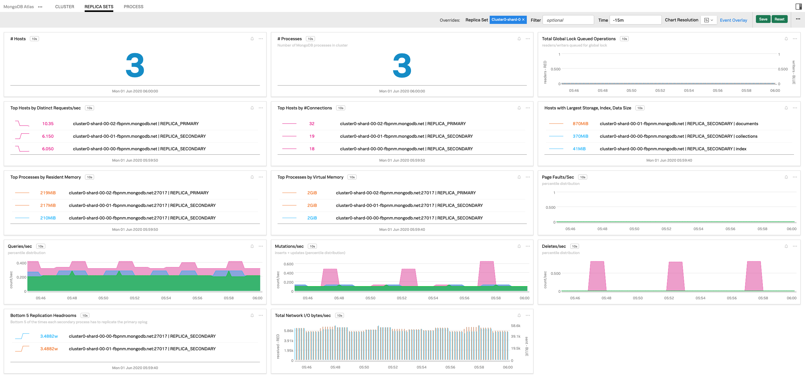

#  MongoDB Atlas

#### FEATURES

##### Built-in dashboards

- **Replica Set**: Overview of an Atlas MongoDB replica sets.

  

- **Process**: Focus on a single Atlas MongoDB process.

  

### USAGE

Below are screen captures of dashboards created for this monitor by SignalFx, illustrating the metrics emitted by this monitor.

For general reference on how to monitor Atlas MongoDB clusters, see <a target="_blank" href="https://docs.atlas.mongodb.com/monitoring-alerts/#monitor-your-cluster">Monitor Your Cluster</a>.

**Monitoring Atlas MongoDB replica set**

The 
Writes to MongoDB require the use of the global lock. If lock utilization is high, operations can begin to slow down. This can be a symptom of database issues such as poorly configured or absent indexes, or a schema design that needs improvement. It can also indicate the failure of a disk. Monitor the number of readers and writers waiting for the lock with metric gauge.globalLock.currentQueue.total.

*This lock has little utilization and few queued readers and writers.*

When analyzing the performance of a MongoDB cluster, it's important to verify that the load is balanced across each instance. The replica sets dashboard included in this repository contains many list charts of MongoDB instances ordered by important metrics like requests per second (counter.network.numRequests) and number of connections to MongoDB (gauge.connections.current). This can help you compare load between instances. Load imbalance can arise in a sharded cluster if MongoDB is unable to balance chunks equally between the shards, for example if lock utilization is high.

*All the listed instances show about the same requests per second and number of connections. Their load is balanced.*

**Monitoring Atlas MongoDB process**

On an individual process level, it's important to monitor system statistics like memory usage, page faults, and disk I/O utilization.

It is important to compare the amount of memory that MongoDB has allocated to the amount of system memory. This monitor reports resident memory usage in mem.resident and virtual memory usage in mem.virtual.

*This MongoDB process is not using a large amount of resident memory.*

This monitor reports page faults in extra\_info.page\_faults. Page faults indicate that reads or writes are occurring to data files that are not currently in memory. This is different from an OS page fault. Sudden increases in MongoDB page faults can indicate that a large read operation is taking place. Steadily high numbers of page faults indicate that MongoDB is reading more often from disk than is optimal.

*This MongoDB process has a low rate of page faults. This means that most of the data MongoDB needs to access is in memory, and doesn't need to be fetched from disk.*

### LICENSE

This integration is released under the Apache 2.0 license. See [LICENSE](./LICENSE) for more details.
