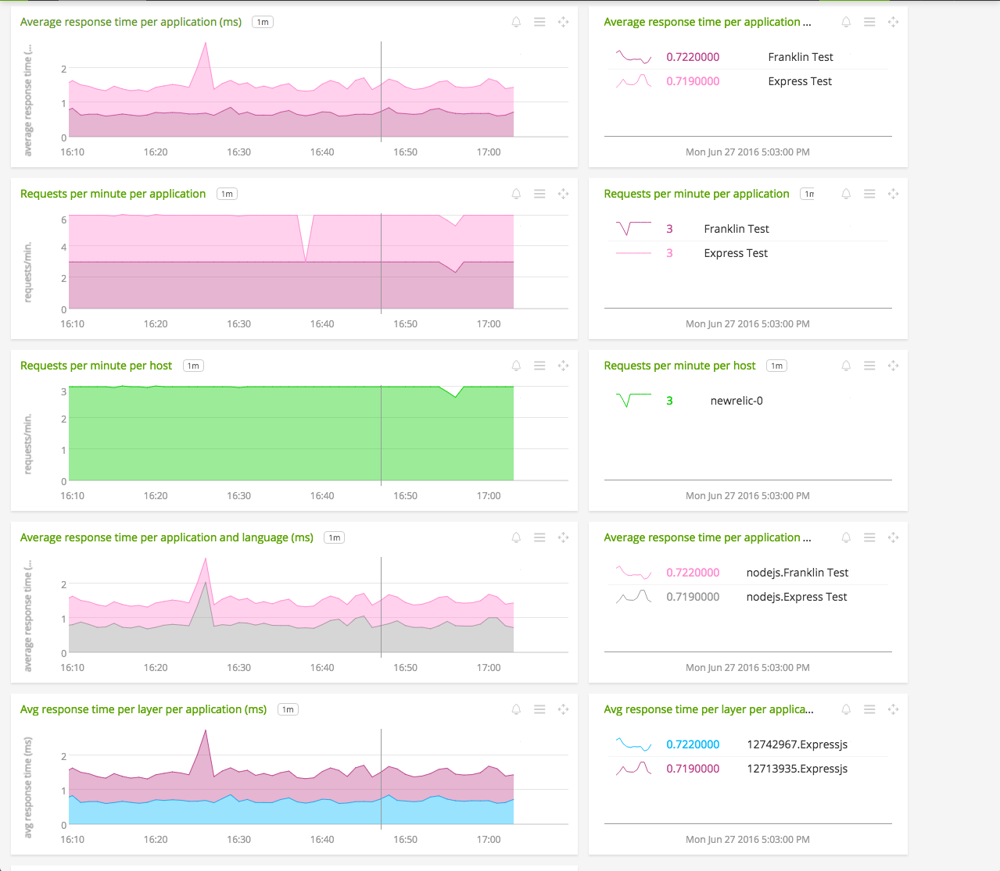
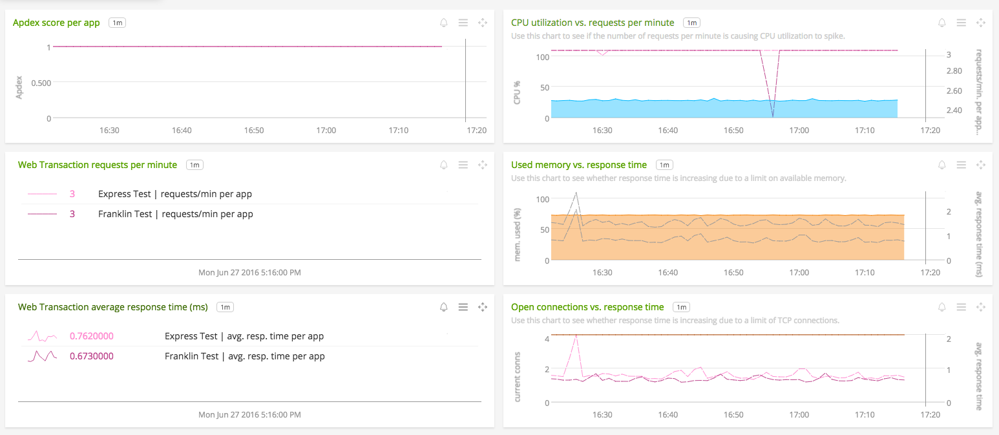

#  New Relic

- [Description](#description)
- [Requirements and Dependencies](#requirements-and-dependencies)
- [Installation](#installation)
- [Usage](#usage)
- [License](#license)

### DESCRIPTION

This document describes SignalFx's integration with <a target="_blank" href="https://www.newrelic.com">New Relic</a>. Use this integration to view New Relic metrics in SignalFx. With this integration, you can apply SignalFx's analytics to New Relic data, use New Relic data in alerts, and enrich your infrastructure data with data about your New Relic-instrumented applications.

### REQUIREMENTS AND DEPENDENCIES

This integration requires a New Relic account. You must be an administrator of your SignalFx organization to create or modify this integration.

### INSTALLATION

1. Follow <a target="_blank" href="https://docs.newrelic.com/docs/apis/rest-api-v2/requirements/api-keys">New Relic's instructions</a> to obtain a REST API key for your account.

2. Click the **New Integration** button. In the field labelled **API key**, enter the API key that you obtained in step 1, then click **Validate**. A message appears that says **Validated!** If a different message appears, contact [support@signalfx.com](mailto:support@signalfx.com) for help.

3. Select a New Relic module to sync to SignalFx (APM, Mobile, or Servers). You will create a sync rule for that module to control which metrics SignalFx will sync from New Relic.

4. Click **Add Apps** or (for the Servers module) **Add Servers**. Use typeahead to include at least one filter string, checking results of the filter on the Sample Matches list.  Click the blue **+** button to add a string to the list of filters. (**Note:** Because the volume of available metrics from New Relic may be large, SignalFx recommends filtering down to just one or a few items to start). When your filter includes all the items you wish to monitor, click **Done**.

5. (optional) Select metrics and stats to monitor. By default, all are monitored.

6. (optional) Click **New Sync Rule** and repeat steps 3-5 for other modules.

7. Click **Save**. The choices you made for each module are saved as individual sync rules. You can later reopen the New Relic integration to add, edit, or delete sync rules.

Your New Relic account is now connected and ready to use. Data from New Relic will arrive at SignalFx within minutes.

### USAGE

This section includes information that can help you build SignalFx charts from New Relic data.

#### Example New Relic dashboards

SignalFx provides example dashboards that you can use as a baseline for creating your own New Relic charts in SignalFx. You can import them to SignalFx by <a target="_blank" href="https://github.com/signalfx/integrations/blob/master/newrelic/dashboards/Page_SignalFx%20collectd%20%2B%20New%20Relic.json">clicking here to download the JSON file</a>. In SignalFx, open the menu in the top right-hand corner of the app next to your profile image, and selecting **Import dashboard group**. This will create a new dashboard group called "SignalFx + New Relic" that contains two example dashboards:

* **"New Relic Applications Overview"** - This shows how to display metrics for multiple New Relic applications at once, like response time and requests per minute.
  

* **"New Relic APM + collectd infrastructure metrics"** - This shows how to display data from New Relic applications data alongside infrastructure metrics from collectd.
  

#### Recognizing New Relic metrics in SignalFx

Metrics from New Relic are composed of strings delimited by the slash character `/`. Examples of New Relic metrics in SignalFx include the following:

`WebTransaction/average_call_time/12345678`
`WebTransaction/Expressjs/GET//*/average_call_time/12345678`

Note that sometimes, as in this example, the delimiter `/` appears in the metric name to denote a URL path (`/*`). SignalFx does not distinguish between `/` characters used as delimiters, and `/` characters used in paths.

SignalFx has made two changes to the names of metrics as we collect them from New Relic, in order to enhance the ability to perform [wildcard searches](#regular-wildcard-mode):

* **All New Relic metrics have their appropriate object id appended to the metric name.** For metrics from the Applications module, this is an application ID. For metrics from the Servers module, this is a server ID. The same value can be found in the id dimension associated with that metric.

  Examples:

  * New Relic application metric as obtained from API: `Apdex/Expressjs/GET//*/score`
  * As it appears in SignalFx with application id 12345678 appended: `Apdex/Expressjs/GET//*/score/12345678`

* **Server metrics have their account ID prepended in front of the metric name.** This only occurs for Server metrics because account ID information is only available for Server metrics. The same value can be found in the account dimension.

  Examples:

  * New Relic server metric as obtained from API: `System/CPU/System/percent/average_exclusive_time`
  * As it appears in SignalFx, with account id 7654321 prepended and server id 12345678 appended: `7654321/System/CPU/System/percent/average_exclusive_time/12345678`

To help you compose charts with New Relic metrics, SignalFx supports two kinds of wildcard searching: regular wildcard mode, and New Relic wildcard mode.

#### Regular wildcard mode

**Use this when**: You’re comparing general data across New Relic applications or accounts, or you need to dynamically filter an entire dashboard. The information that you will filter or aggregate by is captured in dimensions like `application` (the name of the New Relic application) and `host` (the hostname of the server hosting a New Relic application).

In regular wildcard mode you can use `*` for wildcarding, and the wildcard applies to the entire metric name. For example, in a regular wildcard query, `System/*` will return any metric beginning with “System/”, even if there are subsequent slash characters in their metric names.

#### New Relic wildcard mode

**Use this when**: You’re comparing detailed metrics about applications or servers, and can make individual static dashboards about specific applications or servers. You need to filter or aggregate by detailed information that’s only available in the metric name, like transaction endpoint or process name.

New Relic mode appears as an option only after a New Relic integration has been set up in your SignalFx organization. Regular SignalFx dimensions are not available in New Relic mode. You cannot dynamically filter a chart that uses New Relic mode.

This mode is different from a regular wildcard query using `*` because it treats the slash `/` character as a special delimiter. The New Relic wildcard search `System/*` will only return a metric that has no subsequent slash characters in the name. See the next section for an example.

In New Relic mode, you can filter and aggregate metrics based only on the contents of the metric name. To help with this, SignalFx supports on-the-fly dimension aliasing in New Relic mode. Node aliasing allows you to assign names to the slash-delimited components of a metric name, and use the value of each component for aggregation and analytics. When using New Relic mode, you can find aliasing controls in the Y-axis configuration menu in the chart builder.

#### Comparing Regular wildcard mode to New Relic wildcard mode

In this example, we’ve input the search string `System/*` into the "signal" field in the SignalFx chart builder.

In Regular wildcard mode, this search returns the following example metrics:

```
System/foo
System/bar
System/foo/bar
```

A New Relic wildcard search for the same string returns a different list:

```
System/foo
System/bar
```

In New Relic wildcard mode, `System/*` does not return the metric `System/foo/bar`. This is because the search returns only those metrics that have exactly one slash-delimited node after `System`. `System/foo/bar` contains two nodes after `System`: `foo` and `bar`, and so does not match the search.

### LICENSE

This integration is released under the Apache 2.0 license. See [LICENSE](./LICENSE) for more details.
