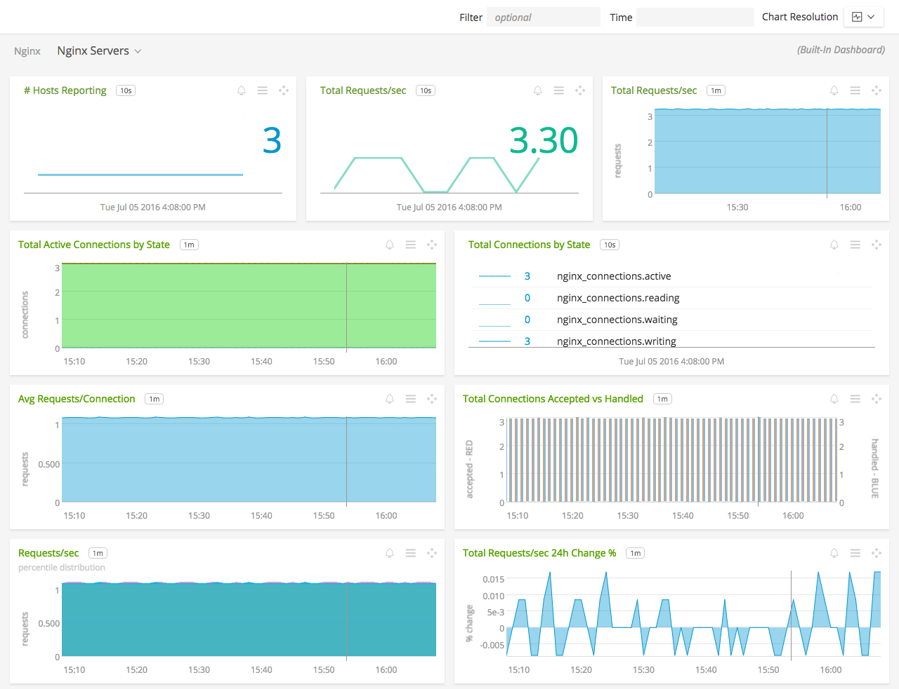
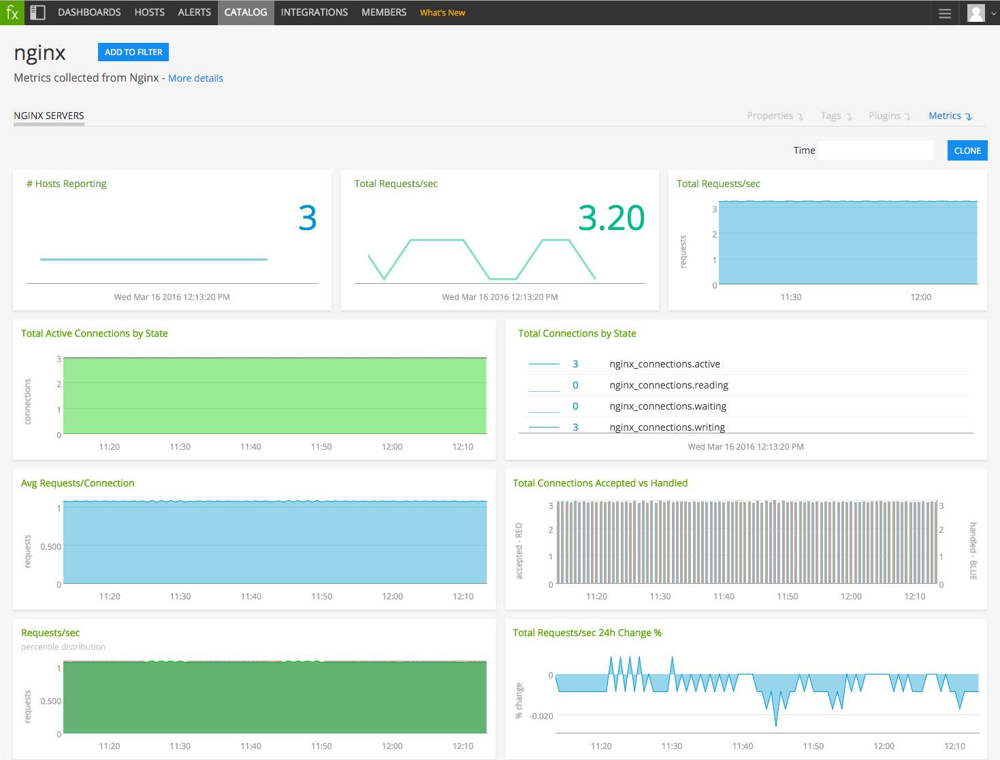

#  NGINX

#### FEATURES

##### Built-in dashboards

- **NGINX Servers**: Overview of data from all NGINX servers.

  

- **NGINX Server**: Focus on a single NGINX server.

    

### USAGE

Sample of built-in dashboard in SignalFx:

### LICENSE

This integration is released under the Apache 2.0 license. See [LICENSE](./LICENSE) for more details.
