#  OpenStack

#### FEATURES

##### Built-in dashboards

- **HYPERVISOR**: Provides a high-level overview of metrics for an OpenStack hypervisor.

  

  [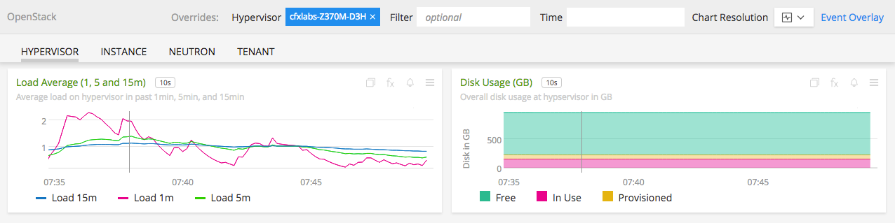](./img/openstack-hypervisor-dashboard-bottom.png)

- **TENANT**: Provides metrics from an OpenStack project/tenant.

  

  

- **NEUTRON**: Provides metrics from an OpenStack Neutron component.

  [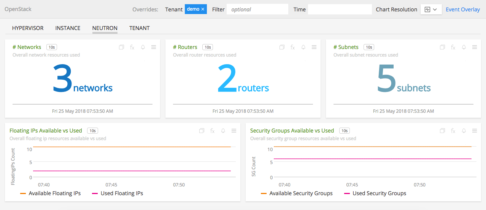](./img/openstack-neutron-dashboard.png)

- **INSTANCE**: Provides metrics from an OpenStack compute instance.

  

  

### USAGE

#### Interpreting Built-in dashboards

- **HYPERVISOR**:

  - **Running VMs**: Shows the number of VMs running in the hypervisor.

    

  - **Load Average**: Shows the average CPU load on the hypervisor.

    [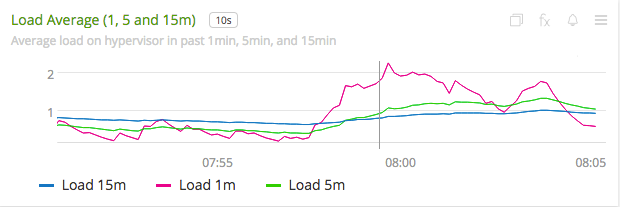](./img/chart-openstack-hypervisor-load.png)

  - **Memory Usage**: Shows the memory usage free vs used in the hypervisor.

    [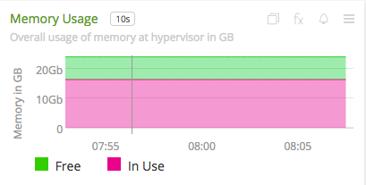](./img/chart-openstack-hypervisor-memory-usage.png)

  - **Disk Usage**: Shows the disk usage free vs used in the hypervisor.

    [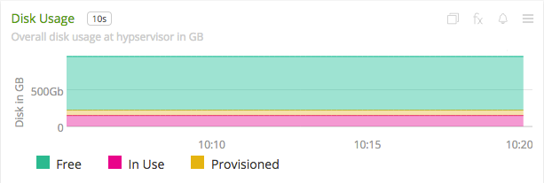](./img/chart-openstack-hypervisor-disk-usage.png)

  - **CPUs and VCPUs**: Shows the number of CPUs available and VCPUs used in the hypervisor.

    

  - **Physical CPUs**: Shows the number of pysical cores on the host running hypervisor.

    

  - **Total Disk**: Shows the total disk available on the host running hypervisor.

    [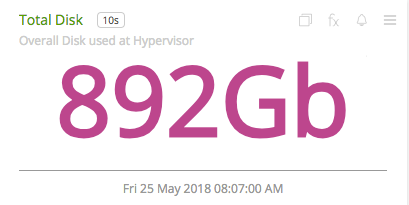](./img/chart-openstack-hypervisor-total-disk.png)

  - **Total Memory**: Shows the total RAM available on the host running hypervisor.

    

- **TENANT**:

  - **Used Instances**: Shows the number of used instances in the tenant/project.

    

  - **Memory Utilization**: Shows the percentage of utilized memory in the tenant/project.

    

  - **Disk Utilization**: Shows the percentage of utilized disk space in the tenant/project.

    

  - **Instances Available vs Used**: Shows the number of available and used instances in the tenant/project.

    

  - **Memory Usage**: Shows the overall memory available and used in the tenant/project.

    [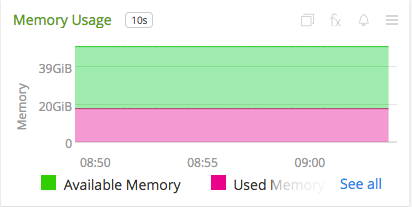](./img/chart-openstack-tenant-memory-usage.png)

  - **Disk Usage**: Shows the overall disk space available and used in the tenant/project.

    

  - **Volumes Available vs Used**: Shows the maximum number of block storage volumes available and used in the tenant/project.

    

  - **VCPUs Available vs Used**: Shows the maximum number of virtual CPUs available and used in the tenant/project.

    

  - **Top Instances by CPU %**: Shows the top five instances by CPU usage percentage in the tenant/project.

    [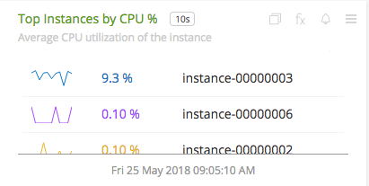](./img/chart-openstack-tenant-top-cpu.png)

  - **Top Instances by Memoery Used**: Shows the top five instances by memory usage in the tenant/project.

    

  - **Top Instances by VCPUs**: Shows the top five instances by virtual CPUs used in the tenant/project.

    

- **NEUTRON**:

  - **Networks**: Shows the total number of networks created in all projects.

    [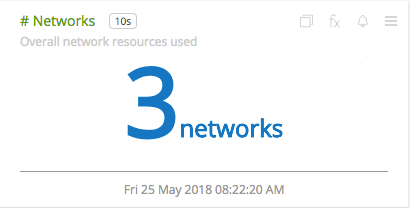](./img/chart-openstack-neutron-networks.png)

  - **Routers**: Shows the total number of routers created in all projects.

    

  - **Subnets**: Shows the total number of subnets created in all projects.

    

  - **Flaoting IPs Available vs Used**: Shows the maximum number of floating IPs available and used in all projects.

    

  - **Security Groups Available vs Used**: Shows the maximum number of security groups available and used in all projects.

    

- **INSTANCE**:

  - **VCPUs**: Shows the number of virtual CPUs allocated to the instance.

    

  - **CPU Used %**: Shows the current percentage of CPU usage of an instance.

    

  - **CPU %**: Shows the percentage of instance CPU usage over the time.

    

  - **Memory**: Shows the memory usage of the instance.

    

  - **Total Bytes Sent/Received**: Shows the number of bytes sent and received over the network.

    

  - **Received vs Transmitted Packers/sec**: Shows the number of network packets sent and received per second.

    [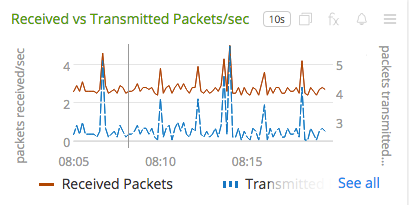](./img/chart-openstack-instance-packets-sent-received.png)

  - **Virtual Disk Read and Write Requests**: Shows the number of virtual disk read and write requests.

    

  - **Size of VDS Reads and Writes**: Shows the size of virtual disk reads and writes.

    [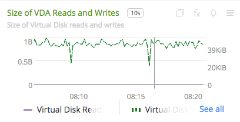](./img/chart-openstack-instance-vda-read-write-size.png)

A few other details:

* `plugin` is always set to `openstack`
* `plugin_instance` will contain the project id and name of the project given in the configuration

### LICENSE

This integration is released under the Apache 2.0 license. See [LICENSE](./LICENSE) for more details.
