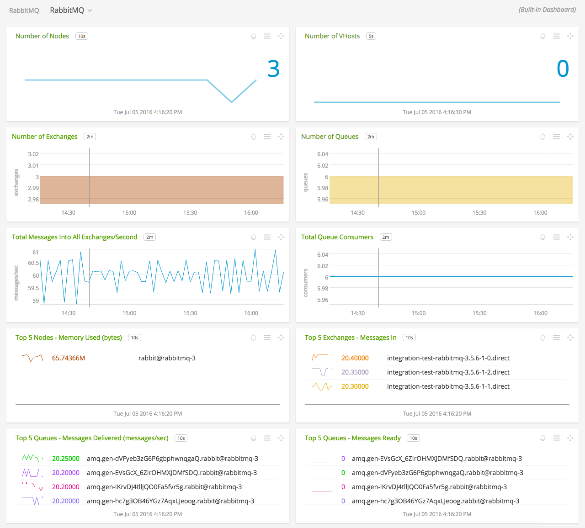
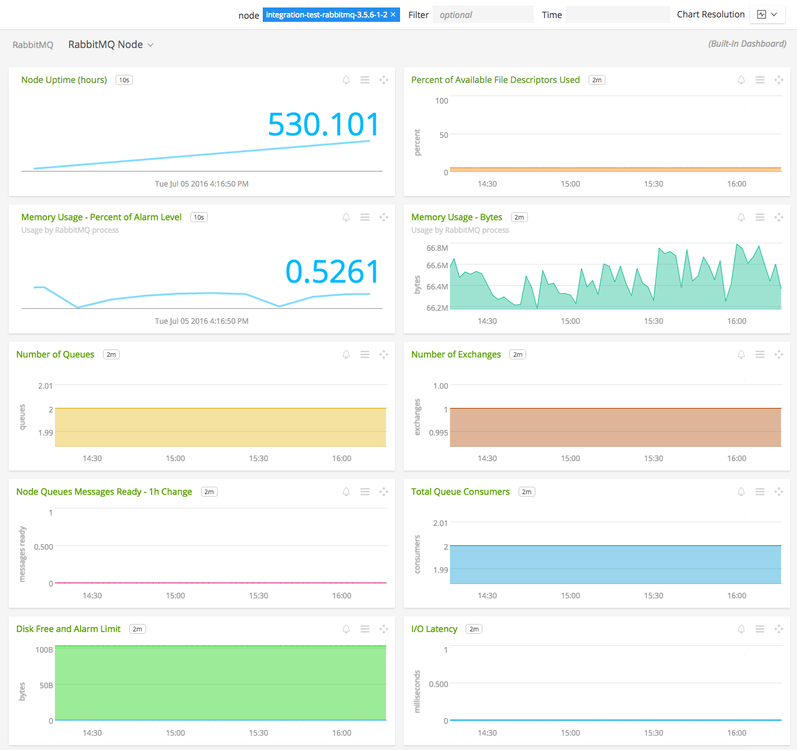

#  RabbitMQ

#### FEATURES

##### Built-in dashboards

- **RabbitMQ**: Overview of data from all RabbitMQ nodes.

  

- **RabbitMQ Node**: Focus on a single RabbitMQ node.

  

### USAGE

Sample of built-in dashboard in SignalFx:

### LICENSE

This integration is released under the Apache 2.0 license. See [LICENSE](./LICENSE) for more details.
