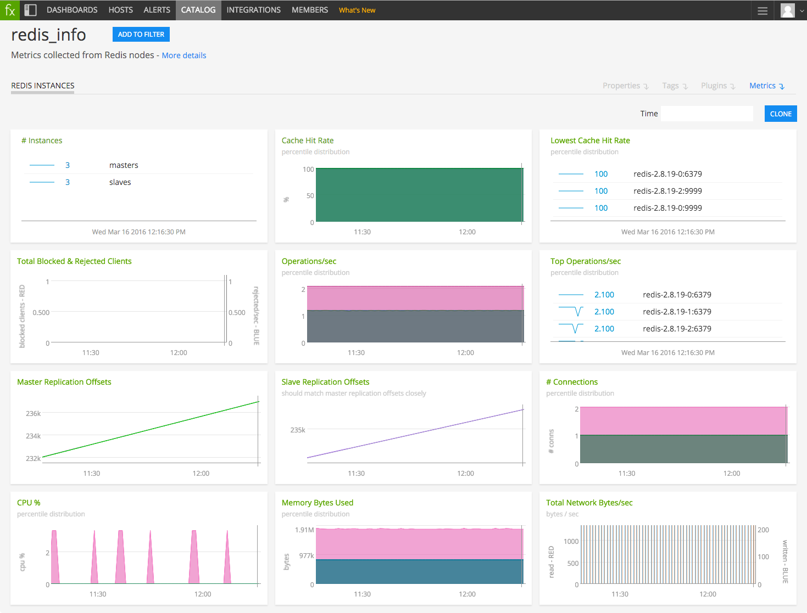

#  Redis

#### FEATURES

##### Built-in dashboards

- **Redis Instances**: Overview of data from all Redis instances.

  

- **Redis Instance**: Focus on a single Redis instance.

  

### USAGE

Sample of built-in dashboard in SignalFx:

j## METRICS

For documentation of the metrics and dimensions emitted by this plugin, [click here](./docs).

### LICENSE

This integration is released under the Apache 2.0 license. See [LICENSE](./LICENSE) for more details.
