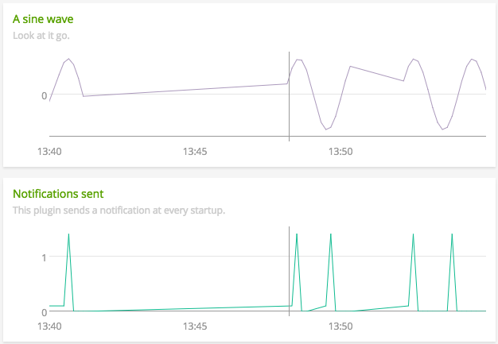

#  Traefik

Metadata associated with the Traefik integration with SignalFx Smart Agent can be found [here](https://github.com/signalfx/integrations/tree/release/signalfx-agent-traefik). The relevant code for the integration can be found [here](https://github.com/signalfx/signalfx-agent-traefik).

- [Description](#description)
- [Requirements and Dependencies](#requirements-and-dependencies)
- [Installation](#installation)
- [Configuration](#configuration)
- [Usage](#usage)
- [Metrics](#metrics)
- [License](#license)

### DESCRIPTION

Configure <a target="_blank" href="https://docs.traefik.io/configuration/metrics">Traefik</a> to expose internal metrics as prometheus metrics at an endpoint. Install the <a target="_blank" href="https://github.com/signalfx/signalfx-agent">SignalFx Smart Agent</a> and configure it to access SignalFx and use the <a target="_blank" href="https://github.com/signalfx/signalfx-agent/blob/9feb3f77fdf6de46dc476f62568ad4f9b725660c/docs/monitors/prometheus-exporter.md">prometheus-exporter</a> monitor.

### REQUIREMENTS AND DEPENDENCIES

| Software          | Version        |
|-------------------|----------------|
| signalfx-agent    |     3.4+       |

### INSTALLATION

Follow these steps to install this plugin:

1. Install the <a target="_blank" href="https://github.com/signalfx/signalfx-agent">SignalFx Smart Agent</a> in your environment.
2. Modify the smart agent configuration file as described in [configuration](#configuration), below.
3. Configure Traefik to expose prometheus metrics endpoint.  

### CONFIGURATION
#### Smart Agent Configuration
Edit the Smart Agent configuration file`agent.yaml`and add the <a target="_blank" href="https://github.com/signalfx/signalfx-agent/blob/9feb3f77fdf6de46dc476f62568ad4f9b725660c/docs/monitors/prometheus-exporter.md">prometheus-exporter monitor</a>. As an example, the configuration below with cause the Smart Agent to discover a prometheus exporter endpoint `localhost:8080/metrics`.
```
monitors:
  - type: prometheus-exporter
    discoveryRule: port == 8080
```
#### Traefik Configuration
Edit the Traefik configuration file, typically`traefik.toml`, and enable Traefik to export <a target="_blank" href="https://docs.traefik.io/configuration/metrics/">prometheus metrics</a>. The configuration file is typically passed in as command line argument. For example,

`./traefik -c traefik.toml` or `./traefik -configFile=traefik.toml`

The configuration file is typically mounted to volume `/etc/traefik/traefik.toml` in the case of docker deployment. For example,

`docker run -d -p 8080:8080 -p 80:80 -v $PWD/traefik.toml:/etc/traefik/traefik.toml`

If the configuration file is not available use the <a target="_blank" href="https://raw.githubusercontent.com/containous/traefik/master/traefik.sample.toml">sample configuration file</a>. The Smart Agent must have network access to Traefik. This means for instance that, in a docker environment, the Smart Agent container needs to share a network with the Traefik container. So docker run command may look as follows:
```
docker run --rm \
-e SFX_ACCESS_TOKEN=<signalfx access token> \
-e SFX_INGEST_URL=<signalfx ingest url> \
-v /var/run/docker.sock:/var/run/docker.sock \
-v <agent.yaml path>:/etc/signalfx/agent.yaml \
--net <traefik container network> \
quay.io/signalfx/signalfx-agent:<version>
```
### USAGE

>This section contains information about how best to monitor the software in question, using the data from this plugin. In this section, the plugin author shares experience and expertise with the software to be monitored, for the benefit of users of the plugin. This section includes:
>
>- Important conditions to watch out for in the software
>- Common failure modes, and the values of metrics that will allow the user to spot them
>- Chart images demonstrating each important condition or failure mode

This plugin is an example that emits values on its own, and does not connect to software. It emits a repeating sine wave in the metric `gauge.sine`, and counts of datapoints and notifications emitted in the metrics `counter.datapoints` and `counter.notifications` respectively.

Below is a screen capture of an example SignalFx dashboard, illustrating the metrics emitted by this plugin. The dashboard is included in this repository, and can be imported into SignalFx or other monitoring product. [Click here to download](././Page_Example Python Plugin.json).


#### Important conditions to watch out for

*`gauge.sine` looks like a straight line instead of a curve.*


This may indicate a period of missing data points. In the example chart shown above, some data points are missing between 16:40 and 16:41, and SignalFx is interpolating a straight line through the gap.

*`counter.notifications` shows a suddenly high value.*



This plugin emits a notification at every startup. If your collectd configuration and plugins do not ordinarily emit notifications, a suddenly high value for `counter.notifications` may indicate that collectd has been restarted. In the example charts shown above, `counter.notifications` shows a spike at about the same time as data resumes in `gauge.sine`.

### METRICS

>This section refers to the metrics documentation found in the `/docs` subdirectory. See [/docs/README.md](./docs/readme.md) for formatting instructions.

For documentation of the metrics and dimensions emitted by this plugin, [click here](./docs).

### LICENSE

> Include licensing information for this integration metadata, not the integration itself, in this section.

This integration is released under the Apache 2.0 license. See [LICENSE](https://github.com/signalfx/collectd-example/blob/master/LICENSE) for more details.
