#  Apache Solr

#### FEATURES

##### Built-in dashboards

- **SOLR CLUSTER**: Provides a high-level overview of metrics for a single solr cluster.

  

  [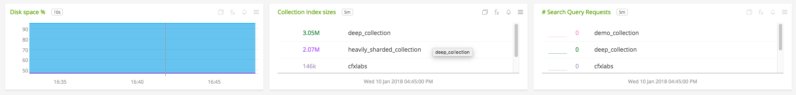](./img/solr-cluster-dashboard-bottom.png)

- **SOLR COLLECTION**: Provides metrics from a single solr collection.

  

- **SOLR NODE**: Provides metrics from a single solr instance/node.

  

- **SOLR NODES**: Provides metrics from nodes on a particular host.

  

### USAGE

#### Interpreting Built-in dashboards

- **SOLR CLUSTER**:

  - **Number of Collections**: Shows the number of collections in the cluster.

    [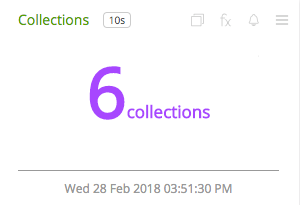](./img/chart-solr-cluster-collections.png)

  - **Number of Nodes**: Shows the number of nodes in the cluster.

    [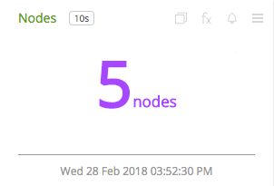](./img/chart-solr-cluster-nodes.png)

  - **Index Size per Collection**: Shows the total index size by collection for all the collections in the cluster.

    [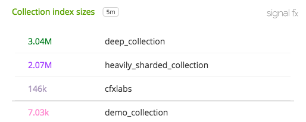](./img/chart-solr-cluster-collection-index-sizes.png)

  - **Document Cache Hit Ratio**: Shows the cumulative document cache hit ration for all collections in the cluster.

    [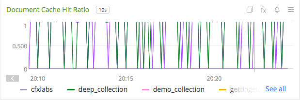](./img/chart-solr-cluster-document-cache-hit-ratio.png)

  - **Query Result Cache Hit Ratio**: Shows the cumulative query result cache hit ration for all collections in the cluster.

    [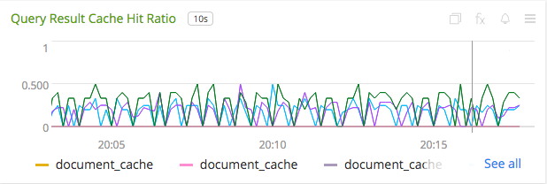](./img/chart-solr-cluster-query-result-cache-hit-ratio.png)

  - **Overall Heap Usage**: Shows the average, minimum, maximum, percentile distribution heap usage of the cluster.

    

  - **GC Invocations**: Shows the mean parnew & cms GC invocations over last minute in the cluster.

    

  - **Search Request Latency**: Shows the average time taken to process a search request in the cluster.

    

- **SOLR COLLECTION**:

  - **Number of Documents**: Shows the number of documents in the collection.

    [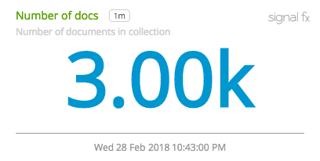](./img/chart-solr-collection-num-docs.png)

  - **Number of Shards**: Shows the number of shards & cores per shard in the collection.

    

  - **Documents Growth**: Shows growth in the number of documents in the collection.

    [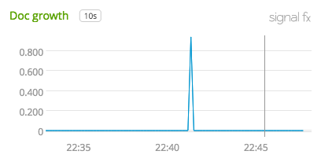](./img/chart-solr-collection-doc-growth.png)

  - **Overall Cache Hit Ratio**: Shows the various caches cumulative hit ratio in the collection.

    [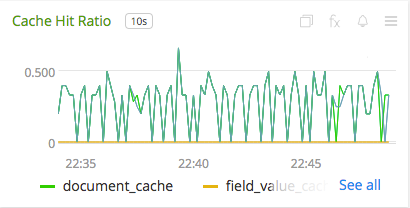](./img/chart-solr-collection-cache-hit-ratio.png)

- **SOLR NODE**:

  - **Number of Cores**: Shows the number of cores in the node.

    

  - **Cores by Indexed Documents**: Shows the top cores by number of indexed documents in the node.

    

  - **Http Request Latency**: Shows the response time of http requests to the cores in the node.

    [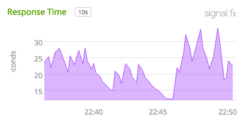](./img/chart-solr-node-response-time.png)

  - **JVM Memory Pools Usage**: Shows the usage of JVM memory pools.

    [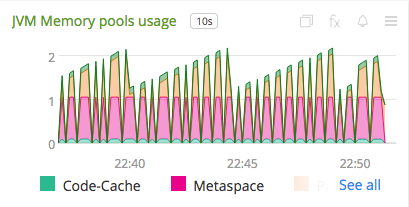](./img/chart-solr-node-jvm-memory-pools-usage.png)

- **SOLR NODES**:

  - **Number of Nodes**: Shows the total number of Solr nodes monitored in the org.

    

  - **Number of Cores Heatmap**: Shows the total number of cores in heapmap for each node.

    [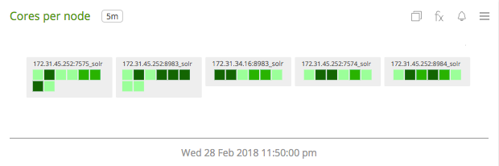](./img/chart-solr-nodes-cores-per-node.png)

  - **Http response time**: Shows the http response time of each node.

    

  - **Number of Requests**: Shows the number of requests for each node.

    [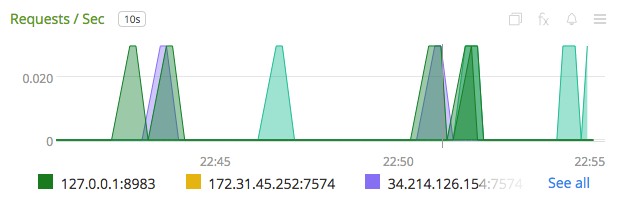](./img/chart-solr-nodes-requests-per-sec.png)

A few other details:

* `plugin` is always set to `solr`
* `plugin_instance` will contain the IP address and the port of the node given in the configuration
* To add metrics from the `/admin/metrics` endpoint, use the configuration options mentioned in [configuration](#configuration). If metrics are being included individually, make sure to give names that are valid.

### ADDITIONAL METRIC INFO
#### Metric naming
`<metric type>.solr.<endpoint name>.<name of metric>`. This is the format of default metric names reported by the plugin. Optional metrics are named as available from the `/metrics` endpoint with `_` replaced by `.`.

### LICENSE

This integration is released under the Apache 2.0 license. See [LICENSE](./LICENSE) for more details.
